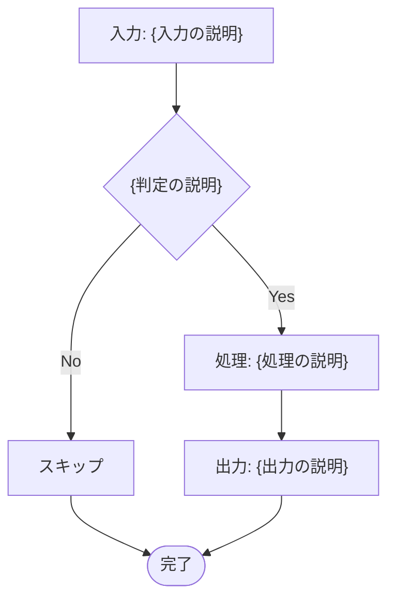
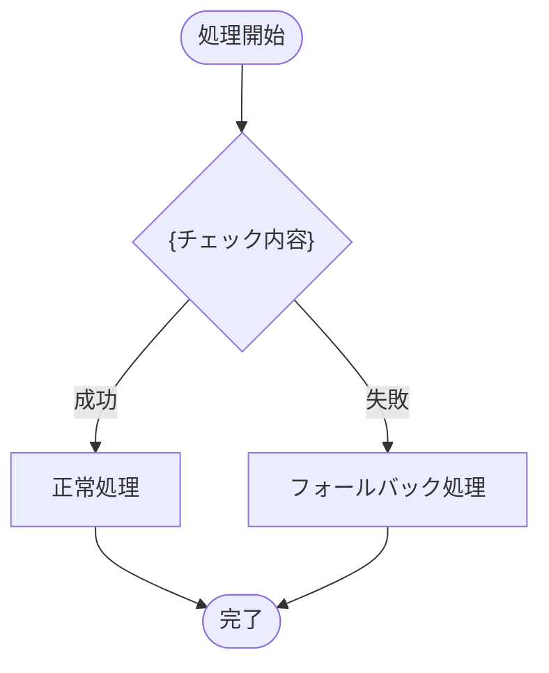

# Spec Document Templates

Templates for creating spec documents in `docs/specs/`.
Based on patterns from existing specs (e.g., `filename-generation.md`).

## Component Spec Template

````markdown
# {コンポーネント名}

> 親ドキュメント: [IMPROVEMENT_PLAN.md](../IMPROVEMENT_PLAN.md)
>
> 関連ドキュメント:
>
> - [関連コンポーネント名](./related-component.md)

## {番号}.1 背景

{現状の説明}

問題点:

- {問題1}
- {問題2}

目標:

{目標の簡潔な説明}

## {番号}.2 処理フロー


````

## {番号}.3 データ仕様

| 項目           | 型     | 説明   | 備考   |
| -------------- | ------ | ------ | ------ |
| {フィールド名} | `{型}` | {説明} | {備考} |

### Rust 型定義

```rust
/// {型の説明}
#[derive(Debug, Clone)]
pub struct {TypeName} {
    /// {フィールドの説明}
    pub field: Type,
}
```

## {番号}.4 エラーハンドリング・フォールバック



## {番号}.5 検討事項

- [ ] {検討事項1}
- [ ] {検討事項2}
- [ ] {検討事項3}

````
## Key Patterns from Existing Specs

### Parent Document Link

Always the first line after the title:
```markdown
> 親ドキュメント: [PLAN.md](../PLAN.md)
````

### Mermaid Diagrams

- Use `flowchart TD` (top-down) for processing flows
- Use `sequenceDiagram` for API interaction flows
- Node labels in Japanese for spec docs
- Decision nodes use `{" "}` format

### Tables

- Use for API specifications, field mappings, configuration schemas
- Include type, description, and notes columns
- Use backticks for type names and code values

### Code Examples

- Rust code blocks with type definitions
- Include doc comments (`///`) in examples
- Show both input and output formats

### Considerations Section

- Use checkbox format `- [ ]` for items requiring decisions
- Group by topic (performance, compatibility, security)
