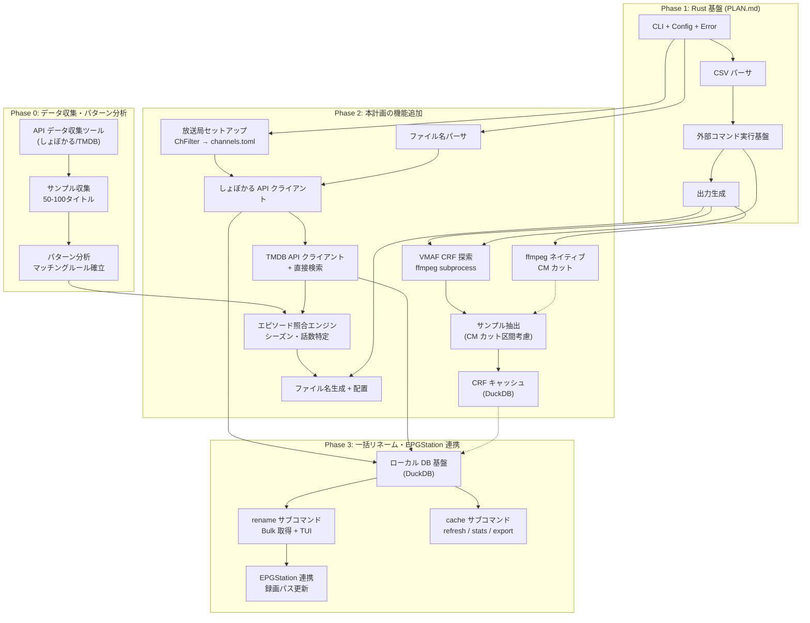

# 改修計画: VMAF ベース CRF 自動決定 & ファイル名自動生成

## 概要

join_logo_scp_trial の Rust 書き直し (PLAN.md) に加え、以下の機能を新規追加する。

1. **VMAF ベースの CRF 自動決定** -- ab-av1 の手法を参考に、映像品質評価で最適な CRF を決定
2. **エンコード後ファイル名の自動生成** -- しょぼいカレンダー + TMDB API で Jellyfin/Emby/Plex 互換のパスを生成
3. **一括リネーム機能** -- 既存ファイルをスキャンし、TUI で確認しながら一括リネーム
4. **EPGStation 連携** -- 録画完了フックからの自動実行、録画パス更新
5. **ffmpeg ネイティブ CM カット** -- AviSynth+ 依存を排除し、ffmpeg filter_complex でフレーム精度カット

---

## 詳細ドキュメント

| ドキュメント                                                                   | 内容                                                                                                                             |
| ------------------------------------------------------------------------------ | -------------------------------------------------------------------------------------------------------------------------------- |
| [components/vmaf-crf-auto.md](components/vmaf-crf-auto.md)                     | 機能1: VMAF ベース CRF 自動決定 (ab-av1 分析、実装設計)                                                                          |
| [components/filename-generation.md](components/filename-generation.md)         | 機能2: ファイル名生成 (2.1-2.5, 2.7-2.9: 背景、ジャンルフラグ、処理フロー、パーサ、しょぼかる API、命名規則、エラーハンドリング) |
| [components/tmdb-episode-matching.md](components/tmdb-episode-matching.md)     | 機能2 続き: TMDB エピソード照合 (2.6: API仕様、課題、シリーズID解決、シーズン・話数特定、再放送判定、統合フロー)                 |
| [components/batch-rename-epgstation.md](components/batch-rename-epgstation.md) | 機能3-4: 一括リネーム・EPGStation 連携 (2.10-2.11: Bulk取得、DuckDB、TUI、キャッシュ戦略)                                        |
| [components/ffmpeg-native-cut.md](components/ffmpeg-native-cut.md)             | 機能5: ffmpeg ネイティブ CM カット (AviSynth+ 依存排除、trim+concat/select フィルタ)                                             |
| [api-research/api-data-collection.md](api-research/api-data-collection.md)     | **前段作業**: API データ収集・分析ツール (しょぼかる/TMDB パターン検証用)                                                        |

---

## 実装優先度と依存関係

| #                             | タスク                                                 | 依存           | 優先度   |
| ----------------------------- | ------------------------------------------------------ | -------------- | -------- |
| **Phase 0: データ収集・分析** |                                                        |                |          |
| A1                            | API データ収集ツール (しょぼかる/TMDB クエリ → DuckDB) | -              | **最高** |
| A2                            | サンプル収集 (50-100タイトル、各種パターン)            | A1             | **最高** |
| A3                            | パターン分析・マッチングルール確立                     | A2             | **最高** |
| **Phase 2: 機能実装**         |                                                        |                |          |
| S1                            | 放送局セットアップ (ChFilter → channels.toml 生成)     | CLI 基盤       | 高       |
| V1                            | VMAF CRF 探索 (ffmpeg subprocess)                      | Phase 1 完了   | 高       |
| V2                            | CM カット考慮サンプル抽出                              | V1             | 高       |
| V3                            | CRF キャッシュ                                         | V2 + D1        | 中       |
| N1                            | ファイル名パーサ                                       | CLI 基盤       | 高       |
| N2                            | しょぼかる API クライアント                            | S1 + N1        | 高       |
| N3                            | TMDB API クライアント + 直接検索                       | N2             | 高       |
| N3b                           | エピソード照合エンジン (シーズン・話数特定)            | N3 + **A3**    | 高       |
| N4                            | ファイル名生成 + ディレクトリ配置                      | N3b + 出力生成 | 高       |
| F1                            | ffmpeg ネイティブ CM カット (trim+concat/select)       | 出力生成       | 高       |
| D1                            | ローカル DB 基盤 (DuckDB)                              | N2 + N3        | 高       |
| R1                            | rename サブコマンド (Bulk 取得 + TUI)                  | D1             | 中       |
| R2                            | EPGStation 連携 (録画パス更新 API)                     | R1             | 中       |
| C1                            | cache サブコマンド (refresh / stats / export)          | D1             | 低       |

---

## Crate 依存

| Crate                         | 用途                                                      | ライセンス         |
| ----------------------------- | --------------------------------------------------------- | ------------------ |
| `tmdb-api`                    | TMDB API クライアント                                     | MIT                |
| `reqwest`                     | HTTP クライアント (しょぼかる用、tmdb-api の依存でもある) | MIT/Apache-2.0     |
| `quick-xml` or `serde-xml-rs` | しょぼかる XML レスポンスパース                           | MIT                |
| `duckdb`                      | ローカル DB (programs, titles, tmdb_series, file_history) | MIT                |
| `blake3`                      | キャッシュキー生成                                        | CC0-1.0/Apache-2.0 |
| `indicatif`                   | 進捗表示 (CRF 探索中)                                     | MIT                |
| `ratatui`                     | TUI フレームワーク (rename コマンド)                      | MIT                |
| `crossterm`                   | ターミナル操作 (ratatui のバックエンド)                   | MIT                |
| `wana_kana` or 自前           | ひらがな → ローマ字変換                                   | MIT                |
| `lazy_static` or `once_cell`  | 仮名パターン正規表現の遅延初期化                          | MIT/Apache-2.0     |
| `chrono`                      | 日時操作 (月単位チャンク、±8時間計算等)                   | MIT/Apache-2.0     |

### 外部 API 依存 (ランタイム)

| API                         | 用途                            | 認証                    | レート制限 |
| --------------------------- | ------------------------------- | ----------------------- | ---------- |
| しょぼかる `db.php`         | TID, Count, SubTitle 取得       | なし (User-Agent 必須)  | 1 req/s    |
| TMDB API                    | series_id, season, episode 取得 | Bearer Token (環境変数) | ~50 req/s  |
| EPGStation API (オプション) | 録画ファイルパス更新            | API Key (設定ファイル)  | ローカル   |

> **外部データベース依存なし:** arm, anime-lists 等の外部マッピング DB は使用しない。
> しょぼかる API + TMDB API のみで完結する。

---

## 検討事項・未決定事項

> 各詳細ドキュメントにも個別の検討事項があります。

### VMAF 関連

- [ ] VMAF 探索の `--thorough` 相当のオプションを提供するか
- [ ] CRF キャッシュの保存先 (`~/.cache/jlse-rs/` or プロジェクト内 `result/`)

### API・外部サービス関連

- [ ] しょぼかる API が落ちている場合のリトライ戦略 (指数バックオフ)
- [ ] TMDB API トークンの管理方法 (環境変数 / 設定ファイル / keyring)
- [ ] TID→TMDB マッピングキャッシュの有効期限 (現在 90日 で設計)

### ffmpeg ネイティブカット関連

- [ ] 方式選択: trim+concat (方式B) vs select (方式A) のデフォルト
- [ ] 複数音声トラック (主音声・副音声) の同期処理
- [ ] 可変フレームレート (VFR) ソースの処理
- [ ] AVS 形式出力のサポート継続期間 (後方互換)

### ファイル名・設定関連

- [ ] ローマ字変換の精度 (wana_kana crate の品質評価)
- [ ] TMDB の英語タイトルが取れない場合の TitleYomi ローマ字化の品質 (長音・促音・拗音の扱い)
- [ ] ファイル名の `[字]` `[デ]` 等 ARIB フラグの完全なリスト整理
- [ ] Jellyfin / Plex / Emby でフォーマットが微妙に異なる (ID タグ形式)。どれをデフォルトにするか
- [ ] channels.toml の配置先 (`~/.config/jlse-rs/` or プロジェクト内)
- [ ] `--merge` 時にしょぼかる側で放送局名が変更されたケースの検出

### 将来拡張

- [ ] アニメ以外のジャンル (ドラマ、映画) への拡張時期
- [ ] しょぼかる以外の番組表ソース (EPG 直接解析、radiko 等)
- [ ] Jellyfin/Plex プラグインとしての提供 (メディアスキャナから直接呼び出し)
