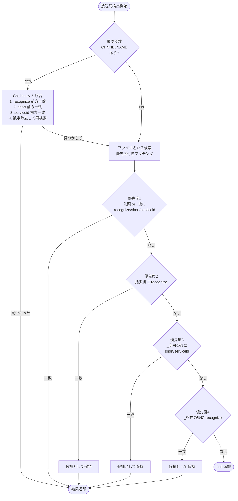
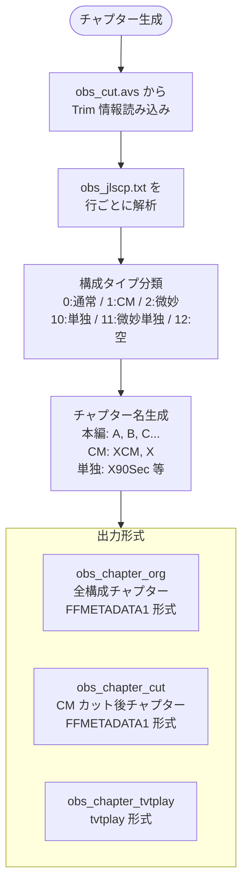
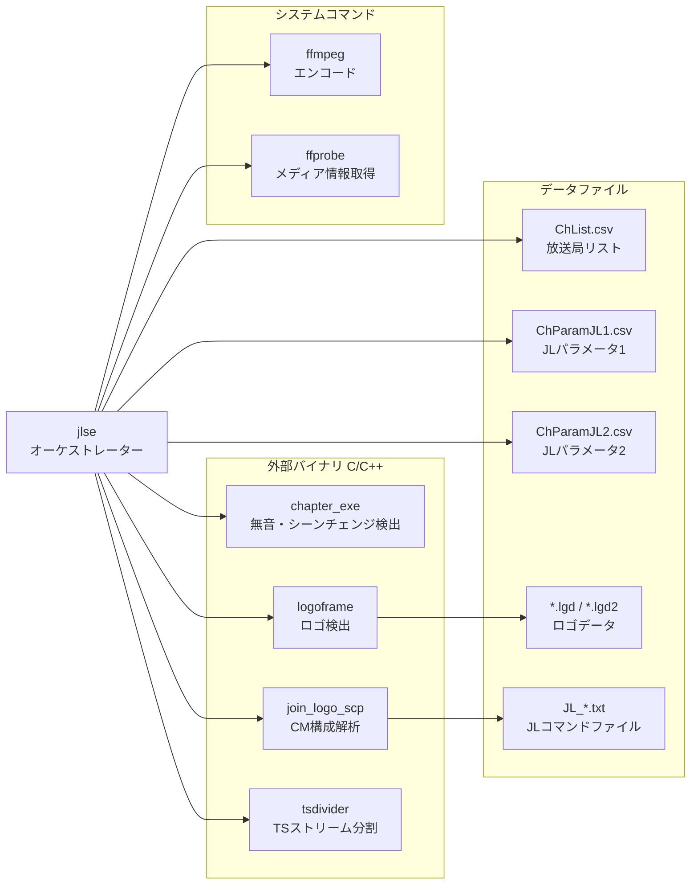
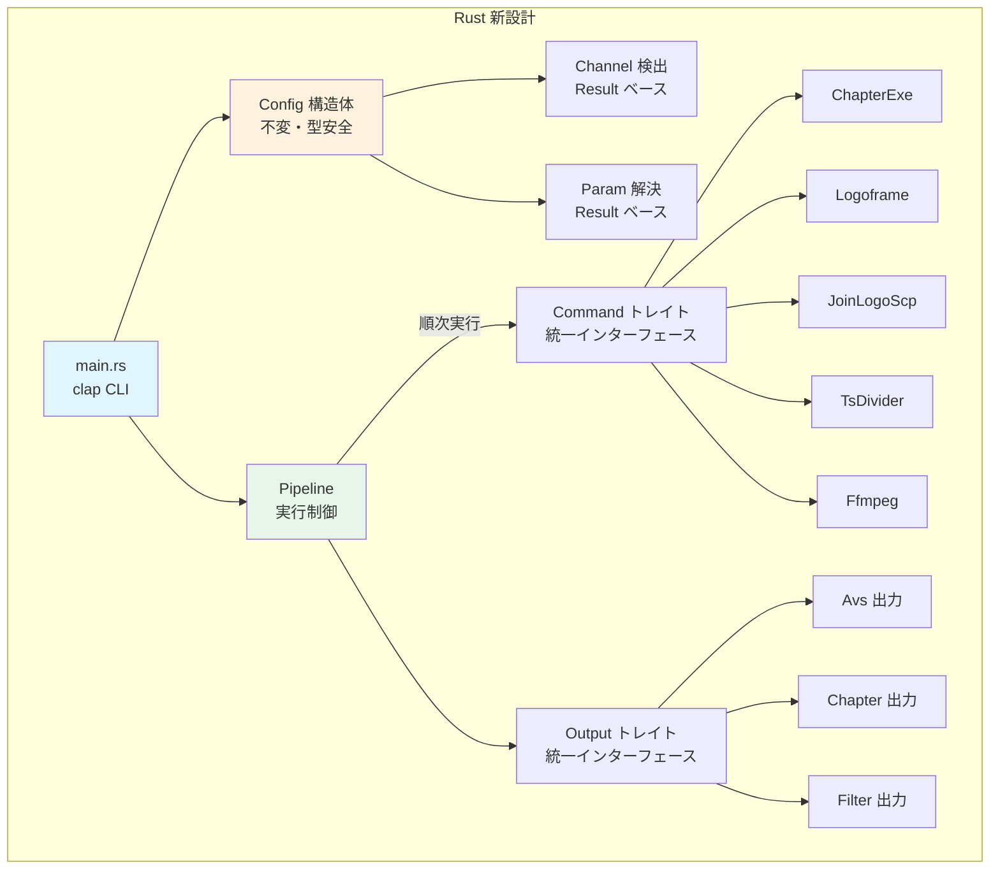
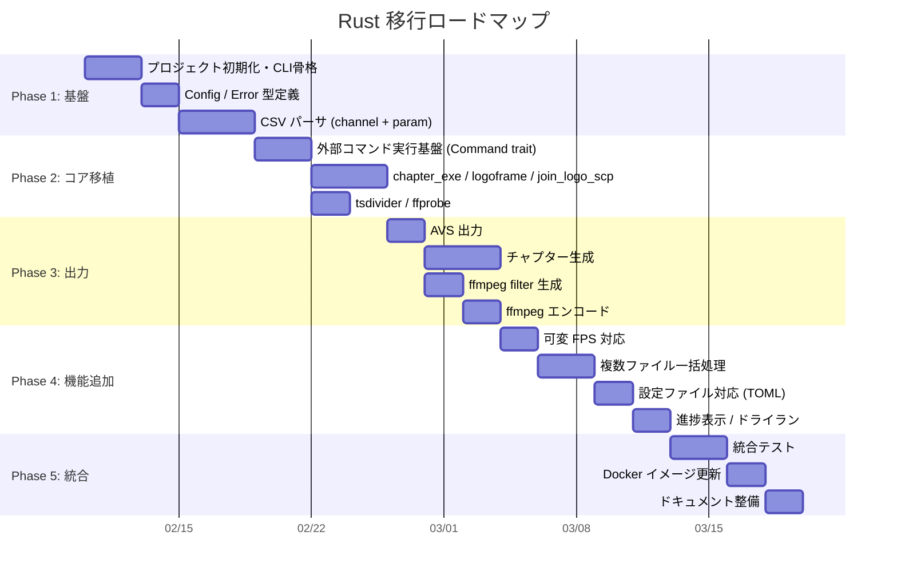

# join_logo_scp_trial Rust 書き直し計画

## 1. 現行 JS 実装の解析

### 1.1 ファイル構成

```
modules/join_logo_scp_trial/
├── src/
│   ├── jlse.js                    # メインエントリポイント (CLI + オーケストレーション)
│   ├── settings.js                # パス定義・出力ディレクトリ初期化
│   ├── param.js                   # CSV パラメータ検索 (放送局+番組名マッチ)
│   ├── channel.js                 # 放送局検出 (ファイル名/環境変数 → CSV照合)
│   ├── command/
│   │   ├── chapterexe.js          # chapter_exe バイナリ呼び出し
│   │   ├── logoframe.js           # logoframe バイナリ呼び出し + ロゴ選択
│   │   ├── join_logo_frame.js     # join_logo_scp バイナリ呼び出し
│   │   ├── tsdivider.js           # tsdivider バイナリ呼び出し
│   │   ├── ffmpeg.js              # ffmpeg エンコード呼び出し
│   │   └── ffprobe.js             # ffprobe 情報取得
│   └── output/
│       ├── avs.js                 # AVS ファイル結合 (cutcm / cutcm_logo)
│       ├── chapter_jls.js         # チャプター生成 (FFMETADATA1/cut/tvtplay)
│       └── ffmpeg_filter.js       # ffmpeg filter_complex 文字列生成
├── bin/                           # 外部バイナリ配置先
├── logo/                          # ロゴデータ (.lgd/.lgd2)
├── result/                        # 解析結果出力先
└── JL/                            # JL パラメータ (symlink)
    └── data/
        ├── ChList.csv             # 放送局リスト
        ├── ChParamJL1.csv         # JLパラメータ1
        └── ChParamJL2.csv         # JLパラメータ2
```

### 1.2 処理フロー図

```mermaid
flowchart TD
    START([jlse 起動]) --> PARSE_ARGS[CLI 引数パース<br/>yargs]
    PARSE_ARGS --> VALIDATE{入力ファイル検証<br/>.ts / .m2ts ?}
    VALIDATE -- NG --> ERROR_EXIT([エラー終了])
    VALIDATE -- OK --> INIT_SETTINGS[settings 初期化<br/>出力ディレクトリ作成<br/>各種パス定義]

    INIT_SETTINGS --> DETECT_CHANNEL[放送局検出<br/>channel.js]
    DETECT_CHANNEL --> PARSE_PARAM[パラメータ検索<br/>param.js]
    PARSE_PARAM --> CREATE_AVS[入力 AVS 生成<br/>in_org.avs]

    CREATE_AVS --> TSD_CHECK{tsdivider<br/>有効?}
    TSD_CHECK -- Yes --> TSDIVIDER[tsdivider 実行<br/>TS ストリーム分割]
    TSDIVIDER --> RECREATE_AVS[AVS 再生成<br/>分割後TS で作り直し]
    RECREATE_AVS --> ANALYSIS
    TSD_CHECK -- No --> ANALYSIS

    subgraph ANALYSIS [解析パイプライン]
        direction TB
        CHAPTER_EXE[chapter_exe 実行<br/>無音・シーンチェンジ検出<br/>→ obs_chapterexe.txt]
        CHAPTER_EXE --> LOGOFRAME[logoframe 実行<br/>ロゴ検出<br/>→ obs_logoframe.txt]
        LOGOFRAME --> JOIN_LOGO_SCP[join_logo_scp 実行<br/>CM 構成解析<br/>→ obs_cut.avs + obs_jlscp.txt]
    end

    ANALYSIS --> OUTPUT

    subgraph OUTPUT [出力生成]
        direction TB
        OUT_AVS[AVS 結合出力<br/>in_cutcm.avs<br/>in_cutcm_logo.avs]
        OUT_AVS --> OUT_CHAPTER[チャプター生成<br/>obs_chapter_org.chapter.txt<br/>obs_chapter_cut.chapter.txt<br/>obs_chapter_tvtplay.chapter]
    end

    OUTPUT --> FILTER_CHECK{filter<br/>オプション?}
    FILTER_CHECK -- Yes --> GEN_FILTER[ffmpeg filter 生成<br/>ffmpeg.filter]
    FILTER_CHECK -- No --> ENCODE_CHECK

    GEN_FILTER --> ENCODE_CHECK{encode<br/>オプション?}
    ENCODE_CHECK -- Yes --> FFMPEG_ENCODE[ffmpeg エンコード<br/>チャプター埋め込み<br/>メタデータ設定]
    ENCODE_CHECK -- No --> REMOVE_CHECK

    FFMPEG_ENCODE --> REMOVE_CHECK{remove<br/>オプション?}
    REMOVE_CHECK -- Yes --> CLEANUP[中間ファイル削除<br/>result/ + .lwi]
    REMOVE_CHECK -- No --> DONE
    CLEANUP --> DONE([完了])
```



### 1.3 放送局検出ロジック (channel.js)



### 1.4 パラメータ解決ロジック (param.js)

```mermaid
flowchart TD
    START([パラメータ検索]) --> READ_CSV[ChParamJL1.csv + ChParamJL2.csv<br/>を順次読み込み]
    READ_CSV --> LOOP{各行をチェック}

    LOOP --> COMMENT{コメント行?<br/>^#}
    COMMENT -- Yes --> LOOP
    COMMENT -- No --> NORMALIZE[ファイル名・タイトルを<br/>jaconv で正規化<br/>全角→半角 / 半角カナ→全角]

    NORMALIZE --> CH_MATCH{放送局一致?}
    CH_MATCH -- Yes --> TITLE_CHECK{タイトル指定<br/>あり?}
    TITLE_CHECK -- Yes --> TITLE_MATCH{タイトル<br/>マッチ?<br/>正規表現 or 部分一致}
    TITLE_MATCH -- Yes --> MERGE[結果にマージ<br/>@ → 空文字に変換]
    TITLE_MATCH -- No --> LOOP
    TITLE_CHECK -- No --> MERGE
    CH_MATCH -- No --> LOOP

    MERGE --> LOOP

    LOOP -- 全行処理完了 --> EMPTY{結果が空?}
    EMPTY -- Yes --> DEFAULT[1行目をデフォルト適用]
    EMPTY -- No --> SAVE[obs_param.txt に保存]
    DEFAULT --> SAVE
    SAVE --> RETURN([結果返却])
```

### 1.5 チャプター生成ロジック (chapter_jls.js)



### 1.6 外部コマンド依存関係



---

## 2. 現行実装の課題

| #  | 課題                       | 詳細                                                                         |
| -- | -------------------------- | ---------------------------------------------------------------------------- |
| 1  | エラーハンドリングが不統一 | `process.exit()` の直呼び出し、reject 後の exit、catch 内 exit が混在        |
| 2  | 設定がグローバル変数       | `settings.js` が `exports` を mutable に書き換え、init() で副作用的に初期化  |
| 3  | 同期/非同期の混在          | `spawnSync` と `spawn` + Promise が混在。tsdivider/ffmpeg は同期、他は非同期 |
| 4  | FPS 固定 (29.97fps)        | chapter_jls.js でフレーム→秒変換が 29.97fps 固定。他のフレームレートに非対応 |
| 5  | テストなし                 | 単体テスト・統合テストが一切存在しない                                       |
| 6  | ロゴ選択ロジックが限定的   | serviceid ベースの選択で最大番号のみ。複数ロゴ候補の優先順位制御がない       |
| 7  | 環境変数名の typo          | `CHNNELNAME` (CHANNEL の N が1つ欠落)                                        |
| 8  | filter 出力の不完全        | ffmpeg_filter.js の出力が `[video][audio]` で終わり、`-map` 指定がない       |
| 9  | Node.js + npm 依存         | Docker 環境では不要な npm エコシステムの管理コストが発生                     |
| 10 | 並列実行不可               | 複数ファイルの一括処理に対応していない                                       |

---

## 3. Rust 書き直し計画

### 3.1 プロジェクト構成案

```
jlse-rs/
├── Cargo.toml
├── src/
│   ├── main.rs                  # CLI エントリポイント (clap)
│   ├── config.rs                # 設定・パス管理 (構造体ベース)
│   ├── channel.rs               # 放送局検出
│   ├── param.rs                 # パラメータ解決
│   ├── pipeline.rs              # パイプライン実行制御
│   ├── command/
│   │   ├── mod.rs
│   │   ├── chapter_exe.rs       # chapter_exe 呼び出し
│   │   ├── logoframe.rs         # logoframe 呼び出し + ロゴ選択
│   │   ├── join_logo_scp.rs     # join_logo_scp 呼び出し
│   │   ├── tsdivider.rs         # tsdivider 呼び出し
│   │   ├── ffmpeg.rs            # ffmpeg エンコード
│   │   └── ffprobe.rs           # ffprobe 情報取得
│   ├── output/
│   │   ├── mod.rs
│   │   ├── avs.rs               # AVS 結合出力
│   │   ├── chapter.rs           # チャプター生成
│   │   └── ffmpeg_filter.rs     # ffmpeg filter 生成
│   └── error.rs                 # 統一エラー型 (thiserror)
└── tests/
    ├── channel_test.rs
    ├── param_test.rs
    ├── chapter_test.rs
    └── integration_test.rs
```

### 3.2 主要 Crate 候補

| 用途         | Crate                               | 理由                                              |
| ------------ | ----------------------------------- | ------------------------------------------------- |
| CLI 引数     | `clap` (derive)                     | 型安全な引数定義。yargs の上位互換                |
| エラー       | `thiserror` + `anyhow`              | ライブラリ用 thiserror / アプリ用 anyhow          |
| CSV          | `csv`                               | Rust 標準の CSV パーサ                            |
| 日本語正規化 | 自前実装 or `unicode-normalization` | jaconv 相当。全角半角変換は小規模なので自前でも可 |
| 正規表現     | `regex`                             | パターンマッチング                                |
| ファイル操作 | `std::fs`                           | fs-extra 相当は標準ライブラリで十分               |
| プロセス実行 | `std::process::Command`             | child_process 相当                                |
| 非同期       | `tokio` (検討中)                    | 並列ファイル処理で必要な場合のみ                  |
| シリアライズ | `serde` + `serde_json`              | パラメータ保存                                    |
| ログ         | `tracing`                           | 構造化ログ                                        |
| テスト       | `assert_cmd` + `predicates`         | CLI 統合テスト                                    |

### 3.3 アーキテクチャ方針



**設計原則:**

1. **イミュータブルな Config** -- `settings.js` のグローバル mutable を排除。Config 構造体を生成後は変更不可
2. **Result ベースのエラー処理** -- `process.exit()` を排除。全関数が `Result<T, Error>` を返す
3. **Command トレイト** -- 外部コマンド呼び出しを共通インターフェースで統一
4. **型安全なパイプライン** -- 各ステージの入出力を型で保証

---

## 4. 機能追加計画

### 4.1 追加予定機能

| #  | 機能                     | 優先度 | 詳細                                                                  |
| -- | ------------------------ | ------ | --------------------------------------------------------------------- |
| 1  | 複数ファイル一括処理     | 高     | ディレクトリ指定 or glob パターンで複数 TS を一括処理                 |
| 2  | 可変フレームレート対応   | 高     | 29.97fps 固定を廃止。ffprobe から取得した FPS を全処理で使用          |
| 3  | 設定ファイル対応         | 中     | TOML/YAML で永続設定。CLI 引数 > 設定ファイル > デフォルト の優先順位 |
| 4  | 進捗表示                 | 中     | 各ステージの処理状況をプログレスバーで表示                            |
| 5  | ドライラン               | 中     | `--dry-run` で実際のコマンドを実行せず、実行計画のみ表示              |
| 6  | ログ出力の構造化         | 中     | `tracing` による JSON ログ出力。デバッグ容易性の向上                  |
| 7  | リトライ機構             | 低     | 外部コマンドの一時的失敗に対する自動リトライ                          |
| 8  | シングルバイナリ配布     | 高     | npm 不要。Docker イメージサイズ削減に寄与                             |
| 9  | EPGStation 連携強化      | 中     | API 直接呼び出しで放送局名取得 (環境変数経由を残しつつ)               |
| 10 | Chapter フォーマット拡充 | 低     | Matroska チャプター (XML) など追加フォーマット対応                    |

### 4.2 移行ステップ



### 4.3 後方互換性

- **CLI 引数** -- 既存の `-i`, `-f`, `-e`, `-ac`, `-c`, `-t`, `-tsd`, `-o`, `-d`, `-n`, `-r` は全て維持
- **環境変数** -- `CHNNELNAME` は `CHANNEL_NAME` に修正しつつ、旧名もフォールバックとして対応
- **出力ファイル** -- result/ 配下のファイル名・フォーマットは完全互換を維持
- **外部バイナリ** -- chapter_exe, logoframe, join_logo_scp, tsdivider との I/F は変更なし

---

## 5. 検討事項・未決定事項

- [ ] `tokio` を使うか `std::thread` で十分か → 複数ファイル処理の並列度で判断
- [ ] 日本語全角半角変換を自前実装するか crate を探すか
- [ ] chapter_jls.js の Trim パーサが正規表現ベースだが、AVS パーサとして proper な実装にするか
- [ ] EPGStation API 連携の認証方式 (API Key? Token?)
- [ ] Matroska chapter XML のフォーマット仕様確認
- [ ] CI/CD: GitHub Actions で cross-compile (x86_64 / aarch64) の設定

---

## 6. Rust 環境構築ブレスト

### 6.1 プロジェクト構成案

```
recmgr/
├── Cargo.toml              # ワークスペース定義
├── crates/
│   ├── recmgr-cli/         # CLI バイナリ (jlse, jlse-api)
│   ├── recmgr-core/        # 共通ロジック (CM検出、パラメータ解決)
│   ├── recmgr-api/         # しょぼかる/TMDB API クライアント
│   ├── recmgr-db/          # DuckDB ラッパー
│   └── recmgr-ffmpeg/      # ffmpeg/ffprobe サブプロセス
├── docs/                   # 設計ドキュメント (既存)
├── tests/                  # 統合テスト
└── fixtures/               # テスト用サンプルデータ
```

### 6.2 Crate 分割の考え方

| Crate           | 責務                               | 主な依存                  |
| --------------- | ---------------------------------- | ------------------------- |
| `recmgr-cli`    | CLI パース、サブコマンド           | clap, tokio               |
| `recmgr-core`   | パラメータ解決、チャプター生成     | (内部のみ)                |
| `recmgr-api`    | HTTP クライアント、XML/JSON パース | reqwest, quick-xml, serde |
| `recmgr-db`     | DuckDB 操作、キャッシュ            | duckdb-rs                 |
| `recmgr-ffmpeg` | ffmpeg/ffprobe 呼び出し            | tokio::process            |

### 6.3 検討事項

**1. ワークスペース vs 単一 Crate**

- ワークスペース: 並列ビルド、テスト分離、依存明確化
- 単一: シンプル、初期開発速い

**2. 非同期ランタイム**

- `tokio` (デファクト、reqwest 必須)
- `async-std` (軽量だが reqwest 非対応)
- → **tokio 一択**

**3. CLI フレームワーク**

- `clap` (derive マクロ、補完生成)
- `argh` (軽量)
- → **clap** (サブコマンド多いため)

**4. HTTP クライアント**

- `reqwest` (async、gzip、cookie)
- `ureq` (sync、軽量)
- → **reqwest** (レート制限制御に async 必要)

**5. XML パーサ (しょぼかる)**

- `quick-xml` (serde 対応、高速)
- `roxmltree` (DOM ベース)
- → **quick-xml** (ストリーミング対応)

**6. DB**

- `duckdb-rs` (DuckDB 公式)
- `rusqlite` (SQLite、軽量)
- → **duckdb-rs** (分析クエリ、Parquet エクスポート)

**7. TUI (rename コマンド)**

- `ratatui` (tui-rs 後継)
- `cursive`
- → **ratatui** (活発、Rust エコシステム主流)

**8. ビルド環境**

- Rust 1.75+ (async trait 安定化)
- cargo-nextest (並列テスト)
- cargo-deny (ライセンス監査)

### 6.4 最小 Cargo.toml (ワークスペース)

```toml
[workspace]
resolver = "2"
members = [
	"crates/recmgr-cli",
	"crates/recmgr-core",
	"crates/recmgr-api",
	"crates/recmgr-db",
	"crates/recmgr-ffmpeg",
]

[workspace.package]
version = "0.1.0"
edition = "2021"
rust-version = "1.75"
license = "MIT"
repository = "https://github.com/naa0yama/recmgr"

[workspace.dependencies]
tokio = { version = "1", features = ["full"] }
reqwest = { version = "0.12", features = ["json", "gzip", "cookies"] }
serde = { version = "1", features = ["derive"] }
serde_json = "1"
quick-xml = { version = "0.31", features = ["serialize"] }
clap = { version = "4", features = ["derive"] }
duckdb = "1"
thiserror = "1"
tracing = "0.1"
tracing-subscriber = "0.3"
```

### 6.5 開発順序案

```
Phase 0: プロジェクト初期化
├── cargo new --lib crates/recmgr-api
├── cargo new --lib crates/recmgr-db
└── cargo new crates/recmgr-cli

Phase 1: API クライアント (データ収集用)
├── しょぼかる XML クライアント
├── TMDB JSON クライアント
└── レート制限実装

Phase 2: DB 層
├── DuckDB スキーマ
├── CRUD 操作
└── キャッシュ戦略

Phase 3: CLI
├── collect サブコマンド
├── query サブコマンド
└── stats サブコマンド
```

### 6.6 未決定事項

1. **ワークスペース分割** — 上記の 5 crate 構成で OK?
2. **最小スタート** — `recmgr-api` + `recmgr-db` + `recmgr-cli` の 3 crate から始める?
3. **既存 PLAN.md の join_logo_scp 連携部分** — 後回し or 並行?
