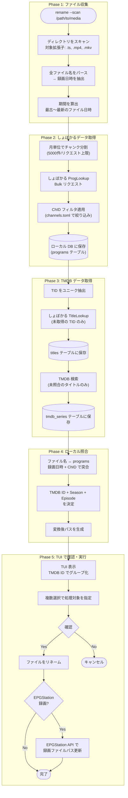

# 一括リネーム・EPGStation 連携

> 親ドキュメント: [IMPROVEMENT_PLAN.md](../IMPROVEMENT_PLAN.md)

## 2.10 一括リネーム機能 (`rename` サブコマンド)

既存のメディアファイルを一括でスキャンし、しょぼかる + TMDB 情報に基づいてリネームする機能。
エンコード完了時の自動リネーム (2.6-2.9) とは別に、過去ファイルの整理用途で使用する。

### 2.10.1 処理フロー概要



### 2.10.2 しょぼかる Bulk リクエスト戦略

```rust
/// 期間を月単位チャンクに分割 (5000件上限を考慮)
fn split_into_monthly_chunks(start: DateTime<Tz>, end: DateTime<Tz>) -> Vec<(DateTime<Tz>, DateTime<Tz>)> {
    let mut chunks = Vec::new();
    let mut current = start;
    while current < end {
        let month_end = (current + Months::new(1))
            .with_day(1).unwrap()
            .with_hour(0).unwrap()
            .min(end);
        chunks.push((current, month_end));
        current = month_end;
    }
    chunks
}

/// ChID フィルタ付き ProgLookup
async fn fetch_programs_bulk(
    syoboi: &SyoboiClient,
    start: DateTime<Tz>,
    end: DateTime<Tz>,
    allowed_chids: &[u32],
) -> Result<Vec<Program>> {
    // ChID 指定で API コール (ChID パラメータはカンマ区切りで複数指定可能)
    let chid_param = allowed_chids.iter()
        .map(|id| id.to_string())
        .collect::<Vec<_>>()
        .join(",");

    let params = [
        ("Command", "ProgLookup"),
        ("ChID", &chid_param),
        ("StTime", &start.format("%Y%m%d_%H%M%S").to_string()),
        ("EdTime", &end.format("%Y%m%d_%H%M%S").to_string()),
        ("JOIN", "SubTitles"),  // SubTitles も同時取得
    ];

    syoboi.request(&params).await
}
```

**ChID 指定のメリット:**

- 全国放送局のデータではなく、ユーザーが受信可能な局のみに絞り込み
- データ量を大幅削減 (関東 8 局 vs 全国 50+ 局)
- `channels.toml` の ChID 設定を再利用

### 2.10.3 ローカル DB 設計 (DuckDB)

DuckDB を採用する理由:

- **単一ファイル:** SQLite 同様、`.duckdb` ファイル1つで完結
- **高速な分析クエリ:** 列指向ストレージで集計が高速
- **CSV/Parquet エクスポート:** `COPY TO` で簡単に変換可能
- **Rust バインディング:** `duckdb-rs` crate で利用可能

```sql
-- しょぼかる番組データ
CREATE TABLE programs (
    pid         INTEGER PRIMARY KEY,  -- しょぼかる PID
    tid         INTEGER NOT NULL,
    ch_id       INTEGER NOT NULL,
    st_time     TIMESTAMP NOT NULL,   -- 放送開始時刻
    ed_time     TIMESTAMP NOT NULL,   -- 放送終了時刻
    count       INTEGER,              -- 話数
    sub_title   TEXT,
    st_sub_title TEXT,                -- SubTitles から取得したサブタイトル
    flag        INTEGER DEFAULT 0,    -- ビットマスク (再放送等)
    updated_at  TIMESTAMP DEFAULT CURRENT_TIMESTAMP,
    UNIQUE(pid)
);
CREATE INDEX idx_programs_st_time ON programs(st_time);
CREATE INDEX idx_programs_tid ON programs(tid);
CREATE INDEX idx_programs_ch_id ON programs(ch_id);

-- しょぼかるタイトルマスタ
CREATE TABLE titles (
    tid             INTEGER PRIMARY KEY,
    title           TEXT NOT NULL,
    title_en        TEXT,
    title_yomi      TEXT,
    short_title     TEXT,
    cat             INTEGER,          -- カテゴリ (1=アニメ等)
    first_year      INTEGER,
    first_month     INTEGER,
    sub_titles_raw  TEXT,             -- *01*サブタイトル\n*02*... 形式
    updated_at      TIMESTAMP DEFAULT CURRENT_TIMESTAMP
);

-- TMDB シリーズマッピング
CREATE TABLE tmdb_series (
    tid             INTEGER PRIMARY KEY,  -- しょぼかる TID
    tmdb_id         INTEGER,              -- TMDB series_id (NULL = 未照合/未登録)
    tmdb_name       TEXT,
    first_air_date  DATE,
    season_count    INTEGER,
    status          TEXT,                 -- 'matched', 'not_found', 'pending'
    updated_at      TIMESTAMP DEFAULT CURRENT_TIMESTAMP
);

-- TMDB シーズン詳細 (キャッシュ)
CREATE TABLE tmdb_seasons (
    tmdb_id         INTEGER NOT NULL,
    season_number   INTEGER NOT NULL,
    air_date        DATE,
    episode_count   INTEGER,
    name            TEXT,
    updated_at      TIMESTAMP DEFAULT CURRENT_TIMESTAMP,
    PRIMARY KEY (tmdb_id, season_number)
);

-- ファイル処理履歴
CREATE TABLE file_history (
    id              INTEGER PRIMARY KEY,
    original_path   TEXT NOT NULL,
    new_path        TEXT,
    pid             INTEGER,              -- しょぼかる PID
    tmdb_id         INTEGER,
    season_number   INTEGER,
    episode_number  INTEGER,
    status          TEXT,                 -- 'pending', 'renamed', 'skipped', 'error'
    error_message   TEXT,
    processed_at    TIMESTAMP,
    UNIQUE(original_path)
);
```

### 2.10.4 ファイル名 ↔ しょぼかる突合ロジック

```rust
/// ファイル名から抽出した情報としょぼかる programs を突合
fn match_file_to_program(
    parsed: &ParsedFilename,
    db: &DuckDbConnection,
) -> Result<Option<Program>> {
    // 録画開始時刻 ±5分 + ChID で検索
    let sql = r#"
        SELECT * FROM programs
        WHERE ch_id = ?
          AND st_time BETWEEN ? - INTERVAL 5 MINUTE
                          AND ? + INTERVAL 5 MINUTE
        ORDER BY ABS(EXTRACT(EPOCH FROM (st_time - ?))) ASC
        LIMIT 1
    "#;

    db.query_row(sql, params![
        parsed.channel_id,
        parsed.start_time,
        parsed.start_time,
        parsed.start_time,
    ])
}

/// ChID のマッピング (放送局名 → しょぼかる ChID)
/// channels.toml から読み込み
fn resolve_channel_id(channel_name: &str, channels: &ChannelsConfig) -> Option<u32> {
    channels.iter()
        .find(|ch| ch.names.iter().any(|n| channel_name.contains(n)))
        .map(|ch| ch.syoboi_chid)
}
```

### 2.10.5 TUI 設計

```
┌─────────────────────────────────────────────────────────────────────────────┐
│ jlse-rs rename - 一括リネーム                                    [q]終了   │
├─────────────────────────────────────────────────────────────────────────────┤
│ スキャン結果: 156 ファイル / 23 シリーズ                                    │
│ しょぼかる照合: 152 成功 / 4 失敗                                           │
│ TMDB 照合: 21 成功 / 2 未登録                                               │
├─────────────────────────────────────────────────────────────────────────────┤
│                                                                             │
│ ▼ SPY×FAMILY [tmdbid-120089] (25 ファイル)                                  │
│   [x] s01e01 オペレーション〈梟〉                                           │
│       /録画/2022-04-09... → SPY FAMILY (2022) [tmdbid-120089]/Season 01/... │
│   [x] s01e02 妻役を確保せよ                                                 │
│       /録画/2022-04-16... → SPY FAMILY (2022) [tmdbid-120089]/Season 01/... │
│   ...                                                                       │
│                                                                             │
│ ▼ ご注文はうさぎですか？ [tmdbid-60843] (36 ファイル)                       │
│   [ ] s01e01 ひと目で尋常でないもふもふだと見抜いたよ                       │
│       /録画/2014-04-10... → Is the order a rabbit (2014) [tmdbid-60843]/... │
│   ...                                                                       │
│                                                                             │
│ ▶ TMDB 未登録 (4 ファイル)                                                  │
│   [ ] 超ニッチなアニメ 第1話                                                │
│       /録画/2026-01-05... → (変換不可: TMDB 未登録)                         │
│                                                                             │
├─────────────────────────────────────────────────────────────────────────────┤
│ [Space] 選択切替  [a] 全選択  [Enter] 実行  [/] 検索  [?] ヘルプ            │
└─────────────────────────────────────────────────────────────────────────────┘
```

**TUI crate:** `ratatui` (tui-rs の後継、アクティブにメンテナンス中)

```rust
use ratatui::{
    widgets::{Block, Borders, List, ListItem, ListState},
    layout::{Layout, Constraint, Direction},
    style::{Color, Modifier, Style},
};

struct RenameApp {
    /// TMDB ID でグループ化されたファイル一覧
    groups: Vec<TmdbGroup>,
    /// 現在選択中のグループ/アイテム
    state: ListState,
    /// 選択されたファイル (リネーム対象)
    selected: HashSet<PathBuf>,
}

struct TmdbGroup {
    tmdb_id: Option<u32>,
    tmdb_name: String,
    files: Vec<RenameCandidate>,
    expanded: bool,
}

struct RenameCandidate {
    original_path: PathBuf,
    new_path: Option<PathBuf>,
    season: Option<u32>,
    episode: Option<u32>,
    subtitle: Option<String>,
    error: Option<String>,
}
```

### 2.10.6 EPGStation 録画パス更新

EPGStation で録画されたファイルをリネームした場合、EPGStation 側の DB も更新が必要。

```rust
/// EPGStation API でファイルパスを更新
async fn update_epgstation_path(
    epgs: &EpgStationClient,
    record_id: u64,
    new_path: &Path,
) -> Result<()> {
    // EPGStation API: PUT /api/recorded/{id}
    // ※ 実際の API 仕様は EPGStation バージョンにより異なる
    let endpoint = format!("/api/recorded/{}", record_id);
    let body = json!({
        "videoFilePath": new_path.to_string_lossy(),
    });
    epgs.put(&endpoint, &body).await
}

/// ファイルパスから EPGStation の record_id を逆引き
/// (EPGStation はファイル名に record_id を含める設定が可能)
fn extract_epgstation_record_id(path: &Path) -> Option<u64> {
    // パターン例: "1234_20260103230000_TOKYO MX1_タイトル.ts"
    // 先頭の数字が record_id
    let filename = path.file_name()?.to_str()?;
    let id_str = filename.split('_').next()?;
    id_str.parse().ok()
}

/// または EPGStation API から逆引き
async fn find_record_by_path(
    epgs: &EpgStationClient,
    original_path: &Path,
) -> Result<Option<u64>> {
    // GET /api/recorded?isHalfWidth=true でファイルパス検索
    let records = epgs.get("/api/recorded").await?;
    records.iter()
        .find(|r| r.video_files.iter().any(|v| v.path == original_path))
        .map(|r| r.id)
}
```

**EPGStation との連携オプション:**

| 設定                               | 説明                                             |
| ---------------------------------- | ------------------------------------------------ |
| `epgstation.enabled`               | EPGStation 連携を有効化                          |
| `epgstation.url`                   | API エンドポイント (例: `http://localhost:8888`) |
| `epgstation.update_db`             | リネーム時に EPGStation DB も更新                |
| `epgstation.record_id_in_filename` | ファイル名から record_id を抽出するパターン      |

---

## 2.11 EPGStation 組み込み (録画完了フック)

EPGStation の録画完了イベントをフックし、自動的にリネーム処理を実行するモード。

### 2.11.1 実行タイミングと課題

```
22:00 ─┬─ 番組A 録画完了 → jlse-rs encode 実行
       │
23:00 ─┼─ 番組B 録画完了 → jlse-rs encode 実行
       │
00:30 ─┼─ 番組C 録画完了 → jlse-rs encode 実行
       │
02:00 ─┼─ 番組D 録画完了 → jlse-rs encode 実行
       │
04:00 ─┘

問題: 同一日に複数回実行され、毎回しょぼかる API を叩くと負荷が高い
解決: 初回実行時に ±8 時間分を一括取得し、ローカル DB にキャッシュ
```

### 2.11.2 キャッシュ戦略

```rust
/// 録画完了フック時のしょぼかるデータ取得戦略
async fn ensure_syoboi_data_cached(
    db: &DuckDbConnection,
    recording_time: DateTime<Tz>,
    allowed_chids: &[u32],
) -> Result<()> {
    // キャッシュ有効期間: 録画時刻 ±8 時間
    let cache_start = recording_time - Duration::hours(8);
    let cache_end = recording_time + Duration::hours(8);

    // 既存キャッシュの範囲を確認
    let cached_range = db.query_row::<(DateTime<Tz>, DateTime<Tz>)>(
        "SELECT MIN(st_time), MAX(st_time) FROM programs WHERE st_time BETWEEN ? AND ?",
        params![cache_start, cache_end],
    )?;

    // キャッシュが不十分な場合のみ API リクエスト
    let needs_fetch = match cached_range {
        Some((min, max)) => min > cache_start || max < cache_end,
        None => true,
    };

    if needs_fetch {
        let programs = fetch_programs_bulk(
            &syoboi,
            cache_start,
            cache_end,
            allowed_chids,
        ).await?;

        // UPSERT: PID で重複は更新
        for prog in programs {
            db.execute(r#"
                INSERT INTO programs (pid, tid, ch_id, st_time, ed_time, count, sub_title, st_sub_title, flag)
                VALUES (?, ?, ?, ?, ?, ?, ?, ?, ?)
                ON CONFLICT(pid) DO UPDATE SET
                    count = excluded.count,
                    sub_title = excluded.sub_title,
                    st_sub_title = excluded.st_sub_title,
                    flag = excluded.flag,
                    updated_at = CURRENT_TIMESTAMP
            "#, params![
                prog.pid, prog.tid, prog.ch_id, prog.st_time, prog.ed_time,
                prog.count, prog.sub_title, prog.st_sub_title, prog.flag,
            ])?;
        }
    }

    Ok(())
}
```

### 2.11.3 ミス時の再取得ロジック

```rust
/// ローカル DB から番組を検索し、見つからなければ再取得
async fn find_or_fetch_program(
    db: &DuckDbConnection,
    syoboi: &SyoboiClient,
    parsed: &ParsedFilename,
    allowed_chids: &[u32],
) -> Result<Option<Program>> {
    // Step 1: ローカル DB から検索
    if let Some(prog) = match_file_to_program(parsed, db)? {
        return Ok(Some(prog));
    }

    // Step 2: キャッシュミス → しょぼかるから再取得
    //   録画時刻の ±30 分を取得 (ピンポイント取得)
    let search_start = parsed.start_time - Duration::minutes(30);
    let search_end = parsed.start_time + Duration::minutes(30);

    let programs = fetch_programs_bulk(
        syoboi,
        search_start,
        search_end,
        allowed_chids,
    ).await?;

    // DB に保存
    for prog in &programs {
        db.execute(/* UPSERT */)?;
    }

    // 再検索
    match_file_to_program(parsed, db)
}
```

### 2.11.4 EPGStation 連携設定

```toml
# config.toml

[epgstation]
enabled = true
url = "http://localhost:8888"
# API 認証 (必要な場合)
# api_key = "your-api-key"

# リネーム時に EPGStation の録画パスも更新
update_recorded_path = true

# EPGStation のファイル名フォーマット
# %RECORDEDID% が含まれている場合、ファイル名から record_id を抽出
filename_format = "%RECORDEDID%_%YEAR%%MONTH%%DAY%%HOUR%%MINUTE%%SECOND%_%CHNAME%_%TITLE%"

[syoboi]
# 受信可能な放送局の ChID (しょぼかる)
# channels.toml から自動読み込みも可能
allowed_chids = [1, 3, 4, 5, 6, 7, 10, 19] # 関東圏の例

[cache]
# ローカル DB パス
db_path = "~/.local/share/jlse-rs/cache.duckdb"
# フック実行時のキャッシュ範囲 (時間)
hook_cache_hours = 8
```

### 2.11.5 実行モード

```bash
# 一括リネーム (TUI)
jlse-rs rename --scan /path/to/media

# 一括リネーム (非対話、dry-run)
jlse-rs rename --scan /path/to/media --dry-run --yes

# 単一ファイル (EPGStation フックから呼び出し)
jlse-rs encode --input "/path/to/recording.ts" --output-dir "/path/to/output"
# → エンコード完了後に自動リネーム

# キャッシュの手動更新
jlse-rs cache refresh --start 2026-01-01 --end 2026-02-01

# キャッシュ統計
jlse-rs cache stats
# → programs: 5,234 records, titles: 89, tmdb_series: 76, last_updated: 2026-02-06 10:30

# CSV エクスポート (デバッグ/バックアップ用)
jlse-rs cache export --format csv --output ./cache_backup/
# → programs.csv, titles.csv, tmdb_series.csv を出力
```

---

## 検討事項・未決定事項

### 一括リネーム・ローカル DB 関連

- [ ] DuckDB の DB ファイルパス (`~/.local/share/jlse-rs/cache.duckdb` or 設定可能)
- [ ] しょぼかる Bulk リクエストの並列化 (月単位チャンクを並列取得、ただしレート制限に注意)
- [ ] ファイル名 ↔ programs 突合の許容誤差 (現在 ±5分、設定可能にするか)
- [ ] TUI の選択状態の保存 (中断時に再開可能にするか)
- [ ] rename --dry-run 出力のフォーマット (JSON / 人間可読)
- [ ] 大量ファイル時の TUI パフォーマンス (1000+ ファイルの仮想スクロール)
- [ ] DuckDB → CSV エクスポート時の文字エンコーディング (UTF-8 BOM 付き for Excel)

### EPGStation 連携関連

- [ ] EPGStation API バージョン互換性 (v1 vs v2)
- [ ] EPGStation のファイル名フォーマット自動検出 (vs 手動設定)
- [ ] 録画完了フック以外のトリガー (ルール録画完了時、手動トリガー)
- [ ] EPGStation DB 直接書き換え (API 経由より高速だが、バージョン依存リスク)
- [ ] 録画中ファイルの誤処理防止 (.ts.tmp 等の除外パターン)
