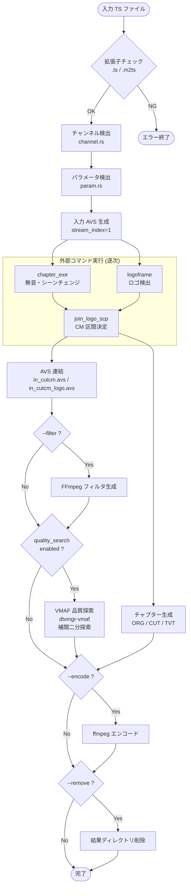

# dtvmgr-jlse Architecture

> 親ドキュメント: [IMPROVEMENT_PLAN.md](../../archive/IMPROVEMENT_PLAN.md) (アーカイブ)

## 1. 背景と目的

### 概要

`join_logo_scp_trial` (以下 jlse) は日本のテレビ放送録画 TS ファイルから CM (コマーシャル) を自動検出・除去する Node.js CLI オーケストレータである。以下の外部バイナリを順次呼び出し、TS ファイルの解析からエンコードまでを一括処理する:

| 外部バイナリ    | 役割                                    |
| --------------- | --------------------------------------- |
| `chapter_exe`   | 無音・シーンチェンジ検出                |
| `logoframe`     | ロゴフレーム検出                        |
| `join_logo_scp` | ロゴ + 無音情報を統合して CM 区間を決定 |
| `ffprobe`       | フレームレート・サンプルレート取得      |
| `ffmpeg`        | エンコード出力                          |

### 元実装

- リポジトリ: `JoinLogoScpTrialSetLinux/modules/join_logo_scp_trial/`
- 言語: Node.js (`yargs`, `csv-parse`, `fs-extra`, `jaconv`, `async`)
- 主要ソース: 13 ファイル (`src/jlse.js` + 5 command + 3 output + `settings.js` + `channel.js` + `param.js`)

### Rust 移植の現状

`dtvmgr-jlse` クレートとして段階的移植中:

- **Phase 1 (完了)**: チャンネル検出 (`channel.rs`) + パラメータ検出 (`param.rs`) + 型定義 (`types.rs`)
- **Phase 2-4**: 各モジュール仕様は下記のモジュール別ドキュメントを参照

---

## 2. 全体処理フロー

### パイプライン概要



---

## 3. モジュール構成

### モジュール別仕様ドキュメント

| モジュール      | ドキュメント                           | Phase | 状態     | 説明                                    |
| --------------- | -------------------------------------- | ----- | -------- | --------------------------------------- |
| チャンネル検出  | [channel.md](./channel.md)             | 1     | **完了** | CSV からの放送局検出                    |
| パラメータ検出  | [param.md](./param.md)                 | 1     | **完了** | JL パラメータ検出・マージ               |
| 設定・パス管理  | [settings.md](./settings.md)           | 2     | **完了** | OutputPaths, BinaryPaths, init          |
| 入力 AVS 生成   | [avs.md](./avs.md)                     | 2     | **完了** | createAvs テンプレート                  |
| chapter_exe     | [chapter_exe.md](./chapter_exe.md)     | 2     | **完了** | 無音・シーンチェンジ検出                |
| logoframe       | [logoframe.md](./logoframe.md)         | 2     | **完了** | ロゴ検出 + ロゴ選択                     |
| join_logo_scp   | [join_logo_scp.md](./join_logo_scp.md) | 2     | **完了** | CM 区間決定                             |
| ffprobe         | [ffprobe.md](./ffprobe.md)             | 2     | **完了** | メタ情報取得                            |
| AVS 連結        | [output_avs.md](./output_avs.md)       | 2     | **完了** | AVS ファイル連結                        |
| チャプター生成  | [chapter.md](./chapter.md)             | 3     | **完了** | TrimReader + CreateChapter + OutputData |
| パイプライン    | [pipeline.md](./pipeline.md)           | 3     | **完了** | オーケストレーション + CLI              |
| VMAF 品質探索   | [pipeline.md](./pipeline.md)           | 4     | **完了** | VMAF ベース品質パラメータ自動探索       |
| ffmpeg          | [ffmpeg.md](./ffmpeg.md)               | 4     | 未実装   | エンコード実行                          |
| FFmpeg フィルタ | [ffmpeg_filter.md](./ffmpeg_filter.md) | 4     | 未実装   | filter_complex 文字列生成               |

### Node.js → Rust マッピング

| Node.js ソース                   | 行数 | Rust モジュール            | 状態     |
| -------------------------------- | ---- | -------------------------- | -------- |
| `src/jlse.js`                    | 165  | `pipeline.rs` + CLI        | **完了** |
| `src/settings.js`                | 44   | `settings.rs`              | **完了** |
| `src/channel.js`                 | 130  | `channel.rs`               | **完了** |
| `src/param.js`                   | 96   | `param.rs`                 | **完了** |
| `src/command/chapterexe.js`      | 34   | `command/chapter_exe.rs`   | **完了** |
| `src/command/logoframe.js`       | 96   | `command/logoframe.rs`     | **完了** |
| `src/command/join_logo_frame.js` | 47   | `command/join_logo_scp.rs` | **完了** |
| `src/command/ffprobe.js`         | 43   | `command/ffprobe.rs`       | **完了** |
| `src/command/ffmpeg.js`          | 64   | `command/ffmpeg.rs`        | 未実装   |
| `src/output/avs.js`              | 37   | `output/avs.rs`            | **完了** |
| `src/output/chapter_jls.js`      | 520  | `output/chapter.rs`        | **完了** |
| `src/output/ffmpeg_filter.js`    | 46   | `output/ffmpeg_filter.rs`  | 未実装   |

### ディレクトリツリー (計画)

```
crates/dtvmgr-jlse/src/
├── lib.rs                  # Public API re-exports
├── types.rs                # Channel, Param, DetectionParam, JlseConfig (完了)
├── channel.rs              # チャンネル検出 (完了)
├── param.rs                # パラメータ検出 (完了)
├── settings.rs             # OutputPaths, init_output_paths()
├── avs.rs                  # 入力 AVS テンプレート生成
├── pipeline.rs             # 全ステップのオーケストレーション
├── command/
│   ├── mod.rs
│   ├── chapter_exe.rs      # chapter_exe 実行
│   ├── logoframe.rs        # logoframe 実行 + ロゴ選択
│   ├── join_logo_scp.rs    # join_logo_scp 実行
│   ├── ffprobe.rs          # ffprobe 実行
│   └── ffmpeg.rs           # ffmpeg エンコード実行
└── output/
    ├── mod.rs
    ├── avs.rs              # AVS ファイル連結
    ├── chapter.rs          # チャプター生成 (3 フォーマット)
    └── ffmpeg_filter.rs    # FFmpeg filter 文字列生成
```

---

## 4. 出力ディレクトリ構造

```
<result_dir>/<filename>/
├── in_org.avs                          # 入力 AVS (L-SMASH Works)
├── obs_chapterexe.txt                  # chapter_exe 出力
├── obs_logoframe.txt                   # logoframe テキスト出力
├── obs_logo_erase.avs                  # logoframe AVS 出力
├── obs_param.txt                       # マージ済みパラメータ情報
├── obs_jlscp.txt                       # join_logo_scp 構成解析結果
├── obs_cut.avs                         # Trim コマンド (カット指示)
├── in_cutcm.avs                        # in_org + obs_cut 連結
├── in_cutcm_logo.avs                   # in_org + obs_logo_erase + obs_cut 連結
├── ffmpeg.filter                       # FFmpeg filter_complex 文字列
├── obs_chapter_org.chapter.txt         # FFMETADATA1 全区間
├── obs_chapter_cut.chapter.txt         # FFMETADATA1 非カット区間
└── obs_chapter_tvtplay.chapter         # TVTPlay 形式
```

---

## 5. エラーハンドリング

### Node.js → Rust の方針

| Node.js パターン      | Rust パターン                            |
| --------------------- | ---------------------------------------- |
| `process.exit(code)`  | `anyhow::bail!()` / `Result` の伝播      |
| `console.error()`     | `tracing::error!()` / `tracing::warn!()` |
| Promise reject + exit | `async fn` → `Result<()>` + `?` 演算子   |
| `try/catch` + exit    | `.with_context()` + `?`                  |

### レイヤー別エラー戦略

| レイヤー           | 戦略                                              |
| ------------------ | ------------------------------------------------- |
| CSV パース         | `anyhow::Result` + `.with_context()` で行番号付き |
| ファイル I/O       | `.with_context()` でパス情報付き                  |
| 外部コマンド実行   | 終了コード確認 + `bail!` でコマンド名・コード付き |
| 正規表現マッチ失敗 | `debug!` ログ + `false` 返却 (致命的でない)       |
| パイプライン全体   | `main()` で `Result` をキャッチして終了コード設定 |

---

## 6. 依存クレート

### 既存

| クレート                | 用途               |
| ----------------------- | ------------------ |
| `anyhow`                | エラーハンドリング |
| `csv`                   | CSV パース         |
| `regex`                 | 正規表現           |
| `serde` / `serde_json`  | 設定の直列化       |
| `tracing`               | ログ出力           |
| `unicode-normalization` | NFKC 正規化        |

### 追加予定

| クレート       | 用途                          |
| -------------- | ----------------------------- |
| `clap`         | CLI 引数パーサー              |
| `dtvmgr-vmaf`  | VMAF ベース品質パラメータ探索 |

---

## 7. Phase 別実装計画

### Phase 1 (完了): チャンネル検出 + パラメータ検出

- [channel.md](./channel.md): `ChList.csv` パース + 優先度ベース検出
- [param.md](./param.md): `ChParamJL*.csv` パース + マージ検出
- `types.rs`: `Channel`, `Param`, `DetectionParam`, `JlseConfig`
- CLI サブコマンド: `dtvmgr jlse channel`, `dtvmgr jlse param`

### Phase 2: 設定 + AVS + コマンド実行 + AVS 連結

- [settings.md](./settings.md): `OutputPaths` + `init_output_paths()` + `BinaryPaths`
- [avs.md](./avs.md): 入力 AVS テンプレート生成 (`createAvs`)
- [chapter_exe.md](./chapter_exe.md): 無音・シーンチェンジ検出
- [logoframe.md](./logoframe.md): ロゴ検出 + ロゴファイル選択
- [join_logo_scp.md](./join_logo_scp.md): CM 区間決定
- [ffprobe.md](./ffprobe.md): メタ情報取得
- [output_avs.md](./output_avs.md): AVS ファイル連結

### Phase 3: チャプター生成 + パイプライン + CLI

- [chapter.md](./chapter.md): `TrimReader` + `CreateChapter` + `OutputData`
  - 状態機械ベースのチャプター生成アルゴリズム
  - 3 フォーマット出力 (ORG / CUT / TVT)
- [pipeline.md](./pipeline.md): 全ステップのオーケストレーション
- CLI サブコマンド: `dtvmgr jlse run`

### Phase 4: ffmpeg + フィルタ + クリーンアップ

- [ffmpeg.md](./ffmpeg.md): エンコード実行 + メタデータ付与
- [ffmpeg_filter.md](./ffmpeg_filter.md): ffmpeg `filter_complex` 文字列生成
- `--remove` オプション: 中間ファイル削除

---

## 8. テスト方針

### ユニットテスト

各モジュールのテスト方針は、それぞれのモジュール仕様ドキュメントを参照。

| 対象                                   | テスト内容                                                        |
| -------------------------------------- | ----------------------------------------------------------------- |
| [channel.md](./channel.md)             | CSV パース、優先度別マッチング、NFKC 正規化、括弧内検出           |
| [param.md](./param.md)                 | CSV パース、チャンネル一致、タイトル正規表現/部分一致、`@` クリア |
| `types.rs`                             | `Debug`/`Clone` derive 確認                                       |
| [settings.md](./settings.md)           | パス生成の正確性、ディレクトリ作成                                |
| [avs.md](./avs.md)                     | テンプレート文字列の正確性                                        |
| [chapter.md](./chapter.md)             | TrimReader パース、ChapterType 判定、チャプター名生成、ミリ秒変換 |
| [ffmpeg_filter.md](./ffmpeg_filter.md) | filter 文字列の構文正確性                                         |

### 統合テスト

- `tests/` ディレクトリにサンプル CSV + AVS + jlscp ファイルを配置
- パイプライン全体の結合テスト (外部バイナリはモック)

---

## 9. 検討事項

### 設計上の決定事項

| 項目                         | 方針                                                                      |
| ---------------------------- | ------------------------------------------------------------------------- |
| 外部コマンド実行方式         | `std::process::Command` による同期実行 (ライブラリクレートの軽量性を優先) |
| フレームレート               | チャプター生成は 29.97fps 固定 (元実装準拠)、フィルタ生成は動的取得       |
| `OutputPaths` のライフタイム | パイプライン開始時に一度生成し、全モジュールで共有                        |

### 元実装のバグ・改善点

| ファイル         | 問題                                                                                                                                                                            | 対応案                               |
| ---------------- | ------------------------------------------------------------------------------------------------------------------------------------------------------------------------------- | ------------------------------------ |
| `channel.js`     | 優先度 3, 4 の `if (priority < 3)` / `if (priority < 4)` の判定が逆 (priority が 3 未満の時に continue するので、priority 2 の候補がある時は priority 3 の検索がスキップされる) | Rust 版で修正済み                    |
| `channel.js`     | 優先度 4 の正規表現 `\|_${recognize}\| ${recognize}` に先頭の空 `\|` があり、空文字列にもマッチしうる                                                                           | Rust 版で修正済み                    |
| `chapter_jls.js` | フレームレートが 29.97fps (30000/1001) 固定で、BS プレミアムの 24fps コンテンツ等に対応できない                                                                                 | Phase 3 で ffprobe 値を使用に変更    |
| `ffmpeg.js`      | `spawnSync` で同期実行のため、エンコード中に他の処理ができない                                                                                                                  | `tokio::process::Command` で非同期化 |
| `param.js`       | `Object.keys(result) == 0` の比較は JavaScript では常に `false` (配列と数値の比較) だが、結果的に空オブジェクトでのみ期待通りに動作する                                         | Rust 版で `HashMap::is_empty()` 使用 |

### 未決定事項

| 項目                               | 選択肢                                                              |
| ---------------------------------- | ------------------------------------------------------------------- |
| `chapter_exe` / `logoframe` 並列化 | 入力が独立しているため並列実行可能だが、元実装は逐次実行            |
| `BinaryPaths` のデフォルト値       | 設定ファイルから読み込むか、`PATH` 環境変数から自動検出するか       |
| `obs_param.txt` のフォーマット     | 元実装は JSON (`Object.assign(result, channel)`) だが、必要性を検討 |
| チャプターの fps 動的化            | ffprobe で取得した値を使用するか、29.97fps 固定を維持するか         |
