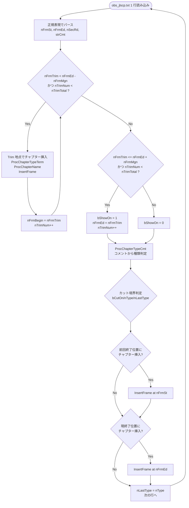

# Chapter Generation

> 親ドキュメント: [Architecture.md](./Architecture.md)

## ステータス

- **Phase**: 3
- **実装状態**: 未実装
- **Node.js ソース**: `src/output/chapter_jls.js` (520行)
- **Rust モジュール**: `crates/dtvmgr-jlse/src/output/chapter.rs`

## 概要

構成解析結果 (`obs_jlscp.txt`) と Trim 情報 (`obs_cut.avs`) からチャプターデータを生成する、パイプライン中で最も複雑なモジュール。3 段階 (TrimReader → CreateChapter → OutputData) で処理し、3 フォーマット (ORG / CUT / TVT) で出力する。

## 仕様

### 処理の 3 段階

1. **`TrimReader`**: `obs_cut.avs` から `Trim(start,end)` をパース
2. **`CreateChapter`**: 構成解析結果 (`obs_jlscp.txt`) と Trim 情報からチャプターデータを生成
3. **`OutputData`**: チャプターデータを 3 フォーマットで出力

### Stage 1: `TrimReader`

`obs_cut.avs` から `Trim(start,end)` コマンドをパースしてフレーム配列を作成する。

**正規表現**: `Trim\((\d+),(\d+)\)` (グローバルマッチ)

**処理**:

```
Trim(100,500)Trim(800,1200) → [100, 501, 800, 1201]
                                 ↑    ↑    ↑    ↑
                               start end+1 start end+1
```

- 開始フレームはそのまま格納
- 終了フレームは `+1` して格納 (開始位置表現に統一)
- 配列の偶数インデックス = Trim 開始、奇数インデックス = Trim 終了

### Stage 2: `CreateChapter`

状態機械ベースのアルゴリズムで、Trim 位置と構成解析結果を照合してチャプターを生成する。

#### 初期状態

| 変数名       | 初期値 | 説明                                              |
| ------------ | ------ | ------------------------------------------------- |
| `nFrmMgn`    | `30`   | Trim と構成位置を同一とみなすフレーム数 (約 1 秒) |
| `nTrimNum`   | `0/1`  | 現在の Trim 位置番号 (先頭が `<=30` なら `1`)     |
| `nFrmBegin`  | `0`    | 次のチャプター開始地点                            |
| `nPart`      | `0`    | 現在のパート番号 (0=A, 1=B, ...)                  |
| `bPartExist` | `0`    | 現在のパートに要素が存在するか                    |
| `nLastType`  | `0`    | 直前の構成種類                                    |
| `bShowOn`    | `1`    | 最初は必ず表示                                    |

#### `nTrimNum` の偶奇

- 偶数: 次の Trim 開始位置を検索中
- 奇数: 次の Trim 終了位置を検索中
- `bCutOn = (nTrimNum + 1) % 2`: `1` でカット状態

#### 構成解析行パース (`obs_jlscp.txt` の正規表現)

```
/^\s*(\d+)\s+(\d+)\s+(\d+)\s+([-\d]+)\s+(\d+).*:(\S+)/
```

| キャプチャ | 変数名   | 説明         |
| ---------- | -------- | ------------ |
| `$1`       | `nFrmSt` | 開始フレーム |
| `$2`       | `nFrmEd` | 終了フレーム |
| `$3`       | `nSecRd` | 期間秒数     |
| `$4`       | (未使用) | ---          |
| `$5`       | (未使用) | ---          |
| `$6`       | `strCmt` | 構成コメント |

#### メインループ処理フロー



### `ProcChapterTypeTerm`: フレーム区間からの種類判定

開始・終了フレームから秒数を計算し、種類を判定する。

**秒数計算** (`ProcGetSec`):

```javascript
// 29.97fps 固定
nSecRd = parseInt((nFrame * 1001 + 30000 / 2) / 30000)
```

**種類判定**:

| 条件       | `nType` | 意味                    |
| ---------- | ------- | ----------------------- |
| 秒数 == 0  | `12`    | 空欄 (無視)             |
| 秒数 == 90 | `11`    | part 扱いの判断迷う構成 |
| 秒数 < 15  | `2`     | part 扱いの判断迷う構成 |
| その他     | `0`     | 通常                    |

### `ProcChapterTypeCmt`: コメント文字列からの種類判定

`obs_jlscp.txt` の構成コメントから種類を判定する。

| コメント内容        | `nType` | 意味                        |
| ------------------- | ------- | --------------------------- |
| `Trailer(cut)` 含む | `0`     | 通常 (カット済みトレイラー) |
| `Trailer` 含む      | `10`    | 単独構成 (トレイラー)       |
| `Sponsor` 含む      | `11`    | part 判断迷う単独構成       |
| `Endcard` 含む      | `11`    | 同上                        |
| `Edge` 含む         | `11`    | 同上                        |
| `Border` 含む       | `11`    | 同上                        |
| `CM` 含む           | `1`     | 明示的に CM                 |
| 秒数 == 90          | `11`    | 90 秒は Sponsor 相当        |
| 秒数 == 60          | `10`    | 60 秒は単独構成             |
| 秒数 < 15           | `2`     | 短い区間                    |
| その他              | `0`     | 通常                        |

### `nType` 値の意味一覧

| `nType` | 意味                        |
| ------- | --------------------------- |
| `0`     | 通常                        |
| `1`     | 明示的に CM                 |
| `2`     | part 扱いの判断迷う構成     |
| `10`    | 単独構成                    |
| `11`    | part 扱いの判断迷う単独構成 |
| `12`    | 空欄 (0 秒区間)             |

### `ProcChapterName`: チャプター名生成

| `bCutOn`     | `nType` | チャプター名                             |
| ------------ | ------- | ---------------------------------------- |
| `0` (残す)   | `>= 10` | `"{パート文字}{秒数}Sec"` (例: `A90Sec`) |
| `0`          | その他  | `"{パート文字}"` (例: `A`, `B`)          |
| `1` (カット) | `>= 10` | `"X{秒数}Sec"` (例: `X60Sec`)            |
| `1`          | `1`     | `"XCM"`                                  |
| `1`          | その他  | `"X"`                                    |

**パート文字**: `A` から `W` まで順番に割り当て (23 文字で `%` 循環)。
`nPart % 23` で文字コードを計算: `'A'.charCodeAt(0) + (nPart % 23)`

**パート更新ロジック**:

- カットしない部分で `nType` が `11` or `2`: `bPartExist` を `1` に設定 (迷い状態)
- カットしない部分で `nType` が `12` 以外: `bPartExist` を `2` に設定 (確定)
- カット部分で `bPartExist > 0` かつ `nType != 12`: `nPart++`, `bPartExist = 0` (次のパートへ)

### `InsertFrame`: フレーム → ミリ秒変換

```javascript
// 29.97fps 固定
var nTmp = parseInt((nFrame * 1001 + 30 / 2) / 30);
```

数式: `msec = floor((frame * 1001 + 15) / 30)`

### Stage 3: `OutputData` — 3 フォーマット出力

| モード     | 定数 | ファイル名                    | 形式                 |
| ---------- | ---- | ----------------------------- | -------------------- |
| `MODE_ORG` | `0`  | `obs_chapter_org.chapter.txt` | FFMETADATA1 全区間   |
| `MODE_CUT` | `1`  | `obs_chapter_cut.chapter.txt` | FFMETADATA1 非カット |
| `MODE_TVT` | `2`  | `obs_chapter_tvtplay.chapter` | TVTPlay 形式         |

**重複除去**: 隣接チャプター間の時間差が `MSEC_DIVMIN = 100` ms 未満の場合、後のチャプターをスキップする。

**FFMETADATA1 形式** (`GetDispChapter`):

```
;FFMETADATA1

[CHAPTER]
TIMEBASE=1/1000
# 00:01:23.456
START=83456
END=83457
title=A
```

**TVTPlay 形式**:

```
c-{msec1}c{name1}-{msec2}c{name2}-...-0e-c
```

- 先頭: `c-`
- 各チャプター: `{累積ミリ秒}c{チャプター名}-`
- 末尾: `0e-c` (カット状態なら `0e{PREFIX_TVTO}-c`)
- チャプター名中の `-` は `－` (全角) に変換
- カット開始: 名前に `ix` プレフィックス
- カット終了: 名前に `ox` プレフィックス

## 型定義

```rust
/// A single trim segment parsed from obs_cut.avs.
pub struct TrimSegment {
    /// Start frame (inclusive).
    pub start: u32,
    /// End frame (exclusive, already +1 adjusted).
    pub end: u32,
}

/// A parsed entry from obs_jlscp.txt.
pub struct JlscpEntry {
    /// Start frame.
    pub frame_start: u32,
    /// End frame.
    pub frame_end: u32,
    /// Duration in seconds.
    pub duration_sec: u32,
    /// Structure comment (e.g. "CM", "Sponsor").
    pub comment: String,
}

/// Chapter type classification.
pub enum ChapterType {
    /// Normal content.
    Normal,          // 0
    /// Explicit CM.
    Cm,              // 1
    /// Ambiguous (not clearly part or CM).
    Ambiguous,       // 2
    /// Standalone section.
    Standalone,      // 10
    /// Ambiguous standalone section.
    AmbiguousStandalone, // 11
    /// Empty (zero duration).
    Empty,           // 12
}

/// A single chapter entry.
pub struct ChapterEntry {
    /// Position in milliseconds.
    pub msec: u64,
    /// Whether this section is cut.
    pub cut: bool,
    /// Chapter display name.
    pub name: String,
}

/// Complete chapter data for output.
pub struct ChapterData {
    pub entries: Vec<ChapterEntry>,
}
```

## データ仕様参照

### `obs_jlscp.txt` の行フォーマット

→ [join_logo_scp.md](./join_logo_scp.md) の `obs_jlscp.txt` セクション参照

### `obs_cut.avs` の `Trim()` コマンドフォーマット

```
Trim(100,500)Trim(800,1200)
```

- 1 行に複数の `Trim()` コマンドが連結される
- `Trim(start,end)`: start, end はフレーム番号 (0-indexed)

## テスト方針

- TrimReader パース: `Trim(start,end)` の正規表現マッチと `end+1` 変換
- ChapterType 判定: 秒数・コメント文字列からの種類判定
- チャプター名生成: `bCutOn` / `nType` の組み合わせによる名前生成
- ミリ秒変換: `InsertFrame` 数式の正確性
- 3 フォーマット出力: FFMETADATA1 と TVTPlay の出力フォーマット検証
- テストデータ: 既知の `obs_cut.avs` / `obs_jlscp.txt` サンプルから期待出力を検証

## 依存モジュール

- [settings.md](./settings.md) — `OutputPaths` (出力ファイルパス)
- [join_logo_scp.md](./join_logo_scp.md) — `obs_jlscp.txt` フォーマット
- [ffprobe.md](./ffprobe.md) — `VideoMetadata` (fps 動的化時)
