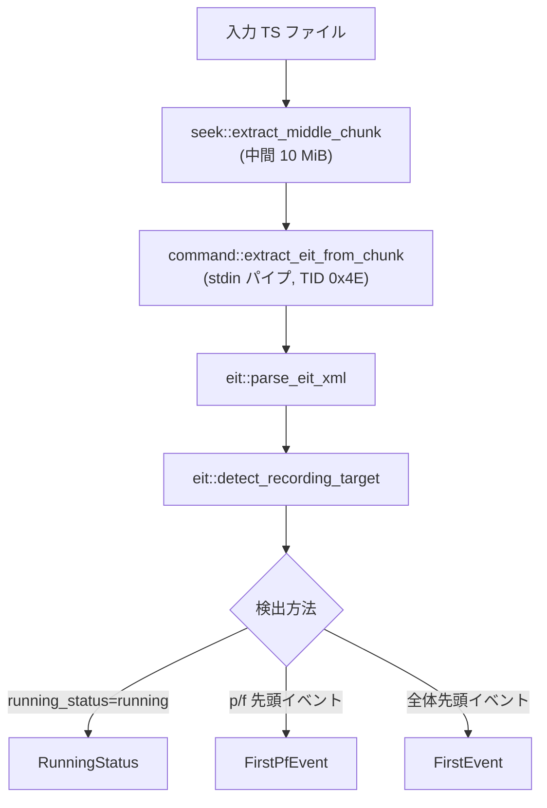
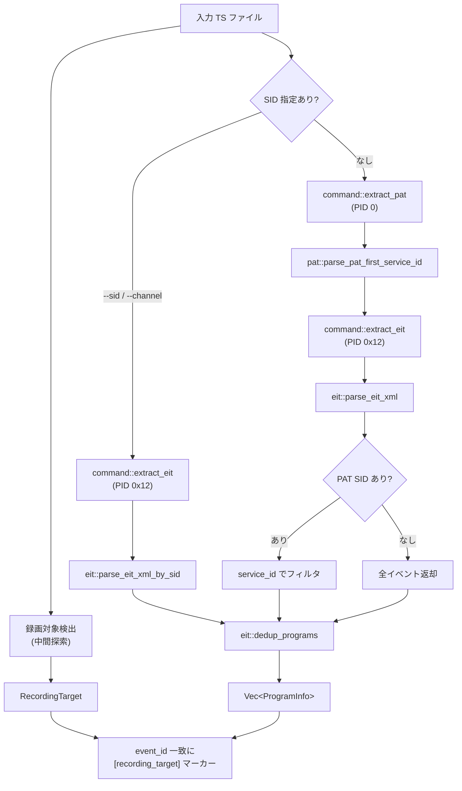

# dtvmgr-tsduck Architecture

> 親ドキュメント: [IMPROVEMENT_PLAN.md](../../IMPROVEMENT_PLAN.md)
>
> 関連ドキュメント:
>
> - [command.md](./command.md)
> - [eit.md](./eit.md)
> - [pat.md](./pat.md)
> - [seek.md](./seek.md)

## 概要

MPEG-TS 録画ファイルから番組情報を抽出するクレート。外部ツール `TSDuck` の `tstables` / `tsp` コマンドをラップし、出力される XML を構造化データにパースする。

## ステータス

- **実装状態**: 完了
- **Rust クレート**: `crates/dtvmgr-tsduck`

## モジュール構成

| モジュール | 責務                                                       |
| ---------- | ---------------------------------------------------------- |
| `command`  | `TSDuck` 外部コマンドの実行とキャプチャ (stdin パイプ対応) |
| `eit`      | EIT (Event Information Table) XML パース & 録画対象検出    |
| `pat`      | PAT (Program Association Table) XML パース                 |
| `seek`     | TS ファイル中間チャンク抽出 (パケット境界アライメント)     |

## 処理フロー

### 録画対象検出 (Amatsukaze 方式)

ファイル中間から EIT p/f を抽出し、`running_status` で録画対象を特定する:

### 全体フロー

## 依存関係

### 外部ツール

| バイナリ   | 用途                       | PID                     |
| ---------- | -------------------------- | ----------------------- |
| `tstables` | テーブル XML 抽出          | `0` (PAT), `0x12` (EIT) |
| `tsp`      | サービス ID フィルタリング | —                       |

### Rust クレート

| クレート    | 用途                              |
| ----------- | --------------------------------- |
| `anyhow`    | エラーハンドリング                |
| `quick-xml` | XML デシリアライズ (`serde` 連携) |
| `serde`     | デシリアライズフレームワーク      |
| `tracing`   | コマンド実行ログ                  |

### 内部依存

- `dtvmgr-cli` がこのクレートを `jlse tsduck` サブコマンドで利用
- `dtvmgr-jlse` のチャンネル検出 (`channel.rs`) と連携して SID を解決

## テスト方針

- **引数構築**: 各 `build_*_args` 関数が正しい引数配列を返すこと
- **XML パース**: EIT / PAT の各パターン (10 進数 / 16 進数 SID、複数イベント、空テーブル) をインライン XML でテスト
- **コマンド実行**: シェルスクリプトモックで成功 / 失敗パスを検証
- **Miri**: コマンド実行テストと `tempfile` テストは `#[cfg_attr(miri, ignore)]` で除外。純粋パースロジックは Miri 互換
