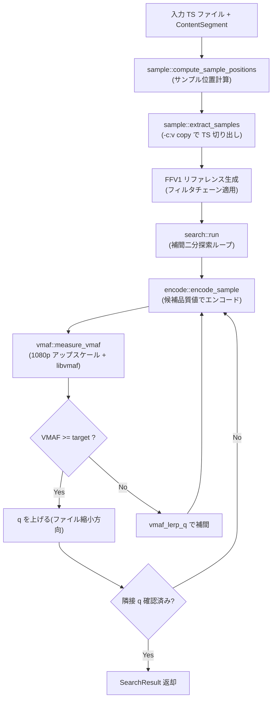

# dtvmgr-vmaf Architecture

> 関連ドキュメント:
>
> - [encoder.md](./encoder.md)
> - [search.md](./search.md)
> - [sample.md](./sample.md)
> - [vmaf.md](./vmaf.md)

## 概要

VMAF ベースの品質パラメータ自動探索クレート。[ab-av1](https://github.com/alexheretic/ab-av1) に着想を得た補間二分探索アルゴリズムにより、目標 VMAF スコア(デフォルト `93.0`)を達成する最適な CRF / ICQ 値を自動決定する。

他の `dtvmgr-*` クレートへの依存は持たず、単体で利用可能。呼び出し側が CM カット済みのコンテンツ区間(`ContentSegment`)を渡すことで、本編区間のみをサンプリング対象とする。

## ステータス

- **実装状態**: 完了
- **Rust クレート**: `crates/dtvmgr-vmaf`

## モジュール構成

| モジュール | 責務 |
| ---------- | ---- |
| `lib`      | 公開 API (`find_optimal_quality()`) と型の再エクスポート |
| `types`    | `SearchConfig`, `EncoderConfig`, `QualityParam`, `SampleConfig` 等の型定義 |
| `encoder`  | エンコーダプリセット(6 種)と品質空間変換(`QualityConverter`) |
| `sample`   | TS からのサンプル抽出と FFV1 リファレンス生成 |
| `encode`   | 候補品質値でのサンプルエンコード |
| `vmaf`     | ffmpeg `libvmaf` フィルタによる VMAF スコア計測 |
| `search`   | 補間二分探索の実行ループと収束判定 |

## 処理フロー



## 公開 API

```rust
pub fn find_optimal_quality(
    config: &SearchConfig,
    on_progress: Option<&dyn Fn(SearchProgress)>,
) -> Result<SearchResult>
```

`SearchConfig` でエンコーダ設定、目標 VMAF、サンプリング条件を指定し、`SearchResult` で最適品質値・達成 VMAF・予測サイズ比を返す。`on_progress` コールバックにより進捗(サンプル抽出、エンコード、スコアリング、イテレーション結果)を通知する。

## 依存関係

### 外部ツール

| バイナリ | 用途 |
| -------- | ---- |
| `ffmpeg` | サンプル抽出、エンコード、VMAF 計測(libvmaf フィルタ) |

### Rust クレート

| クレート  | 用途 |
| --------- | ---- |
| `anyhow`  | エラーハンドリング |
| `tracing` | 構造化ログ |

### 内部依存

- 他の `dtvmgr-*` クレートへの依存は**なし**(スタンドアロン)
- `dtvmgr-jlse` が本クレートを呼び出して最適品質値を取得する

## テスト方針

- **サンプル位置計算**: `compute_sample_positions` の各パターン(長尺、短尺、複数セグメント、スキップ境界)をユニットテスト
- **品質空間変換**: `QualityConverter` のラウンドトリップ、`vmaf_lerp_q` の補間精度とクランプをテスト
- **探索結果選択**: `select_best_result` の優先度ロジック(目標達成、トレランス内、エラー)をテスト
- **外部コマンド**: モック `ffmpeg` シェルスクリプトで抽出・エンコード・VMAF 計測を結合テスト
- **Miri**: 外部コマンド系テストは `#[cfg_attr(miri, ignore)]` で除外
