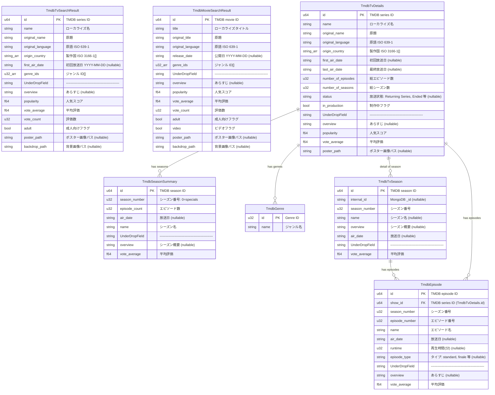

# ER Diagram — Syoboi / TMDB Full Schema

> **Purpose**: DB 設計検討のための全フィールド ER 図。
> 次のステップで不要フィールド削除とリレーショナル設計を行う。

## Syoboi Calendar API

## TMDB API

## Local DB Tables

> API レスポンスに TMDB マッチング情報を結合したローカル DB テーブル。
> cache として機能し、既存の放送中 TID/PID は対応済みのため TMDB API 呼び出しを大幅に削減できる。

