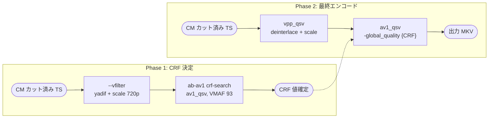
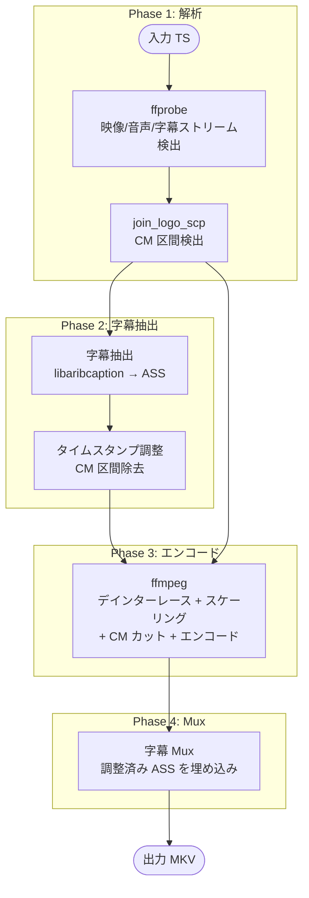
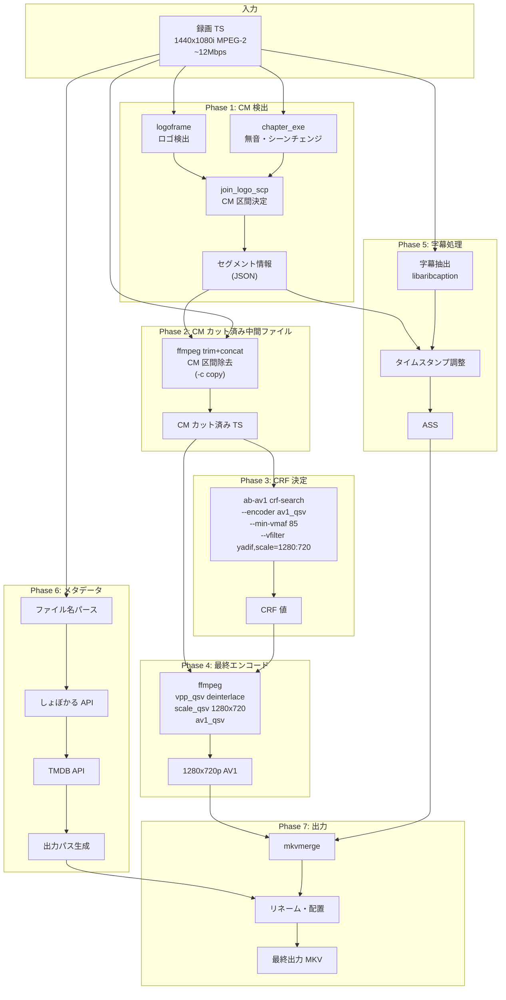

# ffmpeg ネイティブ フレームカット設計

> 親ドキュメント: [IMPROVEMENT_PLAN.md](../IMPROVEMENT_PLAN.md)

## 背景と目的

### 現状の問題

現在の jlse は AVS (AviSynth+) ファイルを使用して CM カットを実現している:

```
join_logo_scp → obs_cut.avs (Trim命令) → ffmpeg -i in_cutcm.avs → 出力
```

この方式には以下の問題がある:

| 問題               | 影響                                                                         |
| ------------------ | ---------------------------------------------------------------------------- |
| AviSynth+ 依存     | Windows では avsplus.dll が必要、Linux では L-SMASH Works 等の追加設定が必要 |
| 環境構築の複雑化   | Docker イメージに AviSynth+ + L-SMASH Works をビルドする必要あり             |
| デバッグ困難       | AVS スクリプトエラーが ffmpeg 側で不明瞭なエラーとして表出                   |
| フレームレート固定 | 現行実装は 29.97fps 固定で変換                                               |

### 目標

ffmpeg のネイティブ機能のみで CM カットを実現し、AviSynth+ 依存を排除する。

---

## 日本地上波放送の映像仕様

### 実際のスペック

| 項目             | 値                        | 備考                                          |
| ---------------- | ------------------------- | --------------------------------------------- |
| コンテナ         | MPEG-2 TS                 | ISDB-T 規格                                   |
| 映像コーデック   | MPEG-2 Video              | H.264 ではない                                |
| 映像解像度       | **1440x1080**             | 1920x1080 ではない (アナモルフィック 4:3 PAR) |
| スキャン方式     | 1080i                     | インターレース                                |
| フレームレート   | 29.97fps (59.94 fields/s) |                                               |
| 映像ビットレート | 平均 12Mbps, 最大 17Mbps  | 局・番組により変動                            |
| 総帯域           | 約 18Mbps                 | 映像+音声+データ放送                          |
| 音声コーデック   | AAC-LC                    |                                               |
| 音声ビットレート | 256kbps (2ch ステレオ)    | デュアルモノの場合あり                        |

### 解像度の実態

```
放送波の実データ:
  水平: 1440 ピクセル (1920 ではない)
  垂直: 1080 ライン (インターレース)

表示時:
  1440x1080 を 16:9 に引き伸ばし
  → ピクセルアスペクト比 (PAR) = 4:3
  → 表示アスペクト比 (DAR) = 16:9
```

### 出力解像度の選択

| 変換先       | 水平処理                  | 垂直処理  | 評価                             |
| ------------ | ------------------------- | --------- | -------------------------------- |
| 1920x1080    | 1440→1920 **(+33% 補間)** | 1080 維持 | ❌ 存在しない情報を補間          |
| 1440x1080    | 維持                      | 維持      | △ 奇妙な解像度、プレイヤー互換性 |
| **1280x720** | 1440→1280 **(-11%)**      | 1080→720  | ✅ 推奨: 情報集約                |

### 1280x720 を推奨する理由

1. **ソースに 1920 の情報がない**
   - 水平解像度は元々 1440
   - 1920 にアップスケールしても補間ピクセルが増えるだけ

2. **インターレースの実効解像度**
   - 1080i はフレームごとに 540 ライン
   - 動きのあるシーンでは垂直解像度が実質 540p 相当
   - 720p はデインターレース後の実効解像度に近い

3. **MPEG-2 圧縮の品質限界**
   - 12Mbps MPEG-2 にはブロックノイズ・モスキートノイズが含まれる
   - ダウンスケールでノイズが目立ちにくくなる

4. **エンコード効率**
   - 720p は 1080p の約 44% のピクセル数 ((1280×720)/(1920×1080))
   - 同じ CRF でファイルサイズが小さくなる
   - 同じビットレートならより高品質

5. **VMAF 測定の一貫性**
   - 720p 同士の比較で適切なスコアが得られる
   - 1080p アップスケールとの比較は不正確

### アニメコンテンツの場合

アニメは制作解像度が異なる場合がある:

| 制作年代     | 典型的な制作解像度 | 推奨出力       |
| ------------ | ------------------ | -------------- |
| 2000年代前半 | 960x540 以下       | 720p で十分    |
| 2000年代後半 | 1280x720           | 720p           |
| 2010年代以降 | 1920x1080          | ソース品質次第 |

> **注意:** 放送波の解像度 (1440x1080) と制作解像度は異なる。
> 1080p 制作でも放送時に 1440x1080 に縮小されている。

---

## ffmpeg でのフレーム指定カット方式

### 方式比較

| 方式                                   | 概要                          | メリット           | デメリット                         |
| -------------------------------------- | ----------------------------- | ------------------ | ---------------------------------- |
| **A. select フィルタ**                 | フレーム番号で選択            | 単一パス、シンプル | 複雑な式が長くなる、音声同期に注意 |
| **B. trim + concat フィルタ**          | 区間ごとに trim → concat      | 柔軟、音声同期容易 | filter_complex が複雑              |
| **C. セグメント抽出 + concat demuxer** | 区間ごとにファイル分割 → 結合 | 無劣化結合可能     | 中間ファイル、キーフレーム制約     |
| **D. -ss/-to による時間指定**          | 時間ベースでシーク            | シンプル           | フレーム精度が出ない               |

### 推奨: 方式 B (trim + concat フィルタ)

理由:

1. フレーム精度のカットが可能
2. 映像・音声の同期が filter_complex 内で完結
3. 中間ファイル不要
4. join_logo_scp の出力 (フレーム番号) から直接変換可能

---

## 方式 B: trim + concat フィルタ 詳細設計

### 基本構造

```bash
ffmpeg -i input.ts -filter_complex "
  [0:v]split=3[v0][v1][v2];
  [0:a]asplit=3[a0][a1][a2];
  [v0]trim=start_frame=0:end_frame=1234,setpts=PTS-STARTPTS[vout0];
  [a0]atrim=start_frame=0:end_frame=1234,asetpts=PTS-STARTPTS[aout0];
  [v1]trim=start_frame=2000:end_frame=3456,setpts=PTS-STARTPTS[vout1];
  [a1]atrim=start_frame=2000:end_frame=3456,asetpts=PTS-STARTPTS[aout1];
  [v2]trim=start_frame=5000:end_frame=8999,setpts=PTS-STARTPTS[vout2];
  [a2]atrim=start_frame=5000:end_frame=8999,asetpts=PTS-STARTPTS[aout2];
  [vout0][aout0][vout1][aout1][vout2][aout2]concat=n=3:v=1:a=1[vout][aout]
" -map "[vout]" -map "[aout]" output.mkv
```

### 問題点: trim の start_frame/end_frame

**重要:** ffmpeg の `trim` フィルタは `start_frame`/`end_frame` をサポートするが、
実際には **PTS (Presentation Time Stamp) ベース** で動作する。

フレーム番号を正確に指定するには、フレームレートから時間に変換する必要がある:

```
start_time = start_frame / fps
end_time = end_frame / fps
```

### 改良版: 時間ベース trim

```bash
# fps = 29.97 の場合
# frame 0-1234 → 0s - 41.174s
# frame 2000-3456 → 66.733s - 115.315s
# frame 5000-8999 → 166.833s - 300.233s

ffmpeg -i input.ts -filter_complex "
  [0:v]split=3[v0][v1][v2];
  [0:a]asplit=3[a0][a1][a2];
  [v0]trim=start=0:end=41.208,setpts=PTS-STARTPTS[vout0];
  [a0]atrim=start=0:end=41.208,asetpts=PTS-STARTPTS[aout0];
  [v1]trim=start=66.733:end=115.349,setpts=PTS-STARTPTS[vout1];
  [a1]atrim=start=66.733:end=115.349,asetpts=PTS-STARTPTS[aout1];
  [v2]trim=start=166.833:end=300.267,setpts=PTS-STARTPTS[vout2];
  [a2]atrim=start=166.833:end=300.267,asetpts=PTS-STARTPTS[aout2];
  [vout0][aout0][vout1][aout1][vout2][aout2]concat=n=3:v=1:a=1[vout][aout]
" -map "[vout]" -map "[aout]" output.mkv
```

---

## 方式 A: select フィルタ (代替案)

よりシンプルだが、セグメントが多い場合に式が長くなる:

```bash
ffmpeg -i input.ts -filter_complex "
  [0:v]select='between(n,0,1234)+between(n,2000,3456)+between(n,5000,8999)',setpts=N/FRAME_RATE/TB[vout];
  [0:a]aselect='between(n,0,1234)+between(n,2000,3456)+between(n,5000,8999)',asetpts=N/SR/TB[aout]
" -map "[vout]" -map "[aout]" output.mkv
```

**注意点:**

- `setpts=N/FRAME_RATE/TB` でタイムスタンプをリセット
- `asetpts=N/SR/TB` で音声タイムスタンプをリセット (SR = sample rate)
- `FRAME_RATE` は入力の実際の fps に置換が必要

---

## 実装設計

### 出力形式の選択

join_logo_scp の出力形式を拡張し、AVS 以外の形式もサポート:

```rust
enum CutOutputFormat {
    /// 従来の AVS 形式 (AviSynth+ 互換)
    Avs,
    /// ffmpeg filter_complex 形式
    FfmpegFilter,
    /// JSON 形式 (汎用)
    Json,
}
```

### セグメント情報の中間表現

```rust
/// CM カット後のセグメント情報
#[derive(Debug, Clone, Serialize, Deserialize)]
struct Segment {
    /// 開始フレーム番号 (0-indexed)
    start_frame: u64,
    /// 終了フレーム番号 (exclusive)
    end_frame: u64,
    /// セグメント種別 (本編/CM/不明)
    segment_type: SegmentType,
}

#[derive(Debug, Clone, Serialize, Deserialize)]
enum SegmentType {
    /// 本編 (出力に含める)
    Main,
    /// CM (出力から除外)
    Commercial,
    /// 境界不確定
    Uncertain,
}

/// カット情報全体
#[derive(Debug, Clone, Serialize, Deserialize)]
struct CutInfo {
    /// 入力ファイルパス
    input_path: PathBuf,
    /// フレームレート
    fps: f64,
    /// 総フレーム数
    total_frames: u64,
    /// 本編セグメント一覧 (CM 除外済み)
    segments: Vec<Segment>,
}
```

### filter_complex 生成

```rust
impl CutInfo {
    /// ffmpeg filter_complex 文字列を生成
    pub fn to_ffmpeg_filter(&self) -> String {
        let n = self.segments.len();
        if n == 0 {
            return String::new();
        }

        let mut filter = String::new();

        // 1. split/asplit でストリームを分岐
        filter.push_str(&format!("[0:v]split={}{};\n",
            n,
            (0..n).map(|i| format!("[v{}]", i)).collect::<String>()
        ));
        filter.push_str(&format!("[0:a]asplit={}{};\n",
            n,
            (0..n).map(|i| format!("[a{}]", i)).collect::<String>()
        ));

        // 2. 各セグメントを trim
        for (i, seg) in self.segments.iter().enumerate() {
            let start_time = seg.start_frame as f64 / self.fps;
            let end_time = seg.end_frame as f64 / self.fps;

            filter.push_str(&format!(
                "[v{}]trim=start={:.6}:end={:.6},setpts=PTS-STARTPTS[vout{}];\n",
                i, start_time, end_time, i
            ));
            filter.push_str(&format!(
                "[a{}]atrim=start={:.6}:end={:.6},asetpts=PTS-STARTPTS[aout{}];\n",
                i, start_time, end_time, i
            ));
        }

        // 3. concat で結合
        let concat_inputs: String = (0..n)
            .map(|i| format!("[vout{}][aout{}]", i, i))
            .collect();
        filter.push_str(&format!(
            "{}concat=n={}:v=1:a=1[vout][aout]",
            concat_inputs, n
        ));

        filter
    }

    /// select フィルタ形式で生成 (セグメント数が少ない場合向け)
    pub fn to_ffmpeg_select(&self) -> String {
        if self.segments.is_empty() {
            return String::new();
        }

        let select_expr: String = self.segments.iter()
            .map(|seg| format!("between(n\\,{}\\,{})", seg.start_frame, seg.end_frame - 1))
            .collect::<Vec<_>>()
            .join("+");

        format!(
            "[0:v]select='{}',setpts=N/FRAME_RATE/TB[vout];\n\
             [0:a]aselect='{}',asetpts=N/SR/TB[aout]",
            select_expr, select_expr
        )
    }
}
```

### JSON 出力形式

汎用性のため、JSON 形式でも出力可能にする:

```json
{
	"input_path": "/path/to/input.ts",
	"fps": 29.97,
	"total_frames": 123456,
	"segments": [
		{ "start_frame": 0, "end_frame": 1234, "type": "main" },
		{ "start_frame": 2000, "end_frame": 3456, "type": "main" },
		{ "start_frame": 5000, "end_frame": 8999, "type": "main" }
	]
}
```

---

## 従来 AVS 形式との互換

### obs_cut.avs パーサ

既存の obs_cut.avs を読み込んで `CutInfo` に変換:

```rust
/// obs_cut.avs から Trim 情報を抽出
fn parse_avs_trim(avs_content: &str) -> Result<Vec<Segment>> {
    // 正規表現: Trim(start, end) または Trim(start,end)
    let re = Regex::new(r"Trim\s*\(\s*(\d+)\s*,\s*(\d+)\s*\)")?;

    let mut segments = Vec::new();
    for cap in re.captures_iter(avs_content) {
        let start: u64 = cap[1].parse()?;
        let end: u64 = cap[2].parse()?;
        segments.push(Segment {
            start_frame: start,
            end_frame: end + 1,  // AVS の end は inclusive なので +1
            segment_type: SegmentType::Main,
        });
    }

    Ok(segments)
}
```

### AVS 出力 (後方互換)

```rust
impl CutInfo {
    /// AVS 形式で出力 (後方互換用)
    pub fn to_avs(&self, input_avs: &str) -> String {
        let mut avs = String::new();

        // 入力 AVS をインポート
        avs.push_str(&format!("Import(\"{}\")\n\n", input_avs));

        // Trim 命令を生成
        let trims: Vec<String> = self.segments.iter()
            .map(|seg| format!("Trim({}, {})", seg.start_frame, seg.end_frame - 1))
            .collect();

        avs.push_str(&trims.join(" ++ "));
        avs.push('\n');

        avs
    }
}
```

---

## CLI インターフェース

```bash
# ffmpeg filter 形式で出力
jlse-rs cut --input result/obs_cut.avs --format ffmpeg-filter --fps 29.97 > filter.txt

# JSON 形式で出力
jlse-rs cut --input result/obs_cut.avs --format json --fps 29.97 > cut_info.json

# 直接 ffmpeg 実行
jlse-rs encode --input input.ts --cut-format ffmpeg-filter --output output.mkv

# 従来の AVS 形式 (後方互換)
jlse-rs encode --input input.ts --cut-format avs --output output.mkv
```

---

## フレームレート検出

現行実装の 29.97fps 固定問題を解決:

```rust
/// ffprobe でフレームレートを取得
async fn detect_fps(input_path: &Path) -> Result<f64> {
    let output = Command::new("ffprobe")
        .args([
            "-v", "quiet",
            "-select_streams", "v:0",
            "-show_entries", "stream=r_frame_rate",
            "-of", "csv=p=0",
        ])
        .arg(input_path)
        .output()
        .await?;

    // 出力例: "30000/1001" (= 29.97fps) または "24/1" (= 24fps)
    let fps_str = String::from_utf8(output.stdout)?;
    parse_fps_fraction(&fps_str.trim())
}

fn parse_fps_fraction(s: &str) -> Result<f64> {
    if let Some((num, den)) = s.split_once('/') {
        let numerator: f64 = num.parse()?;
        let denominator: f64 = den.parse()?;
        Ok(numerator / denominator)
    } else {
        Ok(s.parse()?)
    }
}
```

---

## 検討事項

### 実装優先度

- [ ] 方式 B (trim + concat) をデフォルトとするか、方式 A (select) とするか
- [ ] セグメント数の閾値 (例: 10 以上なら方式 B、それ以下なら方式 A)

### エッジケース

- [ ] 音声のみ/映像のみのストリーム処理
- [ ] 複数音声トラック (主音声・副音声) の同期
- [ ] 可変フレームレート (VFR) ソースの処理
- [ ] インターレース素材の処理 (フィールド単位 vs フレーム単位)

### パフォーマンス

- [ ] split/asplit のオーバーヘッド (メモリ使用量)
- [ ] セグメント数が多い場合の filter_complex パース時間
- [ ] 方式 C (セグメント抽出 + concat demuxer) との比較ベンチマーク

### 後方互換

- [ ] AVS 形式出力のサポート継続期間
- [ ] 既存ワークフローからの移行ガイド

---

## 参考資料

- [ffmpeg trim filter](https://ffmpeg.org/ffmpeg-filters.html#trim)
- [ffmpeg select filter](https://ffmpeg.org/ffmpeg-filters.html#select_002c-aselect)
- [ffmpeg concat filter](https://ffmpeg.org/ffmpeg-filters.html#concat)
- [ffmpeg concat demuxer](https://ffmpeg.org/ffmpeg-formats.html#concat)

---

## インターレース映像の処理

日本の地上波放送は 1080i (インターレース) で送出されるため、特別な考慮が必要。

### ab-av1 / VMAF とインターレース

**問題:**

- VMAF はリファレンスと distorted 映像で**スキャンモードの一致**が必要
- インターレースソース → プログレッシブエンコードの比較では、リファレンス側もデインターレースが必要
- [VMAF Issue #86](https://github.com/Netflix/vmaf/issues/86): VMAF はインターレース用にトレーニングされていないため、スコアは参考値

**ab-av1 の現状:**

- [Issue #277](https://github.com/alexheretic/ab-av1/issues/277) でインターレース対応が議論中
- ab-av1 自体はデインターレースを自動で行わない
- `--vfilter` でエンコード前フィルタ、`--reference-vfilter` で VMAF リファレンス用フィルタを指定

### ab-av1 のオプション整理

| オプション            | 用途                                                                   |
| --------------------- | ---------------------------------------------------------------------- |
| `--encoder` / `-e`    | ffmpeg エンコーダ指定 (av1_qsv, hevc_qsv 等)                           |
| `--vfilter`           | エンコード前に適用する ffmpeg フィルタ (デインターレース、スケール等)  |
| `--reference-vfilter` | VMAF 測定時のリファレンス側フィルタ (`--vfilter` と同じにするのが基本) |
| `--vmaf-scale`        | VMAF 用スケーリング: `auto` (デフォルト), `none`, `WxH`                |
| `--enc`               | ffmpeg エンコーダに渡す追加オプション                                  |
| `--pix-format`        | ピクセルフォーマット (QSV は `nv12` or `p010le`)                       |

### 解像度変更時の VMAF 算出方法

#### VMAF モデルと解像度の関係

[Netflix VMAF models.md](https://github.com/Netflix/vmaf/blob/master/resource/doc/models.md) によると、
デフォルトモデル (`vmaf_v0.6.1`) は **1080p + 視聴距離 3H** で訓練されている:

| 解像度 | 等価視聴距離 | スコアへの影響                              |
| ------ | ------------ | ------------------------------------------- |
| 1080p  | 3H (基準)    | モデル通り                                  |
| 720p   | 4.5H         | **高く出る** (アーティファクトが見えにくい) |
| 480p   | 6.75H        | さらに高く出る                              |

> **重要:** 720p 同士を比較すると、1080p 同士より高いスコアが出る。
> 720p で VMAF 93 は、1080p での VMAF 93 と同等の品質を意味しない。

#### 方式比較

| 方式                            | 比較対象                     | 目標スコア | 意味                     |
| ------------------------------- | ---------------------------- | ---------- | ------------------------ |
| **A. 1080p アップスケール比較** | Ref: 1080p, Dist: 720p→1080p | 93         | 1080p 相当の知覚品質     |
| **B. 720p 同士比較 (相対)**     | Ref: 720p, Dist: 720p        | 85-88      | エンコード品質の相対比較 |

#### 方式 A: 1080p アップスケール比較 (推奨)

「1080p で視聴したときに VMAF 93 相当」を目標にする場合:

```bash
ab-av1 crf-search \
  --input cm_cut.ts \
  --encoder av1_qsv \
  --min-vmaf 93 \
  --vfilter "yadif=0:-1:0,scale=1280:720" \
  --reference-vfilter "yadif=0:-1:0" \
  --vmaf-scale 1920x1080 \
  --pix-format nv12

# 説明:
# --vfilter: エンコード時は 720p に縮小
# --reference-vfilter: リファレンスはデインターレースのみ (1080p 維持)
# --vmaf-scale: 720p 出力を 1080p にアップスケールして VMAF 測定
# → 「1080p で見たときの品質」を正確に測定
```

**注意:** この方式ではスケーリング劣化も含むため、CRF は高め (低品質寄り) になる傾向。

#### 方式 B: 720p 同士比較 (相対的な品質管理)

エンコード品質のみを測定したい場合 (スケーリング劣化は除外):

```bash
ab-av1 crf-search \
  --input cm_cut.ts \
  --encoder av1_qsv \
  --min-vmaf 85 \
  --vfilter "yadif=0:-1:0,scale=1280:720" \
  --reference-vfilter "yadif=0:-1:0,scale=1280:720" \
  --vmaf-scale none \
  --pix-format nv12

# 説明:
# 720p 同士の比較なので、目標スコアを 93 → 85 に下げる
# (720p では同じ品質でもスコアが高く出るため)
```

**目標スコア換算の目安:**

| 1080p 基準 | 720p 同士比較 | 備考         |
| ---------- | ------------- | ------------ |
| VMAF 90    | VMAF 80-82    | 許容品質     |
| VMAF 93    | VMAF 85-88    | 高品質       |
| VMAF 95    | VMAF 90-92    | 非常に高品質 |

> この換算は経験則であり、コンテンツによって異なる。
> 最終的には目視確認を推奨。

### QSV HW フィルタを使用する場合

ab-av1 の `--vfilter` は ffmpeg のソフトウェアフィルタを使用する。
QSV HW フィルタ (vpp_qsv) を使いたい場合は、事前に前処理するか、
最終エンコード時のみ HW フィルタを使用する:

```bash
# 方式1: ab-av1 は SW フィルタで CRF 決定 → 最終エンコードで HW フィルタ
# (ab-av1 と最終エンコードで品質差が出る可能性あり)

# 方式2: 事前に CM カット + デインターレース + スケーリングした中間ファイルを作成
ffmpeg -i input.ts -filter_complex "
  [0:v]yadif=0:-1:0,scale=1280:720[v];
  [0:a]anull[a]
" -map "[v]" -map "[a]" -c:v ffv1 -c:a copy intermediate.mkv

ab-av1 crf-search \
  --input intermediate.mkv \
  --encoder av1_qsv \
  --min-vmaf 85 \
  --pix-format nv12
# → 720p 同士比較なので目標 85
```

### 最終エンコード: av1_qsv + デインターレース + スケーリング

#### パイプライン設計



#### 注意: ab-av1 と最終エンコードのフィルタ差異

ab-av1 の `--vfilter` は ffmpeg SW フィルタ (yadif) を使用するが、
最終エンコードでは QSV HW フィルタ (vpp_qsv) を使用できる。

**品質差の考慮:**

- yadif (SW) と vpp_qsv deinterlace (HW) では微妙に出力が異なる
- 実用上は誤差の範囲だが、厳密には同じフィルタを使うべき
- HW フィルタを優先する場合は「方式2: 中間ファイル」を推奨

#### QSV HW アクセラレーション統合パイプライン

```bash
# ab-av1 で決定した CRF (例: 28) を使用
ffmpeg -init_hw_device qsv=hw -filter_hw_device hw \
  -hwaccel qsv -hwaccel_output_format qsv \
  -i cm_cut.ts \
  -filter_complex "
    [0:v]hwupload=extra_hw_frames=64,
         vpp_qsv=deinterlace=2,
         scale_qsv=w=1280:h=720[vout];
    [0:a:0]anull[aout0];
    [0:a:1]anull[aout1]
  " \
  -map "[vout]" -map "[aout0]" -map "[aout1]" \
  -c:v av1_qsv -preset veryslow -global_quality 28 \
  -c:a copy \
  output.mkv
```

**パラメータ説明:**

| パラメータ               | 説明                                          |
| ------------------------ | --------------------------------------------- |
| `vpp_qsv=deinterlace=2`  | Advanced deinterlace mode (HW アクセラレート) |
| `scale_qsv=w=1280:h=720` | HW スケーリング                               |
| `-global_quality 28`     | ab-av1 で決定した CRF 相当値                  |
| `-c:a copy`              | 音声はストリームコピー (複数トラック対応)     |

#### av1_qsv の global_quality と CRF の対応

av1_qsv は `-crf` ではなく `-global_quality` (ICQ モード) を使用:

| ab-av1 CRF | av1_qsv global_quality | 備考          |
| ---------- | ---------------------- | ------------- |
| 20         | 20                     | ほぼ 1:1 対応 |
| 25         | 25                     |               |
| 30         | 30                     |               |

> **注意:** ab-av1 が内部で av1_qsv を使用する場合、CRF → global_quality 変換は自動で行われる

### CM カット + デインターレース + スケーリング統合

trim+concat と組み合わせた完全なパイプライン:

```bash
ffmpeg -init_hw_device qsv=hw -filter_hw_device hw \
  -hwaccel qsv -hwaccel_output_format qsv \
  -i input.ts \
  -filter_complex "
    # 映像: デインターレース → スケーリング → CM カット
    [0:v]hwupload=extra_hw_frames=64,
         vpp_qsv=deinterlace=2,
         scale_qsv=w=1280:h=720,
         hwdownload,format=nv12[v_processed];
    [v_processed]split=3[v0][v1][v2];
    [v0]trim=start=0:end=41.208,setpts=PTS-STARTPTS[vout0];
    [v1]trim=start=66.733:end=115.349,setpts=PTS-STARTPTS[vout1];
    [v2]trim=start=166.833:end=300.267,setpts=PTS-STARTPTS[vout2];

    # 音声トラック 1: CM カット
    [0:a:0]asplit=3[a0_0][a0_1][a0_2];
    [a0_0]atrim=start=0:end=41.208,asetpts=PTS-STARTPTS[aout0_0];
    [a0_1]atrim=start=66.733:end=115.349,asetpts=PTS-STARTPTS[aout0_1];
    [a0_2]atrim=start=166.833:end=300.267,asetpts=PTS-STARTPTS[aout0_2];

    # 音声トラック 2: CM カット (副音声)
    [0:a:1]asplit=3[a1_0][a1_1][a1_2];
    [a1_0]atrim=start=0:end=41.208,asetpts=PTS-STARTPTS[aout1_0];
    [a1_1]atrim=start=66.733:end=115.349,asetpts=PTS-STARTPTS[aout1_1];
    [a1_2]atrim=start=166.833:end=300.267,asetpts=PTS-STARTPTS[aout1_2];

    # 結合
    [vout0][aout0_0][aout1_0][vout1][aout0_1][aout1_1][vout2][aout0_2][aout1_2]
    concat=n=3:v=1:a=2[vout][aout0][aout1]
  " \
  -map "[vout]" -map "[aout0]" -map "[aout1]" \
  -c:v av1_qsv -preset veryslow -global_quality 30 \
  -c:a copy \
  output.mkv
```

---

## 複数音声トラックの処理

日本の放送波には主音声・副音声の 2 トラックが含まれることがある。

### 音声ストリームの検出

```rust
/// ffprobe で音声ストリーム数を取得
async fn count_audio_streams(input_path: &Path) -> Result<usize> {
    let output = Command::new("ffprobe")
        .args([
            "-v", "quiet",
            "-select_streams", "a",
            "-show_entries", "stream=index",
            "-of", "csv=p=0",
        ])
        .arg(input_path)
        .output()
        .await?;

    let stdout = String::from_utf8(output.stdout)?;
    Ok(stdout.lines().count())
}
```

### 動的 filter_complex 生成

```rust
impl CutInfo {
    /// 複数音声トラック対応の filter_complex 生成
    pub fn to_ffmpeg_filter_multi_audio(&self, audio_track_count: usize) -> String {
        let n = self.segments.len();
        if n == 0 {
            return String::new();
        }

        let mut filter = String::new();

        // 1. 映像の split
        filter.push_str(&format!("[0:v]split={}{};\n",
            n,
            (0..n).map(|i| format!("[v{}]", i)).collect::<String>()
        ));

        // 2. 各音声トラックの asplit
        for track in 0..audio_track_count {
            filter.push_str(&format!("[0:a:{}]asplit={}{};\n",
                track,
                n,
                (0..n).map(|i| format!("[a{}s{}]", track, i)).collect::<String>()
            ));
        }

        // 3. 各セグメントの trim
        for (i, seg) in self.segments.iter().enumerate() {
            let start_time = seg.start_frame as f64 / self.fps;
            let end_time = seg.end_frame as f64 / self.fps;

            // 映像
            filter.push_str(&format!(
                "[v{}]trim=start={:.6}:end={:.6},setpts=PTS-STARTPTS[vout{}];\n",
                i, start_time, end_time, i
            ));

            // 各音声トラック
            for track in 0..audio_track_count {
                filter.push_str(&format!(
                    "[a{}s{}]atrim=start={:.6}:end={:.6},asetpts=PTS-STARTPTS[aout{}s{}];\n",
                    track, i, start_time, end_time, track, i
                ));
            }
        }

        // 4. concat (v=1, a=音声トラック数)
        let mut concat_inputs = String::new();
        for i in 0..n {
            concat_inputs.push_str(&format!("[vout{}]", i));
            for track in 0..audio_track_count {
                concat_inputs.push_str(&format!("[aout{}s{}]", track, i));
            }
        }

        let audio_outputs: String = (0..audio_track_count)
            .map(|t| format!("[aout{}]", t))
            .collect();

        filter.push_str(&format!(
            "{}concat=n={}:v=1:a={}[vout]{}",
            concat_inputs, n, audio_track_count, audio_outputs
        ));

        filter
    }
}
```

---

## 字幕処理 (ARIB Caption)

日本の放送波には ARIB STD-B24 形式の字幕データが含まれる。
ffmpeg ネイティブ処理により、従来欠落していた字幕を保持可能。

### libaribcaption による変換

FFmpeg 6.1 以降で [libaribcaption](https://github.com/xqq/libaribcaption) をサポート。
libaribb24 より高品質な出力が可能:

- 字幕位置の保持
- マルチ矩形字幕 (複数位置同時表示)
- DRCS (外字) サポート
- 安定性・再現性の向上

### 字幕抽出コマンド

```bash
# ASS 形式 (位置・装飾を保持)
ffmpeg -fix_sub_duration -i input.ts -c:s ass output.ass

# SRT 形式 (テキストのみ)
ffmpeg -fix_sub_duration -i input.ts -c:s text output.srt

# libaribcaption オプション指定
ffmpeg -fix_sub_duration -i input.ts \
  -c:s ass \
  -sub_type ass \
  -font "Hiragino Maru Gothic ProN" \
  -replace_fullwidth_ascii true \
  output.ass
```

### CM カット + 字幕の統合処理

```bash
ffmpeg -fix_sub_duration -i input.ts -filter_complex "
  # 映像 CM カット
  [0:v]split=3[v0][v1][v2];
  [v0]trim=start=0:end=41.208,setpts=PTS-STARTPTS[vout0];
  [v1]trim=start=66.733:end=115.349,setpts=PTS-STARTPTS[vout1];
  [v2]trim=start=166.833:end=300.267,setpts=PTS-STARTPTS[vout2];
  [vout0][vout1][vout2]concat=n=3:v=1:a=0[vout];

  # 音声 CM カット
  [0:a]asplit=3[a0][a1][a2];
  [a0]atrim=start=0:end=41.208,asetpts=PTS-STARTPTS[aout0];
  [a1]atrim=start=66.733:end=115.349,asetpts=PTS-STARTPTS[aout1];
  [a2]atrim=start=166.833:end=300.267,asetpts=PTS-STARTPTS[aout2];
  [aout0][aout1][aout2]concat=n=3:v=0:a=1[aout]
" \
  -map "[vout]" -map "[aout]" -map 0:s \
  -c:v av1_qsv -preset veryslow -global_quality 30 \
  -c:a copy \
  -c:s ass \
  output.mkv
```

**注意:** 字幕の CM カット (タイムスタンプ調整) は映像・音声とは別処理が必要。

### 字幕タイムスタンプの調整

字幕は CM 区間を除去した後、タイムスタンプをシフトする必要がある:

```rust
/// 字幕タイムスタンプを CM カット後に調整
fn adjust_subtitle_timestamps(
    subtitles: Vec<SubtitleEvent>,
    segments: &[Segment],
    fps: f64,
) -> Vec<SubtitleEvent> {
    let mut adjusted = Vec::new();
    let mut accumulated_offset = 0.0;

    for seg in segments {
        let seg_start = seg.start_frame as f64 / fps;
        let seg_end = seg.end_frame as f64 / fps;

        for sub in &subtitles {
            // この字幕がセグメント内にあるか
            if sub.start >= seg_start && sub.end <= seg_end {
                adjusted.push(SubtitleEvent {
                    start: sub.start - seg_start + accumulated_offset,
                    end: sub.end - seg_start + accumulated_offset,
                    text: sub.text.clone(),
                    style: sub.style.clone(),
                });
            }
        }

        accumulated_offset += seg_end - seg_start;
    }

    adjusted
}
```

### 統合処理フロー



---

## エンコードパイプライン統合設計

### 設定ファイル

```toml
# config.toml

[encode]
# コーデック
video_codec = "av1_qsv" # av1_qsv, libsvtav1, libx265, etc.
audio_codec = "copy" # copy, aac, libopus

# 品質 (ab-av1 で自動決定 or 固定)
quality_mode = "vmaf" # vmaf, crf
crf_fallback = 30 # VMAF 測定失敗時

# 解像度
output_width = 1280
output_height = 720

# デインターレース
deinterlace = true
deinterlace_mode = "advanced" # bob, advanced

[encode.vmaf]
# VMAF 測定方式
# "upscale": 720p 出力を 1080p にアップスケールして測定 (1080p 相当の品質)
# "native":  720p 同士で比較 (エンコード品質のみ測定)
comparison_mode = "upscale"

# 目標スコア (comparison_mode に応じて調整)
# upscale モード: 93 = 1080p で見たときの知覚品質
# native モード:  85 = 720p 同士の相対品質 (93 相当)
vmaf_target = 93

[encode.qsv]
# QSV 固有設定
preset = "veryslow"
extra_hw_frames = 64

[subtitle]
enabled = true
format = "ass" # ass, srt
font = "Hiragino Maru Gothic ProN"
replace_fullwidth_ascii = true

[cut]
format = "ffmpeg-filter" # ffmpeg-filter, avs
```

### CLI

```bash
# 完全自動パイプライン (1080p 相当の VMAF 93 を目標)
jlse-rs encode \
  --input input.ts \
  --output output.mkv \
  --vmaf-target 93 \
  --vmaf-mode upscale \
  --deinterlace \
  --scale 1280x720 \
  --subtitle ass

# 720p 同士比較モード (エンコード品質のみ測定)
jlse-rs encode \
  --input input.ts \
  --output output.mkv \
  --vmaf-target 85 \
  --vmaf-mode native \
  --deinterlace \
  --scale 1280x720

# ステップ実行
jlse-rs analyze --input input.ts          # CM 検出
jlse-rs vmaf-search --input input.ts      # CRF 決定
jlse-rs encode --input input.ts --crf 30  # エンコード実行
```

---

## 完全なワークフロー

### 全体フロー図



### Phase 別コマンド例

#### Phase 1: CM 検出

```bash
# 既存の join_logo_scp パイプライン
logoframe -infile input.ts -outfile obs_logoframe.txt
chapter_exe -infile input.ts -outfile obs_chapterexe.txt
join_logo_scp -infile input.ts ... -outfile obs_cut.avs
```

#### Phase 2: CM カット (ストリームコピー)

```bash
# セグメント情報から filter_complex を生成して CM 除去
# この段階では再エンコードなし (-c copy)
ffmpeg -i input.ts -filter_complex "
  [0:v]split=N[v0][v1]...;
  [0:a:0]asplit=N[a0_0][a0_1]...;
  [0:a:1]asplit=N[a1_0][a1_1]...;
  ...trim...concat...
" -map "[vout]" -map "[aout0]" -map "[aout1]" \
  -c:v copy -c:a copy cm_cut.ts
```

#### Phase 3: CRF 決定

```bash
ab-av1 crf-search \
  --input cm_cut.ts \
  --encoder av1_qsv \
  --min-vmaf 85 \
  --vfilter "yadif=0:-1:0,scale=1280:720" \
  --reference-vfilter "yadif=0:-1:0,scale=1280:720" \
  --vmaf-scale none \
  --pix-format nv12
# → 出力: CRF 値 (例: 28)
```

#### Phase 4: 最終エンコード

```bash
ffmpeg -init_hw_device qsv=hw -filter_hw_device hw \
  -hwaccel qsv -hwaccel_output_format qsv \
  -i cm_cut.ts \
  -filter_complex "
    [0:v]hwupload=extra_hw_frames=64,
         vpp_qsv=deinterlace=2,
         scale_qsv=w=1280:h=720[vout];
    [0:a:0]anull[aout0];
    [0:a:1]anull[aout1]
  " \
  -map "[vout]" -map "[aout0]" -map "[aout1]" \
  -c:v av1_qsv -preset veryslow -global_quality 28 \
  -c:a copy \
  encoded.mkv
```

#### Phase 5: 字幕処理

```bash
# 抽出
ffmpeg -fix_sub_duration -i input.ts -c:s ass raw_subtitle.ass

# タイムスタンプ調整 (jlse-rs で実装)
jlse-rs subtitle-adjust \
  --input raw_subtitle.ass \
  --segments segments.json \
  --output adjusted_subtitle.ass
```

#### Phase 6: メタデータ取得

```bash
jlse-rs metadata \
  --input input.ts \
  --output metadata.json

# 出力例:
# {
#   "title": "SPY×FAMILY",
#   "tmdb_id": 120089,
#   "season": 1,
#   "episode": 1,
#   "subtitle": "オペレーション〈梟〉"
# }
```

#### Phase 7: Mux & リネーム

```bash
mkvmerge -o final.mkv \
  encoded.mkv \
  --language 0:jpn adjusted_subtitle.ass

mv final.mkv "/media/anime/SPY FAMILY (2022) [tmdbid-120089]/Season 01/..."
```

### 入出力まとめ

| 項目         | 入力            | 出力              |
| ------------ | --------------- | ----------------- |
| 解像度       | 1440x1080i      | **1280x720p**     |
| コーデック   | MPEG-2          | **AV1 (QSV)**     |
| ビットレート | ~12Mbps         | ~2-4Mbps          |
| 音声         | AAC 256kbps × 2 | **コピー**        |
| 字幕         | ARIB B24        | **ASS**           |
| CM           | 含む            | **除去**          |
| ファイル名   | 録画時のまま    | **Jellyfin 互換** |

---

## 検討事項 (追加)

### インターレース処理

- [ ] VMAF 測定時のデインターレース方式 (yadif vs bwdif vs w3fdif)
- [ ] フィールドオーダー自動検出 (TFF/BFF)
- [ ] テレシネ素材 (24p over 60i) の逆テレシネ処理

### 字幕処理

- [ ] 外字 (DRCS) のフォント埋め込み
- [ ] 字幕位置のアスペクト比調整 (1080 → 720 スケーリング時)
- [ ] SRT 出力時のルビ処理 (削除 or 括弧表記)

### パフォーマンス

- [ ] QSV パイプライン全体の HW 処理維持 (hwdownload 回避)
- [ ] 字幕処理の並列化 (別プロセスで抽出)

---

## 参考資料 (追加)

- [Netflix VMAF - Interlaced Sources Issue](https://github.com/Netflix/vmaf/issues/86)
- [ab-av1 Issue #277 - SD/Interlaced Footage](https://github.com/alexheretic/ab-av1/issues/277)
- [easyVmaf - Automatic Deinterlacing](https://github.com/gdavila/easyVmaf)
- [libaribcaption](https://github.com/xqq/libaribcaption)
- [ニコラボ - libaribcaption](https://nico-lab.net/libaribcaption_with_ffmpeg/)
- [Jellyfin ffmpeg - QSV Interlaced Issue](https://github.com/jellyfin/jellyfin-ffmpeg/issues/427)
