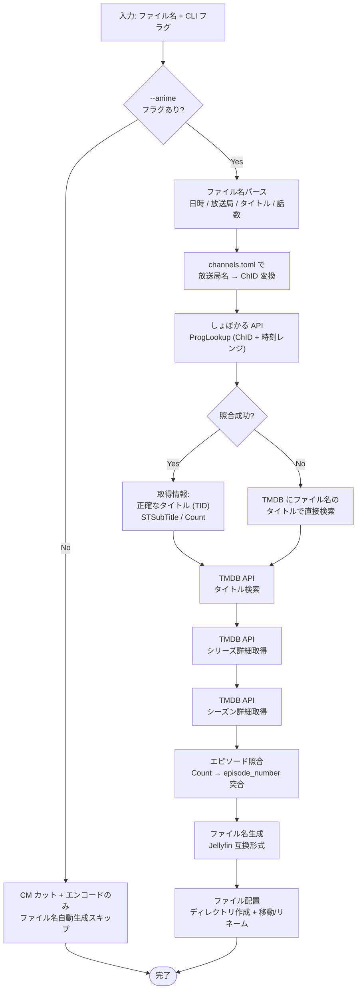
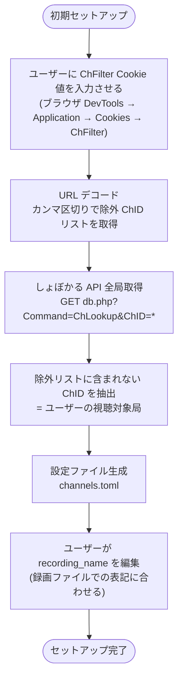
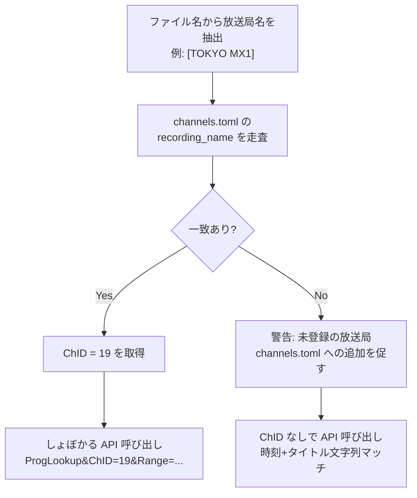
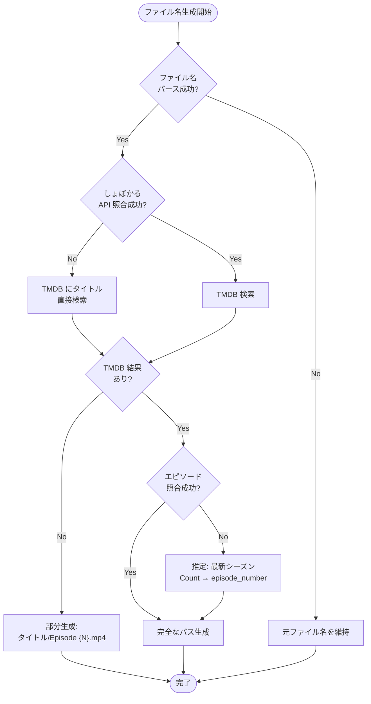

# エンコード後ファイル名自動生成

> 親ドキュメント: [IMPROVEMENT_PLAN.md](../IMPROVEMENT_PLAN.md)
>
> 関連ドキュメント:
>
> - [TMDB エピソード照合](./tmdb-episode-matching.md)
> - [一括リネーム・EPGStation 連携](./batch-rename-epgstation.md)

## 2.1 背景

現状のファイル名:

```
2026-02-03T230000 [TOKYO MX1] 勇者パーティーにかわいい子がいたので、告白してみた。 #5[字].ts
```

問題点:

- Jellyfin/Emby/Plex でシリーズ単位のグルーピングが不可能
- フラットなディレクトリ構成で大量ファイルの管理が困難
- メタデータ取得が機能しない (TMDB ID がないため)

目標のファイル名:

```
CLANNAD (2007) [tmdbid-24835]/Season 01/CLANNAD (2007) [tmdbid-24835] s01e01.mp4
```

### 2.1.1 入力ソースの原則

**ファイル名が唯一の確実な入力。** EPGStation API 等の外部ソースに依存しない設計とする。

| 情報ソース     | 信頼度       | 備考                                                                                                             |
| -------------- | ------------ | ---------------------------------------------------------------------------------------------------------------- |
| ファイル名     | **必須**     | 日時・放送局・タイトル・話数が常に含まれる                                                                       |
| しょぼかる API | 高           | ファイル名の日時+放送局で照合。正確なタイトル・サブタイトルを取得                                                |
| TMDB API       | 高           | しょぼかるのタイトルで検索。TMDB ID・シーズン・エピソード番号を取得                                              |
| EPGStation API | **参考程度** | description にサブタイトルが含まれる場合があるが、EPG データ・放送局・番組に依存して内容が変わるため信頼できない |

EPGStation の description (例: `#5「魔族に戻ってみた。」`) はあくまで補助情報であり、
ファイル名から得られない情報を推察する際の最終手段とする。

## 2.2 ジャンル指定方式

しょぼかるに登録がないバラエティ番組等も録画対象になるため、ジャンル判定は API の Cat フィールドではなく
**ユーザーが CLI フラグで明示する方式**とする。

EPGStation の録画完了イベントから本プログラムを呼び出す際、EPGStation の環境変数
(`GENRE1` 等) を事前にチェックし、アニメの場合のみ `--anime` フラグを付けて実行する想定。

```
# アニメの場合: しょぼかる + TMDB でファイル名自動生成
$ jlse-rs encode --anime -i "2026-02-03T230000 [TOKYO MX1] 勇者パーティー....ts"

# アニメ以外の場合: ファイル名自動生成をスキップ
$ jlse-rs encode -i "2026-02-03T200000 [フジテレビ] バラエティ番組名.ts"
```

## 2.3 処理フロー



## 2.4 ファイル名パース (入力)

EPGStation の `recordedFormat` で生成されるファイル名が対象:

```
フォーマット: "%YEAR%-%MONTH%-%DAY%T%HOUR%%MIN%%SEC% [%HALF_WIDTH_CHNAME%] %HALF_WIDTH_TITLE%"
```

```
2026-02-03T230000 [TOKYO MX1] 勇者パーティーにかわいい子がいたので、告白してみた。 #5[字].ts
│              │  │         │ │                                                  │ │  │ │
│              │  │         │ │                                                  │ │  │ └ 拡張子
│              │  │         │ │                                                  │ │  └ 放送フラグ [字]=字幕
│              │  │         │ └─ タイトル + 話数                                 │ └ 話数
│              │  └─────────┘                                                   │
│              │   HALF_WIDTH_CHNAME                                            │
└──────────────┘                                                                │
  日時 (YYYYMMDDTHHmmss)                                                        │
```

**パースで除去が必要なサフィックス:** `[字]`, `[デ]`, `[二]`, `[多]`, `[解]`, `[新]`, `[終]`, `[再]` 等 (ARIB 放送フラグ)

パースルール:

```rust
struct ParsedFilename {
    /// 放送日時
    datetime: NaiveDateTime,       // 2026-02-03 23:00:00
    /// 放送局名 (EPGStation の HALF_WIDTH_CHNAME)
    channel: String,               // "TOKYO MX1"
    /// 番組タイトル (フラグ・話数を除去後)
    title: String,                 // "勇者パーティーにかわいい子がいたので、告白してみた。"
    /// 枠名 (＜＞ 内、存在する場合)
    timeslot: Option<String>,      // None (or Some("B8station"))
    /// 話数
    episode_number: Option<u32>,   // 5
    /// 放送フラグ ([字], [新], [終] 等)
    broadcast_flags: Vec<String>,  // ["字"]
}
```

## 2.5 しょぼいカレンダー API 連携

### エンドポイント

**推奨: `db.php` の ProgLookup + 放送局・時刻レンジ指定**

```
GET https://cal.syoboi.jp/db.php?Command=ProgLookup&Range=20260203_230000-20260203_233000&JOIN=SubTitles&ChID=19
```

> **注意:** `SubTitle` フィールドは空になることがある。
> `JOIN=SubTitles` パラメータを必ず追加し、`STSubTitle` を利用すること。
> (サブタイトルテーブルはタイトルデータの SubTitles をパースして生成されるため、
> SubTitle が修正されても ProgLookup の LastUpdate は更新されない)

### API 仕様

| 項目           | 値                                                                    |
| -------------- | --------------------------------------------------------------------- |
| 認証           | 不要 (公開 API)                                                       |
| レート制限     | 1リクエスト/秒、500リクエスト/時間、10,000リクエスト/日               |
| User-Agent     | カスタム必須 (例: `jlse-rs/0.1.0 (+https://github.com/naa0yama/...)`) |
| レスポンス形式 | XML (db.php) / JSON (json.php, rss2.php?alt=json)                     |

### 放送局 ChID マッピング (設定ファイルベース)

放送局名はしょぼかると録画システム間で表記ブレが発生する (例: `TOKYO MX` / `TOKYO MX1` / `TOKYO MX2`)。
ハードコードではなく、セットアップ時に設定ファイルを生成してユーザーが対応表を管理する方式とする。

#### ChFilter Cookie の仕組み

しょぼかるの設定画面 (`https://cal.syoboi.jp/`) で閲覧対象局を選択すると、
**除外する ChID** が Cookie `ChFilter` に URL エンコードされたカンマ区切りで保存される。

```
Cookie: ChFilter=1%2C2%2C9%2C10%2C11%2C12%2C13%2C15%2C16%2C17%2C18%2C20%2C...
URL decode → 1,2,9,10,11,12,13,15,16,17,18,20,...
```

つまり ChFilter に **含まれない** ChID がユーザーの視聴対象局。

#### セットアップフロー



#### 生成される設定ファイル例 (`channels.toml`)

```toml
# しょぼいカレンダー放送局設定
# セットアップ時に ChFilter Cookie から自動生成
#
# recording_name: 録画ファイル名に含まれる放送局表記を指定
#   複数の表記ブレがある場合は配列で列挙する
#   例: TOKYO MX は録画システムにより "TOKYO MX" / "TOKYO MX1" になりうる

[[channels]]
chid = 3
syoboi_name = "フジテレビ"
recording_name = ["フジテレビ"]

[[channels]]
chid = 4
syoboi_name = "日本テレビ"
recording_name = ["日本テレビ"]

[[channels]]
chid = 5
syoboi_name = "TBSテレビ"
recording_name = ["TBS"]

[[channels]]
chid = 6
syoboi_name = "テレビ朝日"
recording_name = ["テレビ朝日"]

[[channels]]
chid = 7
syoboi_name = "テレビ東京"
recording_name = ["テレビ東京"]

[[channels]]
chid = 19
syoboi_name = "TOKYO MX"
recording_name = ["TOKYO MX", "TOKYO MX1"]

[[channels]]
chid = 23
syoboi_name = "TOKYO MX2"
recording_name = ["TOKYO MX2"]

[[channels]]
chid = 128
syoboi_name = "BS11イレブン"
recording_name = ["BS11"]

# tvk, とちぎテレビ, チバテレビ, テレ玉, 群馬テレビ 等も同様に生成
```

#### Rust 型定義

```rust
use serde::{Deserialize, Serialize};

/// 設定ファイル全体
#[derive(Debug, Serialize, Deserialize)]
pub struct ChannelConfig {
    pub channels: Vec<ChannelEntry>,
}

/// 放送局エントリ
#[derive(Debug, Serialize, Deserialize)]
pub struct ChannelEntry {
    /// しょぼかるの ChID
    pub chid: u32,
    /// しょぼかる上の放送局名 (ChName)
    pub syoboi_name: String,
    /// 録画ファイル名に使われる表記 (複数対応)
    pub recording_name: Vec<String>,
}

impl ChannelConfig {
    /// recording_name から ChID を逆引き
    pub fn find_chid_by_recording_name(&self, name: &str) -> Option<u32> {
        self.channels.iter().find_map(|ch| {
            ch.recording_name
                .iter()
                .any(|rn| rn == name)
                .then_some(ch.chid)
        })
    }
}
```

#### セットアップ CLI コマンド

```
# 初期セットアップ (ChFilter Cookie 値を引数で指定)
$ jlse-rs setup --chfilter "1%2C2%2C9%2C10%2C11%2C..."

# 対話モード (入力プロンプト)
$ jlse-rs setup --interactive

# 設定ファイル再生成 (既存設定をマージ)
$ jlse-rs setup --chfilter "..." --merge
```

`--merge` を指定した場合、既存の `channels.toml` の `recording_name` カスタマイズを保持しつつ、
新たに追加/削除された ChID のみ更新する。

#### ファイル名パース時の照合



### レスポンスから取得する情報 (実データ: api-spec.md 参照)

**ProgLookup レスポンス:**

```xml
<ProgItem id="687485">
  <PID>687485</PID>
  <TID>7667</TID>                                  <!-- タイトルID -->
  <StTime>2026-02-03 23:00:00</StTime>
  <EdTime>2026-02-03 23:30:00</EdTime>
  <Count>5</Count>                                  <!-- 話数 -->
  <SubTitle></SubTitle>                             <!-- ⚠ 空になることがある -->
  <ChID>19</ChID>
  <STSubTitle>魔族に戻ってみた。</STSubTitle>       <!-- ← こちらを使う (JOIN=SubTitles) -->
</ProgItem>
```

続けて TitleLookup で正確なタイトル情報を取得:

```
GET https://cal.syoboi.jp/db.php?Command=TitleLookup&TID=7667
```

**TitleLookup レスポンス (抜粋):**

```xml
<TitleItem id="7667">
  <Title>勇者パーティーにかわいい子がいたので、告白してみた。</Title>
  <TitleYomi>ゆうしゃぱーてぃーにかわいいこがいたのでこくはくしてみた</TitleYomi>
  <TitleEN></TitleEN>                               <!-- ⚠ 空の場合が多い -->
  <Cat>1</Cat>                                      <!-- 1=アニメ -->
  <FirstYear>2026</FirstYear>
  <FirstMonth>1</FirstMonth>
  <FirstCh>TOKYO MX</FirstCh>
  <SubTitles>*01*告白してみた。                     <!-- *話数*サブタイトル 形式 -->
*02*デートしてみた。
*03*恋愛相談を受けてみた。
*04*勇者に説教してみた。
*05*魔族に戻ってみた。</SubTitles>
</TitleItem>
```

**SubTitles フィールドのパースルール:** `*{話数}*{サブタイトル}` が改行区切りで格納。
正規表現: `\*(\d+)\*(.+)` で話数とサブタイトルのペアを抽出可能。

---

## 2.7 ファイル名生成ルール

> TMDB エピソード照合の詳細は [tmdb-episode-matching.md](./tmdb-episode-matching.md) を参照。

### 命名規則

```
{タイトル} ({初年}) [tmdbid-{ID}]/Season {SS}/タイトル} ({初年}) [tmdbid-{ID}] s{SS}e{EE}.mp4
```

| 項目            | ルール                                        | 例                                   |
| --------------- | --------------------------------------------- | ------------------------------------ |
| タイトル        | 日本語の場合はローマ字 or 略称を採用          | `Shikoudairinin LINK CLICK Eito hen` |
| 年              | TMDB の first_air_date の年                   | `2021`                               |
| TMDB ID         | `[tmdbid-{数値}]` (Jellyfin 形式)             | `[tmdbid-XXXXX]`                     |
| Season フォルダ | `Season {ゼロ埋め2桁}`                        | `Season 03`                          |
| se 表記         | **小文字必須** `s{ゼロ埋め2桁}e{ゼロ埋め2桁}` | `s03e01`                             |
| 拡張子          | エンコード出力に合わせる                      | `.mp4`                               |
| 禁止文字        | `< > : " / \                                  | ? *` はファイル名から除去            |

### タイトルのローマ字化

優先順位:

1. TMDB の英語タイトル (`name` with `language=en-US`) が存在すればそれを使用
2. しょぼかるの `TitleEN` が存在すればそれを使用
3. `TitleYomi` (ひらがな読み) からローマ字に変換
4. フォールバック: 原題をそのまま使用

```rust
/// タイトルのローマ字変換優先順位
fn resolve_title_romaji(
    tmdb_en_name: Option<&str>,
    syoboi_title_en: Option<&str>,
    syoboi_title_yomi: Option<&str>,
    original_title: &str,
) -> String {
    tmdb_en_name
        .filter(|s| !s.is_empty())
        .or(syoboi_title_en.filter(|s| !s.is_empty()))
        .map(|s| s.to_string())
        .unwrap_or_else(|| {
            syoboi_title_yomi
                .filter(|s| !s.is_empty())
                .map(|yomi| hiragana_to_romaji(yomi))
                .unwrap_or_else(|| original_title.to_string())
        })
}
```

### 出力例

入力: `2026-02-03T230000 [TOKYO MX1] 勇者パーティーにかわいい子がいたので、告白してみた。 #5[字].ts`

```
ファイル名パース:
  datetime  = 2026-02-03 23:00:00
  channel   = "TOKYO MX1"
  title     = "勇者パーティーにかわいい子がいたので、告白してみた。"
  episode   = 5
  flags     = ["字"]

channels.toml 照合:
  "TOKYO MX1" → ChID=19

しょぼかる ProgLookup (ChID=19, Range=20260203_225000-20260203_231000):
  TID=7667, Count=5, STSubTitle="魔族に戻ってみた。"

しょぼかる TitleLookup (TID=7667):
  Title="勇者パーティーにかわいい子がいたので、告白してみた。"
  TitleYomi="ゆうしゃぱーてぃーにかわいいこがいたのでこくはくしてみた"
  TitleEN=""  (空)
  FirstYear=2026

TMDB search/tv (query="勇者パーティーにかわいい子がいたので、告白してみた。"):
  id=295366, first_air_date="2026-01-06"

TMDB tv/295366 (language=en-US):
  name(en) が取得できれば採用、なければ TitleYomi からローマ字化

TMDB tv/295366/season/1:
  Count=5 → episode_number=5, season_number=1

出力:
Yuusha Party ni Kawaii Ko ga Ita node Kokuhaku Shite Mita (2026) [tmdbid-295366]/
  Season 01/
    Yuusha Party ni Kawaii Ko ga Ita node Kokuhaku Shite Mita (2026) [tmdbid-295366] s01e05.mp4
```

## 2.8 アニメ特有のシーズン番号問題

TMDB のシーズン構成とクール分割が一致しないケースがある:

| パターン                       | 例                                | 対処                                                |
| ------------------------------ | --------------------------------- | --------------------------------------------------- |
| 続編が別シリーズ登録           | CLANNAD / CLANNAD ~~After Story~~ | しょぼかる TID → TMDB ID のマッピングで対応         |
| 長期シリーズが Season 1 に集約 | ONE PIECE (1000+ 話)              | Episode Groups API を参照、なければ通番で `s01e{N}` |
| クール分割が TMDB と不一致     | 進撃の巨人 Part 1/Part 2          | 放送日でエピソード照合、サブタイトルでも突合        |

## 2.9 エラーハンドリング・フォールバック


