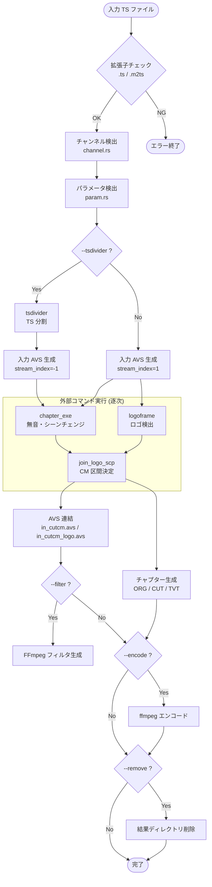
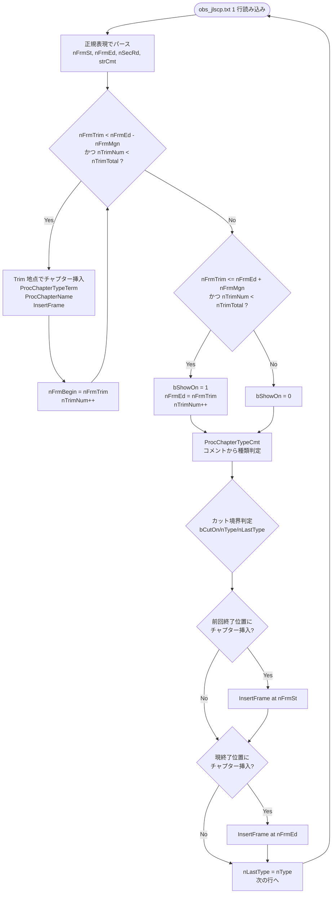

# recmgr-jlse Architecture

> 親ドキュメント: [IMPROVEMENT_PLAN.md](../../IMPROVEMENT_PLAN.md)

## 1. 背景と目的

### 概要

`join_logo_scp_trial` (以下 jlse) は日本のテレビ放送録画 TS ファイルから CM (コマーシャル) を自動検出・除去する Node.js CLI オーケストレータである。以下の外部バイナリを順次呼び出し、TS ファイルの解析からエンコードまでを一括処理する:

| 外部バイナリ    | 役割                                    |
| --------------- | --------------------------------------- |
| `chapter_exe`   | 無音・シーンチェンジ検出                |
| `logoframe`     | ロゴフレーム検出                        |
| `join_logo_scp` | ロゴ + 無音情報を統合して CM 区間を決定 |
| `tsdivider`     | TS ストリーム分割 (任意)                |
| `ffprobe`       | フレームレート・サンプルレート取得      |
| `ffmpeg`        | エンコード出力                          |

### 元実装

- リポジトリ: `JoinLogoScpTrialSetLinux/modules/join_logo_scp_trial/`
- 言語: Node.js (`yargs`, `csv-parse`, `fs-extra`, `jaconv`, `async`)
- 主要ソース: 13 ファイル (`src/jlse.js` + 5 command + 3 output + `settings.js` + `channel.js` + `param.js`)

### Rust 移植の現状

`dtvmgr-jlse` クレートとして段階的移植中:

- **Phase 1 (完了)**: チャンネル検出 (`channel.rs`) + パラメータ検出 (`param.rs`) + 型定義 (`types.rs`)
- **Phase 2-4**: 本ドキュメントに記載の残りモジュール

---

## 2. 全体処理フロー

### パイプライン概要



### CLI 引数 (yargs → clap マッピング)

| yargs オプション | 短縮   | 型        | デフォルト     | 説明                         | clap 案                 |
| ---------------- | ------ | --------- | -------------- | ---------------------------- | ----------------------- |
| `--input`        | `-i`   | `string`  | (必須)         | 入力 TS ファイルパス         | `--input` / `-i`        |
| `--filter`       | `-f`   | `boolean` | `false`        | ffmpeg フィルタ出力を有効化  | `--filter` / `-f`       |
| `--addchapter`   | `-ac`  | `boolean` | `false`        | エンコード時にチャプター付与 | `--add-chapter`         |
| `--channel`      | `-c`   | `boolean` | `false`        | 環境変数 `CHNNELNAME` を参照 | `--channel <name>`      |
| `--encode`       | `-e`   | `boolean` | `false`        | ffmpeg エンコードを有効化    | `--encode` / `-e`       |
| `--target`       | `-t`   | `choice`  | `"cutcm_logo"` | エンコード対象 AVS           | `--target <cutcm/logo>` |
| `--tsdivider`    | `-tsd` | `boolean` | `false`        | tsdivider による前処理       | `--tsdivider`           |
| `--option`       | `-o`   | `string`  | `""`           | ffmpeg 追加オプション        | `--ffmpeg-option`       |
| `--outdir`       | `-d`   | `string`  | `""`           | エンコード出力先ディレクトリ | `--outdir`              |
| `--outname`      | `-n`   | `string`  | `""`           | エンコード出力ファイル名     | `--outname`             |
| `--remove`       | `-r`   | `boolean` | `false`        | 処理後に中間ファイルを削除   | `--remove` / `-r`       |

---

## 3. モジュール構成

### Node.js → Rust マッピング

| Node.js ソース                   | 行数 | Rust モジュール            | 状態     |
| -------------------------------- | ---- | -------------------------- | -------- |
| `src/jlse.js`                    | 165  | `pipeline.rs` + CLI        | 未実装   |
| `src/settings.js`                | 44   | `settings.rs`              | 未実装   |
| `src/channel.js`                 | 130  | `channel.rs`               | **完了** |
| `src/param.js`                   | 96   | `param.rs`                 | **完了** |
| `src/command/chapterexe.js`      | 34   | `command/chapter_exe.rs`   | 未実装   |
| `src/command/logoframe.js`       | 96   | `command/logoframe.rs`     | 未実装   |
| `src/command/join_logo_frame.js` | 47   | `command/join_logo_scp.rs` | 未実装   |
| `src/command/tsdivider.js`       | 13   | `command/tsdivider.rs`     | 未実装   |
| `src/command/ffprobe.js`         | 43   | `command/ffprobe.rs`       | 未実装   |
| `src/command/ffmpeg.js`          | 64   | `command/ffmpeg.rs`        | 未実装   |
| `src/output/avs.js`              | 37   | `output/avs.rs`            | 未実装   |
| `src/output/chapter_jls.js`      | 520  | `output/chapter.rs`        | 未実装   |
| `src/output/ffmpeg_filter.js`    | 46   | `output/ffmpeg_filter.rs`  | 未実装   |

### ディレクトリツリー (計画)

```
crates/dtvmgr-jlse/src/
├── lib.rs                  # Public API re-exports
├── types.rs                # Channel, Param, DetectionParam, JlseConfig (完了)
├── channel.rs              # チャンネル検出 (完了)
├── param.rs                # パラメータ検出 (完了)
├── settings.rs             # OutputPaths, init_output_paths()
├── avs.rs                  # 入力 AVS テンプレート生成
├── pipeline.rs             # 全ステップのオーケストレーション
├── command/
│   ├── mod.rs
│   ├── chapter_exe.rs      # chapter_exe 実行
│   ├── logoframe.rs        # logoframe 実行 + ロゴ選択
│   ├── join_logo_scp.rs    # join_logo_scp 実行
│   ├── tsdivider.rs        # tsdivider 実行
│   ├── ffprobe.rs          # ffprobe 実行
│   └── ffmpeg.rs           # ffmpeg エンコード実行
└── output/
    ├── mod.rs
    ├── avs.rs              # AVS ファイル連結
    ├── chapter.rs          # チャプター生成 (3 フォーマット)
    └── ffmpeg_filter.rs    # FFmpeg filter 文字列生成
```

---

## 4. 設定・パス管理 (`settings.js`)

### パス定数

元実装では `settings.js` で以下のパスを管理する:

| 分類         | 変数名               | 値                                |
| ------------ | -------------------- | --------------------------------- |
| CSV データ   | `CHANNEL_LIST`       | `<module>/JL/data/ChList.csv`     |
|              | `PARAM_LIST_1`       | `<module>/JL/data/ChParamJL1.csv` |
|              | `PARAM_LIST_2`       | `<module>/JL/data/ChParamJL2.csv` |
| バイナリ     | `LOGOFRAME_COMMAND`  | `<module>/bin/logoframe`          |
|              | `CHAPTEREXE_COMMAND` | `<module>/bin/chapter_exe`        |
|              | `TSDIVIDER_COMMAND`  | `<module>/bin/tsdivider`          |
|              | `JLSCP_COMMAND`      | `<module>/bin/join_logo_scp`      |
|              | `FFPROBE_COMMAND`    | `/usr/local/bin/ffprobe`          |
|              | `FFMPEG_COMMAND`     | `/usr/local/bin/ffmpeg`           |
| ディレクトリ | `JL_DIR`             | `<module>/JL`                     |
|              | `LOGO_PATH`          | `<module>/logo`                   |

### `OutputPaths` 構造体定義

`init(filename)` 関数で初期化される出力パス。全 15 ファイルを管理する:

```rust
/// All output file paths for a single processing run.
pub struct OutputPaths {
    /// Base output directory: `<result_dir>/<filename>/`
    pub save_dir: PathBuf,
    /// Input AVS file: `in_org.avs`
    pub input_avs: PathBuf,
    /// tsdivider output: `<filename>_split.ts`
    pub tsdivider_output: PathBuf,
    /// chapter_exe output: `obs_chapterexe.txt`
    pub chapterexe_output: PathBuf,
    /// logoframe text output: `obs_logoframe.txt`
    pub logoframe_txt_output: PathBuf,
    /// logoframe AVS output: `obs_logo_erase.avs`
    pub logoframe_avs_output: PathBuf,
    /// Merged parameter info: `obs_param.txt`
    pub obs_param_path: PathBuf,
    /// join_logo_scp structure output: `obs_jlscp.txt`
    pub jlscp_output: PathBuf,
    /// Cut AVS (Trim commands): `obs_cut.avs`
    pub output_avs_cut: PathBuf,
    /// Concatenated cut AVS: `in_cutcm.avs`
    pub output_avs_in_cut: PathBuf,
    /// Concatenated cut+logo AVS: `in_cutcm_logo.avs`
    pub output_avs_in_cut_logo: PathBuf,
    /// FFmpeg filter output: `ffmpeg.filter`
    pub output_filter_cut: PathBuf,
    /// Chapter ORG (all sections): `obs_chapter_org.chapter.txt`
    pub file_txt_cpt_org: PathBuf,
    /// Chapter CUT (non-cut only): `obs_chapter_cut.chapter.txt`
    pub file_txt_cpt_cut: PathBuf,
    /// Chapter TVTPlay format: `obs_chapter_tvtplay.chapter`
    pub file_txt_cpt_tvt: PathBuf,
}
```

### ディレクトリ初期化ロジック

`init_output_paths()` は以下を行う:

1. `<result_dir>/<filename>/` ディレクトリを作成 (Node.js: `fs.ensureDirSync`)
2. 上記の全パスをファイル名から生成して `OutputPaths` を返す

```rust
pub fn init_output_paths(result_dir: &Path, filename: &str) -> Result<OutputPaths> {
    let save_dir = result_dir.join(filename);
    std::fs::create_dir_all(&save_dir)
        .with_context(|| format!("failed to create output dir: {}", save_dir.display()))?;
    // ... 各フィールドを save_dir.join(...) で構築 ...
    Ok(OutputPaths { /* ... */ })
}
```

### 設定 (`dtvmgr.toml`)

`AppConfig` に `jlse: Option<JlseConfig>` フィールドを追加:

```toml
[jlse]
jl_dir = "/path/to/JL" # JL/ ディレクトリ (ChList.csv, ChParamJL*.csv, JL コマンドファイル)
logo_dir = "/path/to/logo" # logo/ ディレクトリ (*.lgd ファイル)
result_dir = "/path/to/result" # result/ 出力先
```

```rust
/// Configuration for the jlse CM detection pipeline.
#[derive(Debug, Clone, Serialize, Deserialize, PartialEq, Eq)]
pub struct JlseConfig {
    /// Path to JL directory containing command files and `data/`.
    pub jl_dir: PathBuf,
    /// Path to logo directory containing `.lgd` files.
    pub logo_dir: PathBuf,
    /// Path to result output directory.
    pub result_dir: PathBuf,
}
```

---

## 5. チャンネル検出 (`channel.rs`) [Phase 1 完了]

### CSV フォーマット: `ChList.csv`

```csv
放送局名（認識用）,放送局名（設定用）,略称,サービスID
ＮＨＫＢＳ１,,BS1,101
ＮＨＫＢＳプレミアム,,BSP,103
ＢＳ１１イレブン,,BS11,211
```

- 4 列固定: `recognize`, `install`, `short`, `service_id`
- 先頭 1 行はヘッダ (スキップ)
- `csv` クレートの `has_headers(true)` でパース

### 検出アルゴリズム

入力: ファイルパスのベースネーム + オプションのチャンネル名
前処理: NFKC 正規化 (`unicode-normalization` クレート) で全角英数を半角に統一

#### 1. チャンネル名指定時 (`--channel` or `CHNNELNAME` 環境変数)

チャンネル名が指定された場合、以下の順序で前方一致検索:

1. `recognize` (NFKC 正規化済み) で前方一致
2. `short` (NFKC 正規化済み) で前方一致
3. `service_id` で前方一致
4. チャンネル名から末尾以外の 1 桁孤立数字を除去して `recognize` で前方一致

一致しない場合はファイル名検索にフォールバック。

**孤立数字除去**: チャンネル名中の、前後が数字でなく末尾でもない 1 桁数字を削除する。
元実装の正規表現: `/(?<!\d)\d(?!\d|$)/g`

#### 2. ファイル名からの検出 (デフォルト)

**優先度 1** (即時 return):

| 対象         | パターン                                                             |
| ------------ | -------------------------------------------------------------------- |
| `recognize`  | `^{recognize}` or `_{recognize}`                                     |
| `short`      | `^{short}[_ ]` or `_{short}` or `{開き括弧}{short}{閉じ括弧/空白/_}` |
| `service_id` | `short` と同じパターンで `service_id` を使用                         |

**優先度 2** (候補記録、探索継続):

| 対象        | パターン                       |
| ----------- | ------------------------------ |
| `recognize` | `{開き括弧}{recognize}` が出現 |

**優先度 3** (より低い候補):

| 対象         | パターン                                   |
| ------------ | ------------------------------------------ |
| `short`      | `[ _]{short}{閉じ括弧/空白/_}` が出現      |
| `service_id` | `[ _]{service_id}{閉じ括弧/空白/_}` が出現 |

**優先度 4** (最低):

| 対象        | パターン                               |
| ----------- | -------------------------------------- |
| `recognize` | `_{recognize}` or `{recognize}` が出現 |

### 括弧文字セット

検出で使用される括弧文字:

- 開き括弧: `(`, `〔`, `[`, `{`, `〈`, `《`, `｢`, `『`, `【`, `≪`
- 閉じ括弧: `)`, `〕`, `]`, `}`, `〉`, `》`, `｣`, `』`, `】`, `≫`

### パブリック API

```rust
/// Loads channel entries from ChList.csv.
pub fn load_channels(csv_path: &Path) -> Result<Vec<Channel>>;

/// Detects the broadcast channel from a filename.
/// Returns `None` if no channel matches.
pub fn detect_channel(
    channels: &[Channel],
    filepath: &str,
    channel_name: Option<&str>,
) -> Option<Channel>;
```

---

## 6. パラメータ検出 (`param.rs`) [Phase 1 完了]

### CSV フォーマット: `ChParamJL1.csv` / `ChParamJL2.csv`

```csv
放送局略称,タイトル,JL_RUN,FLAGS,OPTIONS,#コメント表示用,#コメント
,,JL_フラグ指定.txt,@,@,,デフォルト設定。先頭@マークは設定クリア
NHK-G,,JL_NHK.txt,,,NHK用前後（他番組宣伝）カット,
```

- 7 列固定: `channel`, `title`, `jl_run`, `flags`, `options`, `comment_view`, `comment`
- 先頭 1 行はヘッダ (スキップ)
- `#` で始まる `channel` 値はコメント行としてスキップ

### 検索アルゴリズム

入力: `Vec<Param>` (JL1), `Vec<Param>` (JL2), `Option<Channel>`, ファイル名

1. 検索キーは `channel.short` (チャンネル未検出時は `"__normal"`)
2. CSV の各行について:
   - `channel` フィールドが `#` で始まる → スキップ
   - `channel` が検索キーと一致するか確認
   - 一致し、かつ `title` が指定されている場合:
     - `title` に正規表現メタ文字 (`.*+?|[]^`) が含まれる → 正規表現マッチ
     - それ以外 → 部分文字列マッチ (NFKC 正規化済み)
   - 一致し、`title` が空 → 無条件マッチ
3. マッチした行のフィールドをマージ:
   - 値が `"@"` → そのフィールドを空文字にクリア
   - 値が空 → 既存値を維持 (上書きしない)
   - 値が非空 → 上書き
4. どの行にもマッチしない → 最初の非コメント行 (デフォルト行) の値を使用
5. JL1 の結果に JL2 の結果をマージ (`Object.assign` 相当: JL2 が JL1 を上書き)

### `@` マーカーの動作

`flags` や `options` が `"@"` の場合、そのフィールドの値を空文字列にリセットする。これは前の CSV で設定された値を明示的にクリアするために使用される。

### JL1 + JL2 のマージロジック

```
JL1 検索 → result1 (HashMap<String, String>)
JL2 検索 → result2 (HashMap<String, String>)
最終結果 = result1 に result2 を上書きマージ
  "@" 値は空文字に変換
```

### パブリック API

```rust
/// Loads parameter entries from a ChParamJL CSV file.
pub fn load_params(csv_path: &Path) -> Result<Vec<Param>>;

/// Detects JL parameters by matching channel and filename.
/// Searches JL1 first, then JL2, merging results.
pub fn detect_param(
    params_jl1: &[Param],
    params_jl2: &[Param],
    channel: Option<&Channel>,
    filename: &str,
) -> DetectionParam;
```

---

## 7. 入力 AVS 生成 (`jlse.js` 内 `createAvs()`)

### テンプレート文字列

L-SMASH Works (LWLibavSource) ベースの AviSynth スクリプト:

```avs
TSFilePath="<input_file_path>"
LWLibavVideoSource(TSFilePath, repeat=true, dominance=1)
AudioDub(last,LWLibavAudioSource(TSFilePath, stream_index=<index>, av_sync=true))
```

### `stream_index` の決定ロジック

| 条件         | `stream_index` | 理由                               |
| ------------ | -------------- | ---------------------------------- |
| 通常         | `1`            | デフォルトの音声ストリーム         |
| tsdivider 後 | `-1`           | tsdivider がストリームを再構成する |

### Rust 実装案

```rust
/// Generates an AviSynth input script for L-SMASH Works.
pub fn create_avs(output_path: &Path, input_file: &Path, stream_index: i32) -> Result<()> {
    let content = format!(
        "TSFilePath=\"{}\"\n\
         LWLibavVideoSource(TSFilePath, repeat=true, dominance=1)\n\
         AudioDub(last,LWLibavAudioSource(TSFilePath, stream_index={}, av_sync=true))\n",
        input_file.display(),
        stream_index
    );
    std::fs::write(output_path, content)
        .with_context(|| format!("failed to write AVS: {}", output_path.display()))?;
    Ok(())
}
```

---

## 8. 外部コマンド実行ラッパー

### 共通パターン

全外部コマンドは以下の共通パターンで実行する:

```rust
use tokio::process::Command;

async fn run_command(program: &str, args: &[&str]) -> Result<()> {
    let status = Command::new(program)
        .args(args)
        .status()
        .await
        .with_context(|| format!("failed to spawn {program}"))?;
    if !status.success() {
        anyhow::bail!("{program} exited with code {}", status.code().unwrap_or(-1));
    }
    Ok(())
}
```

### 8.1 `chapter_exe`

無音区間とシーンチェンジポイントを検出する。

**引数構築**:

```
chapter_exe -v <avs_file> -s 8 -e 4 -o <chapterexe_output>
```

| 引数 | 値                   | 説明               |
| ---- | -------------------- | ------------------ |
| `-v` | `in_org.avs`         | 入力 AVS ファイル  |
| `-s` | `8`                  | 無音判定の感度     |
| `-e` | `4`                  | シーンチェンジ感度 |
| `-o` | `obs_chapterexe.txt` | 出力ファイル       |

**stderr 処理**: `Creating` で始まる行は AviSynth の初期化メッセージとしてログ出力。

### 8.2 `logoframe`

放送局ロゴの表示フレームを検出する。

**引数構築**:

```
logoframe <avs_file> -oa <logoframe_txt_output> -o <logoframe_avs_output> -logo <logo_file>
```

| 引数    | 値                   | 説明                           |
| ------- | -------------------- | ------------------------------ |
| 第1引数 | `in_org.avs`         | 入力 AVS ファイル              |
| `-oa`   | `obs_logoframe.txt`  | ロゴ検出結果テキスト           |
| `-o`    | `obs_logo_erase.avs` | ロゴ除去用 AVS                 |
| `-logo` | `<logo_file_or_dir>` | ロゴファイルまたはディレクトリ |

**ロゴ選択アルゴリズム**:

```mermaid
flowchart TD
    START([チャンネル情報]) --> HAS_CH{チャンネル<br/>検出済み?}
    HAS_CH -->|No| ALL_LOGO[全ロゴファイルを<br/>入力<br/>logo/ ディレクトリ]
    HAS_CH -->|Yes| INSTALL{install.lgd<br/>存在?}
    INSTALL -->|Yes| USE_INSTALL([install.lgd を使用])
    INSTALL -->|No| SHORT{short.lgd<br/>存在?}
    SHORT -->|Yes| USE_SHORT([short.lgd を使用])
    SHORT -->|No| RECOGNIZE{recognize.lgd<br/>存在?}
    RECOGNIZE -->|Yes| USE_RECOGNIZE([recognize.lgd を使用])
    RECOGNIZE -->|No| SID{SID{service_id}.lgd<br/>存在?}
    SID -->|Yes| USE_SID([SID*.lgd を使用])
    SID -->|No| ALL_LOGO

    subgraph "ロゴファイル検索"
        INSTALL
        SHORT
        RECOGNIZE
        SID
    end
```

**ロゴファイル検索の詳細** (`getLogo` 関数):

1. `<name>.lgd` の存在チェック
2. `<name>.lgd2` の存在チェック
3. `<name>` が `SID` で始まる場合:
   - `<name>-1.lgd`, `<name>-2.lgd`, ... を探索
   - 最大番号のファイルを選択 (例: `SID103-3.lgd` が最新)

**ロゴ選択の優先順位** (`selectLogo` 関数):

1. `channel.install` (通常空なのでスキップされる)
2. `channel.short` (例: `BS11.lgd`)
3. `channel.recognize` (例: `ＢＳ１１イレブン.lgd`)
4. `SID{channel.service_id}` (例: `SID211.lgd` → `SID211-3.lgd`)
5. 全てに失敗 → `LOGO_PATH` ディレクトリ全体を指定

### 8.3 `join_logo_scp`

ロゴ検出結果と無音・シーンチェンジ情報を統合して CM 区間を決定する。

**引数構築**:

```
join_logo_scp -inlogo <logoframe_txt> -inscp <chapterexe_txt> -incmd <jl_command_file>
              -o <output_avs_cut> -oscp <jlscp_output> -flags <flags> [OPTIONS...]
```

| 引数      | 値                                | 説明                        |
| --------- | --------------------------------- | --------------------------- |
| `-inlogo` | `obs_logoframe.txt`               | logoframe 出力              |
| `-inscp`  | `obs_chapterexe.txt`              | chapter_exe 出力            |
| `-incmd`  | `<JL_DIR>/<param.JL_RUN>`         | JL コマンドファイル         |
| `-o`      | `obs_cut.avs`                     | Trim コマンド出力 AVS       |
| `-oscp`   | `obs_jlscp.txt`                   | 構成解析結果出力            |
| `-flags`  | `param.FLAGS`                     | フラグ文字列                |
| OPTIONS   | `param.OPTIONS.split(" ")` で分割 | 追加オプション (空白区切り) |

**OPTIONS 分割**: `param.OPTIONS` が非空の場合、空白でスプリットして個別引数として追加。

### 8.4 `tsdivider`

TS ストリームを分割する前処理 (任意)。

**引数構築**:

```
tsdivider -i <input_file> --overlap_front 0 -o <tsdivider_output>
```

**注意**: 同期実行 (`spawnSync`) で `stdio: "inherit"` (標準出力をそのまま表示)。

### 8.5 `ffprobe`

映像・音声のメタ情報を取得する。

**共通引数パターン**:

```
ffprobe -hide_banner -loglevel error -select_streams <stream>
        -show_entries <entries> -of default=noprint_wrappers=1:nokey=1 <filename>
```

**`getFrameRate`**: フレームレート取得

- `stream`: `v:0`, `entries`: `stream=avg_frame_rate`
- 出力: `30000/1001` → `{ fpsNumerator: "30000", fpsDenominator: "1001" }`

**`getSampleRate`**: サンプルレート取得

- `stream`: `a:0`, `entries`: `stream=sample_rate`
- 出力: `48000`

### 8.6 `ffmpeg`

最終エンコードを実行する。

**引数構築**:

```
ffmpeg -hide_banner -y -ignore_unknown -i <avs_file>
       [-i <chapter_file> -map_metadata 1
        -metadata title=<HALF_WIDTH_NAME>
        -metadata comment=<description_block>
        -movflags +use_metadata_tags]
       [<ffmpeg_option>...]
       <output_dir>/<output_name>.mp4
```

**AVS ファイル選択**:

| `--target` 値 | 入力 AVS            |
| ------------- | ------------------- |
| `cutcm`       | `in_cutcm.avs`      |
| `cutcm_logo`  | `in_cutcm_logo.avs` |

**チャプター付与時** (`--addchapter`):

- 2 つ目の入力として `obs_chapter_cut.chapter.txt` を追加
- `-map_metadata 1` でチャプターメタデータをマッピング
- 環境変数からメタデータを取得:
  - `HALF_WIDTH_NAME` → `-metadata title=`
  - `HALF_WIDTH_DESCRIPTION` → `-metadata comment=` (Description セクション)
  - `HALF_WIDTH_EXTENDED` → `-metadata comment=` (Extended セクション)

**追加 ffmpeg オプション**: `--option` の値を空白でスプリットして引数に追加。

---

## 9. 出力生成

### 9.1 AVS 連結 (`output/avs.js`)

複数の AVS ファイルをストリーミングで連結する。

**出力ファイル**:

| 変数名                   | ファイル名          | 構成                                                |
| ------------------------ | ------------------- | --------------------------------------------------- |
| `OUTPUT_AVS_IN_CUT`      | `in_cutcm.avs`      | `in_org.avs` + `obs_cut.avs`                        |
| `OUTPUT_AVS_IN_CUT_LOGO` | `in_cutcm_logo.avs` | `in_org.avs` + `obs_logo_erase.avs` + `obs_cut.avs` |

**ロジック**: Node.js ではストリーミングパイプで連結 (`fs.createReadStream` → `pipe` → `fs.createWriteStream`)。Rust では単純なファイル読み書きで実装可能。

### 9.2 チャプター生成 (`output/chapter_jls.js`) -- 最重要・最複雑

チャプター生成は 3 段階で処理される:

1. **`TrimReader`**: `obs_cut.avs` から `Trim(start,end)` をパース
2. **`CreateChapter`**: 構成解析結果 (`obs_jlscp.txt`) と Trim 情報からチャプターデータを生成
3. **`OutputData`**: チャプターデータを 3 フォーマットで出力

#### 9.2.1 `TrimReader`

`obs_cut.avs` から `Trim(start,end)` コマンドをパースしてフレーム配列を作成する。

**正規表現**: `Trim\((\d+),(\d+)\)` (グローバルマッチ)

**処理**:

```
Trim(100,500)Trim(800,1200) → [100, 501, 800, 1201]
                                 ↑    ↑    ↑    ↑
                               start end+1 start end+1
```

- 開始フレームはそのまま格納
- 終了フレームは `+1` して格納 (開始位置表現に統一)
- 配列の偶数インデックス = Trim 開始、奇数インデックス = Trim 終了

#### 9.2.2 `CreateChapter`

状態機械ベースのアルゴリズムで、Trim 位置と構成解析結果を照合してチャプターを生成する。

**初期状態**:

| 変数名       | 初期値 | 説明                                              |
| ------------ | ------ | ------------------------------------------------- |
| `nFrmMgn`    | `30`   | Trim と構成位置を同一とみなすフレーム数 (約 1 秒) |
| `nTrimNum`   | `0/1`  | 現在の Trim 位置番号 (先頭が `<=30` なら `1`)     |
| `nFrmBegin`  | `0`    | 次のチャプター開始地点                            |
| `nPart`      | `0`    | 現在のパート番号 (0=A, 1=B, ...)                  |
| `bPartExist` | `0`    | 現在のパートに要素が存在するか                    |
| `nLastType`  | `0`    | 直前の構成種類                                    |
| `bShowOn`    | `1`    | 最初は必ず表示                                    |

**`nTrimNum` の偶奇**:

- 偶数: 次の Trim 開始位置を検索中
- 奇数: 次の Trim 終了位置を検索中
- `bCutOn = (nTrimNum + 1) % 2`: `1` でカット状態

**構成解析行パース** (`obs_jlscp.txt` の正規表現):

```
/^\s*(\d+)\s+(\d+)\s+(\d+)\s+([-\d]+)\s+(\d+).*:(\S+)/
```

| キャプチャ | 変数名   | 説明         |
| ---------- | -------- | ------------ |
| `$1`       | `nFrmSt` | 開始フレーム |
| `$2`       | `nFrmEd` | 終了フレーム |
| `$3`       | `nSecRd` | 期間秒数     |
| `$4`       | (未使用) | ---          |
| `$5`       | (未使用) | ---          |
| `$6`       | `strCmt` | 構成コメント |

**メインループ処理フロー**:



#### 9.2.3 `ProcChapterTypeTerm`: フレーム区間からの種類判定

開始・終了フレームから秒数を計算し、種類を判定する。

**秒数計算** (`ProcGetSec`):

```javascript
// 29.97fps 固定
nSecRd = parseInt((nFrame * 1001 + 30000 / 2) / 30000)
```

**種類判定**:

| 条件       | `nType` | 意味                    |
| ---------- | ------- | ----------------------- |
| 秒数 == 0  | `12`    | 空欄 (無視)             |
| 秒数 == 90 | `11`    | part 扱いの判断迷う構成 |
| 秒数 < 15  | `2`     | part 扱いの判断迷う構成 |
| その他     | `0`     | 通常                    |

#### 9.2.4 `ProcChapterTypeCmt`: コメント文字列からの種類判定

`obs_jlscp.txt` の構成コメントから種類を判定する。

| コメント内容        | `nType` | 意味                        |
| ------------------- | ------- | --------------------------- |
| `Trailer(cut)` 含む | `0`     | 通常 (カット済みトレイラー) |
| `Trailer` 含む      | `10`    | 単独構成 (トレイラー)       |
| `Sponsor` 含む      | `11`    | part 判断迷う単独構成       |
| `Endcard` 含む      | `11`    | 同上                        |
| `Edge` 含む         | `11`    | 同上                        |
| `Border` 含む       | `11`    | 同上                        |
| `CM` 含む           | `1`     | 明示的に CM                 |
| 秒数 == 90          | `11`    | 90 秒は Sponsor 相当        |
| 秒数 == 60          | `10`    | 60 秒は単独構成             |
| 秒数 < 15           | `2`     | 短い区間                    |
| その他              | `0`     | 通常                        |

**`nType` 値の意味一覧**:

| `nType` | 意味                        |
| ------- | --------------------------- |
| `0`     | 通常                        |
| `1`     | 明示的に CM                 |
| `2`     | part 扱いの判断迷う構成     |
| `10`    | 単独構成                    |
| `11`    | part 扱いの判断迷う単独構成 |
| `12`    | 空欄 (0 秒区間)             |

#### 9.2.5 `ProcChapterName`: チャプター名生成

| `bCutOn`     | `nType` | チャプター名                             |
| ------------ | ------- | ---------------------------------------- |
| `0` (残す)   | `>= 10` | `"{パート文字}{秒数}Sec"` (例: `A90Sec`) |
| `0`          | その他  | `"{パート文字}"` (例: `A`, `B`)          |
| `1` (カット) | `>= 10` | `"X{秒数}Sec"` (例: `X60Sec`)            |
| `1`          | `1`     | `"XCM"`                                  |
| `1`          | その他  | `"X"`                                    |

**パート文字**: `A` から `W` まで順番に割り当て (23 文字で `%` 循環)。
`nPart % 23` で文字コードを計算: `'A'.charCodeAt(0) + (nPart % 23)`

**パート更新ロジック**:

- カットしない部分で `nType` が `11` or `2`: `bPartExist` を `1` に設定 (迷い状態)
- カットしない部分で `nType` が `12` 以外: `bPartExist` を `2` に設定 (確定)
- カット部分で `bPartExist > 0` かつ `nType != 12`: `nPart++`, `bPartExist = 0` (次のパートへ)

#### 9.2.6 `InsertFrame`: フレーム → ミリ秒変換

```javascript
// 29.97fps 固定
var nTmp = parseInt((nFrame * 1001 + 30 / 2) / 30);
```

数式: `msec = floor((frame * 1001 + 15) / 30)`

#### 9.2.7 `OutputData`: 3 フォーマット出力

| モード     | 定数 | ファイル名                    | 形式                 |
| ---------- | ---- | ----------------------------- | -------------------- |
| `MODE_ORG` | `0`  | `obs_chapter_org.chapter.txt` | FFMETADATA1 全区間   |
| `MODE_CUT` | `1`  | `obs_chapter_cut.chapter.txt` | FFMETADATA1 非カット |
| `MODE_TVT` | `2`  | `obs_chapter_tvtplay.chapter` | TVTPlay 形式         |

**重複除去**: 隣接チャプター間の時間差が `MSEC_DIVMIN = 100` ms 未満の場合、後のチャプターをスキップする。

**FFMETADATA1 形式** (`GetDispChapter`):

```
;FFMETADATA1

[CHAPTER]
TIMEBASE=1/1000
# 00:01:23.456
START=83456
END=83457
title=A
```

**TVTPlay 形式**:

```
c-{msec1}c{name1}-{msec2}c{name2}-...-0e-c
```

- 先頭: `c-`
- 各チャプター: `{累積ミリ秒}c{チャプター名}-`
- 末尾: `0e-c` (カット状態なら `0e{PREFIX_TVTO}-c`)
- チャプター名中の `-` は `－` (全角) に変換
- カット開始: 名前に `ix` プレフィックス
- カット終了: 名前に `ox` プレフィックス

### 9.3 FFmpeg フィルタ生成 (`output/ffmpeg_filter.js`)

`obs_cut.avs` の Trim 情報から ffmpeg の `filter_complex` 文字列を生成する。

**処理手順**:

1. `obs_cut.avs` から `Trim(start,end)` をパース
2. 開始フレームが `MIN_START_FRAME` (30) 未満の場合は `30` にクランプ
3. `ffprobe` でフレームレート (分子/分母) を取得
4. 各 Trim セグメントの開始・終了時間を計算:
   - `startTime = start * fpsDenominator / fpsNumerator`
   - `endTime = end * fpsDenominator / fpsNumerator`
5. `trim`/`atrim`/`setpts`/`asetpts` フィルタ文字列を生成
6. `concat` フィルタで結合

**出力例**:

```
[0:v]trim=1.001:16.683,setpts=PTS-STARTPTS[v0];[0:a]atrim=1.001:16.683,asetpts=PTS-STARTPTS[a0];[0:v]trim=26.693:38.372,setpts=PTS-STARTPTS[v1];[0:a]atrim=26.693:38.372,asetpts=PTS-STARTPTS[a1];[v0][a0][v1][a1]concat=n=2:v=1:a=1[video][audio];
```

---

## 10. データ仕様

### 10.1 CSV フォーマット

#### `ChList.csv`

```
放送局名（認識用）,放送局名（設定用）,略称,サービスID
```

4 列: `recognize`, `install`, `short`, `service_id`

#### `ChParamJL1.csv` / `ChParamJL2.csv`

```
放送局略称,タイトル,JL_RUN,FLAGS,OPTIONS,#コメント表示用,#コメント
```

7 列: `channel`, `title`, `jl_run`, `flags`, `options`, `comment_view`, `comment`

### 10.2 `obs_jlscp.txt` の行フォーマット

構成解析結果ファイル。各行は以下の正規表現でパースされる:

```
/^\s*(\d+)\s+(\d+)\s+(\d+)\s+([-\d]+)\s+(\d+).*:(\S+)/
```

| フィールド | 説明         | 例        |
| ---------- | ------------ | --------- |
| `$1`       | 開始フレーム | `0`       |
| `$2`       | 終了フレーム | `2696`    |
| `$3`       | 期間秒数     | `90`      |
| `$4`       | (分類値)     | `-1`      |
| `$5`       | (信頼度)     | `100`     |
| `$6`       | 構成コメント | `Sponsor` |

### 10.3 `obs_cut.avs` の `Trim()` コマンドフォーマット

```
Trim(100,500)Trim(800,1200)
```

- 1 行に複数の `Trim()` コマンドが連結される
- `Trim(start,end)`: start, end はフレーム番号 (0-indexed)

### 10.4 出力ディレクトリ構造

```
<result_dir>/<filename>/
├── in_org.avs                          # 入力 AVS (L-SMASH Works)
├── <filename>_split.ts                 # tsdivider 出力 (任意)
├── obs_chapterexe.txt                  # chapter_exe 出力
├── obs_logoframe.txt                   # logoframe テキスト出力
├── obs_logo_erase.avs                  # logoframe AVS 出力
├── obs_param.txt                       # マージ済みパラメータ情報
├── obs_jlscp.txt                       # join_logo_scp 構成解析結果
├── obs_cut.avs                         # Trim コマンド (カット指示)
├── in_cutcm.avs                        # in_org + obs_cut 連結
├── in_cutcm_logo.avs                   # in_org + obs_logo_erase + obs_cut 連結
├── ffmpeg.filter                       # FFmpeg filter_complex 文字列
├── obs_chapter_org.chapter.txt         # FFMETADATA1 全区間
├── obs_chapter_cut.chapter.txt         # FFMETADATA1 非カット区間
└── obs_chapter_tvtplay.chapter         # TVTPlay 形式
```

---

## 11. Rust 型定義

### 既存型 (Phase 1 完了)

```rust
/// Broadcast channel entry from `ChList.csv`.
#[derive(Debug, Clone, PartialEq, Eq)]
pub struct Channel {
    pub recognize: String,
    pub install: String,
    pub short: String,
    pub service_id: String,
}

/// Raw parameter entry from `ChParamJL*.csv`.
#[derive(Debug, Clone, PartialEq, Eq)]
pub struct Param {
    pub channel: String,
    pub title: String,
    pub jl_run: String,
    pub flags: String,
    pub options: String,
    pub comment_view: String,
    pub comment: String,
}

/// Merged detection result from channel + filename matching.
#[derive(Debug, Clone, Default, PartialEq, Eq)]
pub struct DetectionParam {
    pub jl_run: String,
    pub flags: String,
    pub options: String,
}

/// Configuration for the jlse CM detection pipeline.
#[derive(Debug, Clone, Serialize, Deserialize, PartialEq, Eq)]
pub struct JlseConfig {
    pub jl_dir: PathBuf,
    pub logo_dir: PathBuf,
    pub result_dir: PathBuf,
}
```

### 新規追加型 (Phase 2-4)

```rust
/// Paths to external binary commands.
pub struct BinaryPaths {
    pub logoframe: PathBuf,
    pub chapter_exe: PathBuf,
    pub tsdivider: PathBuf,
    pub join_logo_scp: PathBuf,
    pub ffprobe: PathBuf,
    pub ffmpeg: PathBuf,
}

/// CLI arguments for the jlse pipeline.
pub struct PipelineArgs {
    pub input: PathBuf,
    pub filter: bool,
    pub add_chapter: bool,
    pub channel_name: Option<String>,
    pub encode: bool,
    pub target: AvsTarget,
    pub tsdivider: bool,
    pub ffmpeg_option: Option<String>,
    pub out_dir: Option<PathBuf>,
    pub out_name: Option<String>,
    pub remove: bool,
}

/// Encode target AVS selection.
pub enum AvsTarget {
    /// `in_cutcm.avs` (cut only)
    CutCm,
    /// `in_cutcm_logo.avs` (cut + logo removal)
    CutCmLogo,
}

/// A single trim segment parsed from obs_cut.avs.
pub struct TrimSegment {
    /// Start frame (inclusive).
    pub start: u32,
    /// End frame (exclusive, already +1 adjusted).
    pub end: u32,
}

/// A parsed entry from obs_jlscp.txt.
pub struct JlscpEntry {
    /// Start frame.
    pub frame_start: u32,
    /// End frame.
    pub frame_end: u32,
    /// Duration in seconds.
    pub duration_sec: u32,
    /// Structure comment (e.g. "CM", "Sponsor").
    pub comment: String,
}

/// Chapter type classification.
pub enum ChapterType {
    /// Normal content.
    Normal,          // 0
    /// Explicit CM.
    Cm,              // 1
    /// Ambiguous (not clearly part or CM).
    Ambiguous,       // 2
    /// Standalone section.
    Standalone,      // 10
    /// Ambiguous standalone section.
    AmbiguousStandalone, // 11
    /// Empty (zero duration).
    Empty,           // 12
}

/// A single chapter entry.
pub struct ChapterEntry {
    /// Position in milliseconds.
    pub msec: u64,
    /// Whether this section is cut.
    pub cut: bool,
    /// Chapter display name.
    pub name: String,
}

/// Complete chapter data for output.
pub struct ChapterData {
    pub entries: Vec<ChapterEntry>,
}

/// Video metadata from ffprobe.
pub struct VideoMetadata {
    /// Frame rate numerator (e.g. 30000).
    pub fps_numerator: u32,
    /// Frame rate denominator (e.g. 1001).
    pub fps_denominator: u32,
    /// Audio sample rate (e.g. 48000).
    pub sample_rate: Option<u32>,
}
```

---

## 12. エラーハンドリング

### Node.js → Rust の方針

| Node.js パターン      | Rust パターン                            |
| --------------------- | ---------------------------------------- |
| `process.exit(code)`  | `anyhow::bail!()` / `Result` の伝播      |
| `console.error()`     | `tracing::error!()` / `tracing::warn!()` |
| Promise reject + exit | `async fn` → `Result<()>` + `?` 演算子   |
| `try/catch` + exit    | `.with_context()` + `?`                  |

### レイヤー別エラー戦略

| レイヤー           | 戦略                                              |
| ------------------ | ------------------------------------------------- |
| CSV パース         | `anyhow::Result` + `.with_context()` で行番号付き |
| ファイル I/O       | `.with_context()` でパス情報付き                  |
| 外部コマンド実行   | 終了コード確認 + `bail!` でコマンド名・コード付き |
| 正規表現マッチ失敗 | `debug!` ログ + `false` 返却 (致命的でない)       |
| パイプライン全体   | `main()` で `Result` をキャッチして終了コード設定 |

---

## 13. 依存クレート

### 既存

| クレート                | 用途               |
| ----------------------- | ------------------ |
| `anyhow`                | エラーハンドリング |
| `csv`                   | CSV パース         |
| `regex`                 | 正規表現           |
| `serde` / `serde_json`  | 設定の直列化       |
| `tracing`               | ログ出力           |
| `unicode-normalization` | NFKC 正規化        |

### 追加予定

| クレート | 用途                           |
| -------- | ------------------------------ |
| `tokio`  | 非同期コマンド実行 (`Command`) |
| `clap`   | CLI 引数パーサー               |

---

## 14. Phase 別実装計画

### Phase 1 (完了): チャンネル検出 + パラメータ検出

- `channel.rs`: `ChList.csv` パース + 優先度ベース検出
- `param.rs`: `ChParamJL*.csv` パース + マージ検出
- `types.rs`: `Channel`, `Param`, `DetectionParam`, `JlseConfig`
- CLI サブコマンド: `dtvmgr jlse channel`, `dtvmgr jlse param`

### Phase 2: 設定 + AVS + コマンド実行 + AVS 連結

- `settings.rs`: `OutputPaths` + `init_output_paths()` + `BinaryPaths`
- `avs.rs`: 入力 AVS テンプレート生成 (`createAvs`)
- `command/chapter_exe.rs`: 無音・シーンチェンジ検出
- `command/logoframe.rs`: ロゴ検出 + ロゴファイル選択
- `command/join_logo_scp.rs`: CM 区間決定
- `command/tsdivider.rs`: TS 分割 (任意)
- `command/ffprobe.rs`: メタ情報取得
- `output/avs.rs`: AVS ファイル連結

### Phase 3: チャプター生成 + パイプライン + CLI

- `output/chapter.rs`: `TrimReader` + `CreateChapter` + `OutputData`
  - 状態機械ベースのチャプター生成アルゴリズム
  - 3 フォーマット出力 (ORG / CUT / TVT)
- `pipeline.rs`: 全ステップのオーケストレーション
- CLI サブコマンド: `dtvmgr jlse run`

### Phase 4: ffmpeg + フィルタ + クリーンアップ

- `command/ffmpeg.rs`: エンコード実行 + メタデータ付与
- `output/ffmpeg_filter.rs`: ffmpeg `filter_complex` 文字列生成
- `--remove` オプション: 中間ファイル削除

---

## 15. テスト方針

### ユニットテスト

| 対象                      | テスト内容                                                        |
| ------------------------- | ----------------------------------------------------------------- |
| `channel.rs`              | CSV パース、優先度別マッチング、NFKC 正規化、括弧内検出           |
| `param.rs`                | CSV パース、チャンネル一致、タイトル正規表現/部分一致、`@` クリア |
| `types.rs`                | `Debug`/`Clone` derive 確認                                       |
| `settings.rs`             | パス生成の正確性、ディレクトリ作成                                |
| `avs.rs`                  | テンプレート文字列の正確性                                        |
| `output/chapter.rs`       | TrimReader パース、ChapterType 判定、チャプター名生成、ミリ秒変換 |
| `output/ffmpeg_filter.rs` | filter 文字列の構文正確性                                         |

### テストデータ

- `channel.rs`: 少数のチャンネルエントリをインラインで定義
- `param.rs`: デフォルト行 + NHK + WOWOW 等の代表的なエントリをインラインで定義
- `output/chapter.rs`: 既知の `obs_cut.avs` / `obs_jlscp.txt` サンプルから期待出力を検証

### 統合テスト

- `tests/` ディレクトリにサンプル CSV + AVS + jlscp ファイルを配置
- パイプライン全体の結合テスト (外部バイナリはモック)

---

## 16. 検討事項

### 設計上の決定事項

| 項目                         | 方針                                                                |
| ---------------------------- | ------------------------------------------------------------------- |
| 外部コマンド実行方式         | `tokio::process::Command` による非同期実行                          |
| フレームレート               | チャプター生成は 29.97fps 固定 (元実装準拠)、フィルタ生成は動的取得 |
| `OutputPaths` のライフタイム | パイプライン開始時に一度生成し、全モジュールで共有                  |

### 元実装のバグ・改善点

| ファイル         | 問題                                                                                                                                                                            | 対応案                               |
| ---------------- | ------------------------------------------------------------------------------------------------------------------------------------------------------------------------------- | ------------------------------------ |
| `channel.js`     | 優先度 3, 4 の `if (priority < 3)` / `if (priority < 4)` の判定が逆 (priority が 3 未満の時に continue するので、priority 2 の候補がある時は priority 3 の検索がスキップされる) | Rust 版で修正済み                    |
| `channel.js`     | 優先度 4 の正規表現 `\|_${recognize}\| ${recognize}` に先頭の空 `\|` があり、空文字列にもマッチしうる                                                                           | Rust 版で修正済み                    |
| `chapter_jls.js` | フレームレートが 29.97fps (30000/1001) 固定で、BS プレミアムの 24fps コンテンツ等に対応できない                                                                                 | Phase 3 で ffprobe 値を使用に変更    |
| `ffmpeg.js`      | `spawnSync` で同期実行のため、エンコード中に他の処理ができない                                                                                                                  | `tokio::process::Command` で非同期化 |
| `param.js`       | `Object.keys(result) == 0` の比較は JavaScript では常に `false` (配列と数値の比較) だが、結果的に空オブジェクトでのみ期待通りに動作する                                         | Rust 版で `HashMap::is_empty()` 使用 |

### 未決定事項

| 項目                               | 選択肢                                                              |
| ---------------------------------- | ------------------------------------------------------------------- |
| `chapter_exe` / `logoframe` 並列化 | 入力が独立しているため並列実行可能だが、元実装は逐次実行            |
| `BinaryPaths` のデフォルト値       | 設定ファイルから読み込むか、`PATH` 環境変数から自動検出するか       |
| `obs_param.txt` のフォーマット     | 元実装は JSON (`Object.assign(result, channel)`) だが、必要性を検討 |
| チャプターの fps 動的化            | ffprobe で取得した値を使用するか、29.97fps 固定を維持するか         |

---

## CLI サブコマンド

### `dtvmgr jlse channel`

ファイル名からチャンネルを検出して表示。

```
dtvmgr jlse channel --input /path/to/[BS11]番組名.ts
dtvmgr jlse channel --input /path/to/番組名.ts --channel NHK-G
```

出力例:

```
recognize: ＢＳ１１イレブン
install:
short: BS11
service_id: 211
```

### `dtvmgr jlse param`

チャンネル + ファイル名からパラメータを検出して表示。

```
dtvmgr jlse param --input /path/to/[NHK-G]番組名.ts
```

出力例:

```
jl_run: JL_NHK.txt
flags:
options:
```

### `dtvmgr jlse run` (Phase 3)

完全なパイプラインを実行。

```
dtvmgr jlse run --input /path/to/recording.ts [--encode] [--filter] [--tsdivider]
```
