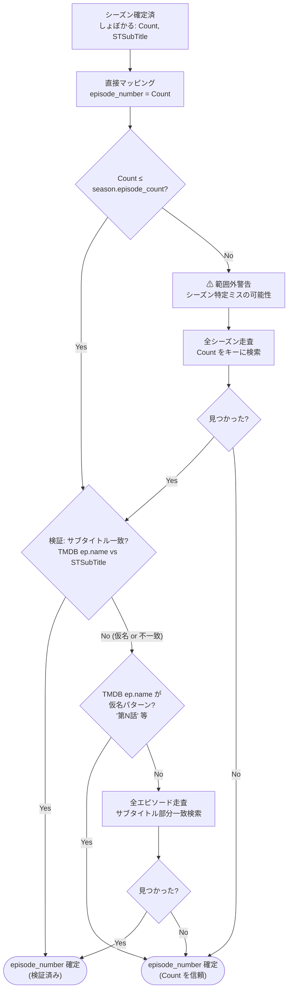
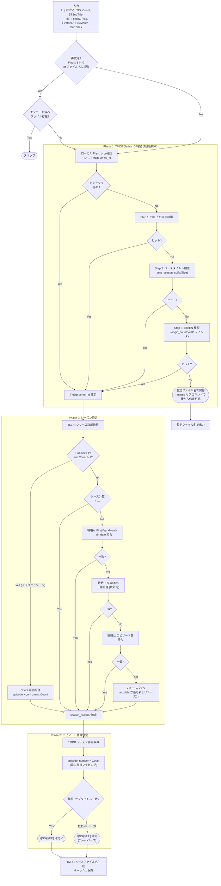

# TMDB エピソード照合

> 親ドキュメント: [IMPROVEMENT_PLAN.md](../IMPROVEMENT_PLAN.md)
>
> 関連ドキュメント:
>
> - [ファイル名自動生成](./filename-generation.md)
> - [API 実データ](../api-research/api-spec.md)

## 2.6 TMDB API 連携

### 認証

```
Authorization: Bearer {TMDB_READ_ACCESS_TOKEN}
```

環境変数 `TMDB_API_TOKEN` から取得。

### レート制限

- ~50リクエスト/秒 (per IP)
- 日次上限なし
- 制限は寛容。通常利用で問題にならない

### TMDB のアニメシーズン構造

TMDB はアニメのシーズン構成に独自のルールを持っており、しょぼかるや MAL 等のアニメ専門 DB とは構造が異なる:

| TMDB のルール                                | 影響                                                      |
| -------------------------------------------- | --------------------------------------------------------- |
| **エピソード番号が連番の場合は単一シーズン** | ONE PIECE は 1000+ 話が Season 1 に集約                   |
| **番号リセットでシーズン分割**               | 進撃の巨人は Season 1-4 に分割                            |
| **スプリットクールは連番なら1シーズン**      | 前半12話+後半12話を連番にする場合、1シーズン扱い          |
| **Season 0 はスペシャル/OVA**                | 通常のエピソード照合では除外が必要                        |
| **Episode Groups で代替順序**                | Absolute (通番)、Story Arc 等の代替グルーピングが利用可能 |

> **しょぼかるとの構造差異:** しょぼかるではシーズンごとに **別の TID** が割り当てられる
> (例: CLANNAD と CLANNAD ~~After Story~~ は別 TID)。
> 一方 TMDB では同一シリーズの Season 1, Season 2 として管理される場合がある。
> つまり **しょぼかる TID → (TMDB series_id, season_number)** のマッピングが必要。

### API エンドポイント一覧

| エンドポイント                              | 用途                                 |
| ------------------------------------------- | ------------------------------------ |
| `GET /search/tv?query={Title}`              | タイトル検索 → series_id 取得        |
| `GET /tv/{id}?language=ja-JP`               | シリーズ詳細 (シーズン一覧)          |
| `GET /tv/{id}/season/{num}?language=ja-JP`  | シーズン詳細 (エピソード一覧)        |
| `GET /tv/{id}/external_ids`                 | IMDB, TVDB 等の外部 ID               |
| `GET /tv/{id}/episode_groups`               | 代替エピソードグルーピング一覧       |
| `GET /tv/episode_group/{group_id}`          | グループ詳細                         |
| `GET /find/{external_id}?external_source=X` | 外部 ID (IMDB/TVDB) から TMDB 逆引き |

### 検索フロー (実データ: api-spec.md 参照)

**Step 1: TV 検索**

```
GET https://api.themoviedb.org/3/search/tv
  ?query=勇者パーティーにかわいい子がいたので、告白してみた。
  &include_adult=false
  &language=ja-JP
  &page=1
```

レスポンス:

```json
{
	"results": [
		{
			"id": 295366,
			"origin_country": ["JP"],
			"original_language": "ja",
			"original_name": "勇者パーティーにかわいい子がいたので、告白してみた。",
			"first_air_date": "2026-01-06",
			"name": "勇者パーティーにかわいい子がいたので、告白してみた。"
		}
	]
}
```

**Step 2: シリーズ詳細**

```
GET https://api.themoviedb.org/3/tv/295366?language=ja-JP
```

レスポンス:

```json
{
	"id": 295366,
	"name": "勇者パーティーにかわいい子がいたので、告白してみた。",
	"original_name": "勇者パーティーにかわいい子がいたので、告白してみた。",
	"first_air_date": "2026-01-06",
	"number_of_episodes": 12,
	"number_of_seasons": 1,
	"seasons": [
		{
			"air_date": "2026-01-06",
			"episode_count": 12,
			"id": 463953,
			"season_number": 1
		}
	]
}
```

**Step 3: シーズン詳細**

```
GET https://api.themoviedb.org/3/tv/295366/season/1?language=ja-JP
```

レスポンス:

```json
{
	"season_number": 1,
	"episodes": [
		{ "episode_number": 1, "name": "告白してみた。", "air_date": "2026-01-06" },
		{ "episode_number": 2, "name": "デートしてみた。", "air_date": "2026-01-13" },
		{ "episode_number": 3, "name": "恋愛相談を受けてみた。", "air_date": "2026-01-20" },
		{ "episode_number": 4, "name": "勇者に説教してみた。", "air_date": "2026-01-27" },
		{ "episode_number": 5, "name": "第5話", "air_date": "2026-02-04" }
	]
}
```

> **⚠ 放映中エピソードの注意:** TMDB では未放映・直近放映のエピソードは
> サブタイトルが `"第5話"` のような仮名になっていることがある。
> エピソード照合でサブタイトル一致に依存してはならない。

### Rust Crate

**`tmdb-api` (v1.0.0-alpha.5, MIT License)** を採用。

```toml
[dependencies]
tmdb-api = "1.0.0-alpha.5"
# 内部依存: chrono, reqwest (rustls-tls), serde, thiserror
```

---

## 2.6.1 エピソード照合の課題と解決方針

### 課題の整理

当初の照合ロジック (サブタイトル → air_date → Count のカスケード) では以下のケースで失敗する:

| 失敗パターン                   | 原因                                                  | 影響度                    |
| ------------------------------ | ----------------------------------------------------- | ------------------------- |
| **TMDB サブタイトル仮名**      | 放送直後のエピソードは `"第5話"` 等のプレースホルダー | 高 (放送直後は常に発生)   |
| **再放送の air_date 不一致**   | TMDB は初回放送日を保持。しょぼかるは再放送時刻を返す | 中 (再放送時に発生)       |
| **深夜帯の日付ズレ**           | 2/3 23:00 放送 → TMDB は 2/4 登録                     | 高 (深夜アニメで常に発生) |
| **マルチシーズンの TID 分離**  | しょぼかる TID ≠ TMDB シーズン構造                    | 中 (続編で発生)           |
| **スプリットクールの統合**     | しょぼかるで別 TID だが TMDB では同一シーズン         | 低 (一部作品)             |
| **長期シリーズの単一シーズン** | TMDB が連番エピソードを Season 1 に集約               | 低 (長期シリーズのみ)     |

### 設計原則

1. **サブタイトル照合は検証 (verification) にのみ使用し、主要な特定手段にしない**
2. **外部データベースに依存しない: しょぼかる API + TMDB API のみで完結させる**
3. **Count → episode_number の直接マッピングを基本とする** (しょぼかるはスプリットクールでも連番を使用するため、オフセット計算は不要)
4. **air_date は deep-night offset (深夜帯補正) を適用してから比較する**
5. **リアルタイム照合を前提とし、TMDB 未登録時のみ後からバッチリネームで対応する**

---

## 2.6.2 TMDB Series ID 特定 (直接検索方式)

しょぼかるから取得した**正確な日本語タイトル**で TMDB を直接検索する。
外部 ID マッピングデータベース (arm, anime-lists 等) への依存を排除し、
しょぼかる API + TMDB API のみで完結する設計とする。

### リアルタイム照合の実現性

録画完了直後にファイル名を決定できるかの分析:

| TMDB データ    | 放送時点での状態                                      | ファイル名に必要か      |
| -------------- | ----------------------------------------------------- | ----------------------- |
| series_id      | **放送前に登録済** (制作発表〜放送開始前に作成される) | `[tmdbid-XXXXX]` に必要 |
| seasons 構造   | **放送前に登録済** (シーズン情報は事前に設定)         | `Season XX` に必要      |
| episode_number | **放送前に登録済** (仮名だが番号エントリは存在)       | `s01e05` の確認用       |
| first_air_date | **放送前に登録済**                                    | 年 `(2026)` に必要      |
| 英語タイトル   | 放送前に登録されていることが多い                      | ローマ字パスに使用      |
| エピソード名   | **仮名** (`"第5話"`) の場合あり                       | **不要** (Count で決定) |

> **結論:** ファイル名生成に必要なデータは放送時点で全て TMDB から取得可能。
> エピソード名の仮名問題は Count ベースの設計で回避済み。
> **唯一の失敗ケース** は TMDB に未登録の極めてマイナーな作品のみ。

### タイトル正規化

マルチシーズンアニメのタイトルバリエーションに対応するための正規化:

```rust
/// しょぼかるタイトルを TMDB 検索用に正規化
fn normalize_for_search(title: &str) -> String {
    let mut s = title.to_string();

    // 1. 全角/半角の統一
    // ？ → ?, ！ → !, etc.
    s = s.nfkc().collect::<String>();

    // 2. シーズン指示子の除去 (検索用のベースタイトル抽出)
    //    例: "ご注文はうさぎですか??" → "ご注文はうさぎですか"
    //    例: "進撃の巨人 Season 3" → "進撃の巨人"
    //    例: "CLANNAD ~AFTER STORY~" → "CLANNAD"
    s
}

/// よくあるシーズン指示子パターン
static SEASON_SUFFIXES: &[&str] = &[
    // 記号の繰り返し (ごちうさ ??, ゆるゆり ♪♪)
    // 正規表現で末尾の記号重複を検出
    r"[?？!！♪☆★]{2,}$",
    // 明示的シーズン表記
    r"\s*(Season|シーズン)\s*\d+",
    r"\s*(2nd|3rd|\d+th)\s*[Ss]eason",
    r"\s*[第Ⅱ]期",
    r"\s*[IⅡⅢ]+$",
    // クール表記 (実データ: "SPY×FAMILY(第2クール)" → TMDB 0件)
    r"[（\(]第?\d+クール[）\)]$",
    // ShortTitle 括弧番号 (例: "SPY×FAMILY(2)")
    r"[（\(]\d+[）\)]$",
    // サブタイトル形式
    r"\s*[~〜].*[~〜]$",
    // Sの付与 ("Re:ゼロから始める異世界生活" → "Re:ゼロから始める異世界生活 2nd Season")
];
```

### 検索ロジック (段階的フォールバック)

```rust
/// TMDB Series ID の特定
async fn resolve_tmdb_series(
    tmdb: &TmdbClient,
    syoboi_title: &str,
    syoboi_title_en: Option<&str>,
    first_year: u32,
) -> Result<Option<TmdbSeries>> {
    // Step 1: しょぼかるタイトルそのままで検索
    let results = tmdb.search_tv(syoboi_title, "ja-JP").await?;
    if let Some(found) = filter_results(&results, syoboi_title, first_year) {
        return Ok(Some(found));
    }

    // Step 2: 正規化したベースタイトルで再検索
    //   シーズン指示子 (第2クール) 等を除去して検索
    //   実データ: "SPY×FAMILY(第2クール)" → 0件, "SPY×FAMILY" → ヒット
    let base_title = strip_season_suffix(syoboi_title);
    if base_title != syoboi_title {
        let results = tmdb.search_tv(&base_title, "ja-JP").await?;
        if let Some(found) = filter_results(&results, &base_title, first_year) {
            return Ok(Some(found));
        }
    }

    // Step 3: TitleEN (英語タイトル) で検索
    //   日本語タイトルで見つからない場合のフォールバック
    //   実データ: TitleEN="SPY FAMILY" → id=120089 (正解) + 非日本作品2件
    //   → filter_results の origin_country="JP" フィルタで偽陽性を除外
    if let Some(title_en) = syoboi_title_en.filter(|s| !s.is_empty()) {
        let results = tmdb.search_tv(title_en, "ja-JP").await?;
        if let Some(found) = filter_results(&results, title_en, first_year) {
            return Ok(Some(found));
        }
    }

    Ok(None)
}

/// 検索結果のフィルタリング (優先順位付き)
fn filter_results(
    results: &[TmdbSearchResult],
    query: &str,
    first_year: u32,
) -> Option<TmdbSeries> {
    let normalized_query = normalize_for_search(query);

    results.iter()
        // 1. original_name 正規化一致 + 日本作品
        .find(|r| normalize_for_search(&r.original_name) == normalized_query
            && r.origin_country.contains(&"JP".to_string()))
        // 2. original_name が query を含む + 日本作品
        .or_else(|| results.iter().find(|r|
            normalize_for_search(&r.original_name)
                .contains(&normalized_query)
            && r.origin_country.contains(&"JP".to_string())))
        // 3. 検索結果の先頭 (TMDB のスコア順) + 日本作品
        .or_else(|| results.iter().find(|r|
            r.origin_country.contains(&"JP".to_string())))
        .cloned()
}
```

### ごちうさでの検索ウォークスルー (api-spec.md 実データ検証済み)

```
しょぼかる S2: Title="ご注文はうさぎですか??" (TID=3893)

Step 1: TMDB search query="ご注文はうさぎですか??"
        → results: [{ id: 60843, original_name: "ご注文はうさぎですか？", origin_country: ["JP"] }]
        → TMDB の検索エンジンがファジーマッチで正しいシリーズを返す
        → filter_results: 正規化比較で一致 → series_id=60843 確定

※ TMDB search API は十分にファジーで、2期タイトル "??" でも
  1期タイトル "？" のシリーズ (id=60843) を返すことを実データで確認。
  タイトル正規化・ベースタイトル再検索は検索結果0件時のフォールバックとして機能。
```

### SPY×FAMILY での検索ウォークスルー (api-spec.md 実データ検証済み)

```
しょぼかる Part 2: Title="SPY×FAMILY(第2クール)" (TID=6451), TitleEN="SPY FAMILY"

Step 1: TMDB search query="SPY×FAMILY(第2クール)"
        → results: [] (0件)
        → "(第2クール)" サフィックスが検索を阻害

Step 2: ベースタイトル strip_season_suffix → "SPY×FAMILY"
        TMDB search query="SPY×FAMILY"
        → results: [{ id: 120089, original_name: "SPY×FAMILY", origin_country: ["JP"] },
                     { id: 6929, original_name: "My Spy Family", origin_country: ["GB"] },
                     { id: 40224, original_name: "Family of Spies", origin_country: ["US"] }]
        → filter_results: origin_country="JP" + original_name 一致 → series_id=120089 確定

※ Step 2 で見つかるため Step 3 (TitleEN) は不要だが、
  ベースタイトル抽出が不完全な場合のセーフティネットとして Step 3 が機能する:
  TitleEN="SPY FAMILY" でも同じ series_id=120089 が得られることを実データで確認。
```

> **strip_season_suffix の重要性:** `SPY×FAMILY(第2クール)` → TMDB 0件 は実データで確認済み。
> シーズン指示子の除去は必須。SEASON_SUFFIXES パターンに `(第\d+クール)` を含めること。

### 検索精度を高める要素

| 条件                                                | 根拠                                     |
| --------------------------------------------------- | ---------------------------------------- |
| タイトル正規化 (全角/半角統一 + シーズン指示子除去) | しょぼかるとTMDBのタイトル表記揺れに対応 |
| `origin_country` = `"JP"`                           | 日本アニメを優先 (同名の海外作品を除外)  |
| `original_language` = `"ja"`                        | 日本語作品を優先                         |
| ベースタイトルで再検索                              | マルチシーズンのタイトル差異に対応       |

### TMDB 未登録時のフォールバック

TMDB に登録されていない場合 (検索結果なし):

```rust
enum NamingResult {
    /// TMDB 照合成功 → Emby/Jellyfin 互換ファイル名
    TmdbResolved {
        series_id: u64,
        season_number: u32,
        episode_number: u32,
        title_romaji: String,
        year: u32,
    },
    /// TMDB 未登録 → 暫定ファイル名 (後で rename サブコマンドで修正可能)
    Pending {
        syoboi_title: String,
        count: u32,
    },
}
```

暫定ファイル名の形式:

```
{しょぼかるTitle}/Season 01/{しょぼかるTitle} e{Count:02}.mp4
```

後から TMDB が登録された後に修正:

```bash
# バッチリネーム: 暫定ファイル名 → TMDB ベースのファイル名に一括変換
$ jlse-rs rename --scan /path/to/media
```

### ローカルキャッシュ

一度解決した TID → TMDB series_id のマッピングはローカル DB にキャッシュする:

```rust
/// TID → TMDB マッピングキャッシュ
pub struct TmdbMappingCache {
    // sled or SQLite
    // Key: syobocal_tid (u32)
    // Value: TmdbMapping { series_id, season_number, resolved_at }
}
```

- 同一 TID の2回目以降は TMDB API を叩かずキャッシュから返す
- キャッシュ有効期限: 90日 (シーズン構成が変更される可能性を考慮)
- `rename --scan` サブコマンド実行時にキャッシュを無効化して再取得可能

### 参考: 外部 ID マッピングサービス

将来的に TMDB 直接検索で不十分なケースが多発する場合の拡張オプション:

| サービス                                                    | ルート           | ライセンス | 備考                                       |
| ----------------------------------------------------------- | ---------------- | ---------- | ------------------------------------------ |
| [kawaiioverflow/arm](https://github.com/kawaiioverflow/arm) | TID → MAL ID     | MIT        | しょぼかる TID のカバレッジ 6,448 件       |
| [Fribb/anime-lists](https://github.com/Fribb/anime-lists)   | MAL ID → TMDB ID | MIT        | arm と組み合わせて 2-hop チェーン          |
| [nattadasu/animeApi](https://github.com/nattadasu/animeApi) | TID → TMDB 直接  | AGPL-3.0   | season_number も取得可能だがライセンス注意 |

> **現時点ではこれらを採用しない。** しょぼかるの正式タイトルによる TMDB 検索は
> 十分な精度が期待でき、外部データソースへの依存を増やす必要がない。
> 運用開始後に検索精度が不足する場合に再検討する。

---

## 2.6.3 シーズン特定ロジック

TMDB series_id が確定した後、しょぼかる TID がどのシーズンに対応するかを特定する。

### スプリットクールの検出

しょぼかるの SubTitles フィールドから、現在の TID がスプリットクールの後半かどうかを判定する。

```rust
/// SubTitles をパースして (Count, SubTitle) のリストを返す
fn parse_subtitles(subtitles_raw: &str) -> Vec<(u32, String)> {
    let re = Regex::new(r"\*(\d+)\*(.+)").unwrap();
    re.captures_iter(subtitles_raw)
        .filter_map(|cap| {
            let count: u32 = cap[1].parse().ok()?;
            let title = cap[2].to_string();
            Some((count, title))
        })
        .collect()
}

/// スプリットクールの後半 TID かどうか判定
/// SubTitles の最小 Count が 1 より大きければ、前期からの連番 = スプリットクール後半
fn is_split_cour_continuation(subtitles: &[(u32, String)]) -> bool {
    subtitles.first().map_or(false, |(count, _)| *count > 1)
}
```

> **実データ根拠 (SPY×FAMILY):**
>
> - TID 6309 (Part 1): SubTitles `*01*`〜`*12*` → min Count = 1 → 通常 (Part 1)
> - TID 6451 (Part 2): SubTitles `*13*`〜`*25*` → min Count = 13 → スプリットクール後半
> - TID 6451 Comment: "話数は前作からの連番で表記"
>
> TMDB 側: Season 1 の episode_count = 25 (Part 1+2 を統合)

### シーズン特定の優先カスケード

```mermaid
flowchart TD
    START["TMDB series_id 確定済<br/>しょぼかる: TID, FirstYear, FirstMonth, SubTitles"]
    START --> SPLIT_CHECK{"SubTitles の<br/>min Count > 1?<br/>(スプリットクール判定)"}
    SPLIT_CHECK -- Yes --> COUNT_RANGE["Count 範囲照合<br/>max Count を含むシーズンを検索<br/>(episode_count ≥ max Count)"]
    COUNT_RANGE --> RANGE_MATCH{一致する<br/>シーズンあり?}
    RANGE_MATCH -- Yes --> FOUND_S(["Season 確定"])
    RANGE_MATCH -- No --> AIR_DATE
    SPLIT_CHECK -- No --> SINGLE{シーズン数<br/>= 1?<br/>(Season 0 除外)}
    SINGLE -- Yes --> FOUND_S
    SINGLE -- No --> AIR_DATE["戦略A: 放送開始時期照合<br/>FirstYear+FirstMonth と<br/>各シーズン air_date を比較"]
    AIR_DATE --> AIR_MATCH{一致する<br/>シーズンあり?}
    AIR_MATCH -- Yes (1件) --> FOUND_S
    AIR_MATCH -- No / 複数 --> SUBTITLE_BULK["戦略B: サブタイトル一括照合<br/>しょぼかる SubTitles の全話を<br/>各シーズンのエピソード名と突合"]
    SUBTITLE_BULK --> SUB_MATCH{最多一致<br/>シーズンあり?}
    SUB_MATCH -- Yes --> FOUND_S
    SUB_MATCH -- No --> EP_COUNT["戦略C: エピソード数照合<br/>しょぼかる SubTitles の話数と<br/>各シーズン episode_count を比較"]
    EP_COUNT --> COUNT_MATCH{一致する<br/>シーズンあり?}
    COUNT_MATCH -- Yes --> FOUND_S
    COUNT_MATCH -- No --> LATEST["フォールバック:<br/>air_date が最も新しいシーズン"]
    LATEST --> FOUND_S
```

### スプリットクール: Count 範囲によるシーズン特定

```rust
/// スプリットクール後半の TID に対し、Count 範囲を含む TMDB シーズンを特定
fn match_season_by_count_range(
    seasons: &[TmdbSeason],
    max_count: u32,
) -> Option<u32> {
    // Season 0 (Specials) を除外し、
    // episode_count が max_count 以上のシーズンを検索
    // (Count は連番なので、max_count を含むシーズンが正解)
    seasons.iter()
        .filter(|s| s.season_number > 0)
        .find(|s| s.episode_count >= max_count)
        .map(|s| s.season_number)
}

// 実データ: TID 6451 → SubTitles *13*〜*25* → max_count = 25
// TMDB Season 1: episode_count = 25 (>= 25) → season_number = 1 ✓
// TMDB Season 2: episode_count = 12 (< 25) → skip
// TMDB Season 3: episode_count = 13 (< 25) → skip
```

### 戦略A: 放送開始時期照合 (FirstYear + FirstMonth)

しょぼかるの `FirstYear` / `FirstMonth` と TMDB シーズンの `air_date` を比較する。

```rust
fn match_season_by_air_date(
    seasons: &[TmdbSeason],
    first_year: u32,
    first_month: u32,
) -> Option<u32> {
    // Season 0 (Specials) を除外
    let candidates: Vec<_> = seasons.iter()
        .filter(|s| s.season_number > 0)
        .filter(|s| {
            if let Some(air_date) = &s.air_date {
                let (year, month) = parse_year_month(air_date);
                // 年が一致し、月が ±1 の範囲内
                year == first_year && month.abs_diff(first_month) <= 1
            } else {
                false
            }
        })
        .collect();

    match candidates.len() {
        1 => Some(candidates[0].season_number),
        _ => None, // 0件 or 複数件 → 次の戦略へ
    }
}
```

> **±1 月の許容理由:** アニメの放送開始月としょぼかるの `FirstMonth` にはズレが生じうる。
> 例: 1月クールの作品が12月末に先行放送される場合、FirstMonth=12 だが
> TMDB シーズン air_date は翌年1月となる。

### 戦略B: サブタイトル一括照合

しょぼかるの `SubTitles` フィールド (全話サブタイトルリスト) を TMDB の各シーズンと突合する。
**個別エピソードの照合ではなく、シーズン全体を統計的に特定する方式。**

```rust
fn match_season_by_subtitles(
    seasons_with_episodes: &[(u32, Vec<TmdbEpisode>)], // (season_number, episodes)
    syoboi_subtitles: &[(u32, String)],                 // (count, subtitle) from SubTitles
) -> Option<u32> {
    let mut best_season = None;
    let mut best_score = 0;

    for (season_num, episodes) in seasons_with_episodes {
        if *season_num == 0 { continue; } // Specials を除外

        let score = syoboi_subtitles.iter().filter(|(_, sub)| {
            episodes.iter().any(|ep| {
                // 正規化して比較 (全角/半角、句読点の揺れを吸収)
                normalize(sub) == normalize(&ep.name)
            })
        }).count();

        if score > best_score {
            best_score = score;
            best_season = Some(*season_num);
        }
    }

    // 最低2話以上の一致がないと信頼性が低い
    if best_score >= 2 { best_season } else { None }
}
```

> **この戦略の利点:** TMDB で放送直後のエピソード名が仮名 (`"第5話"`) であっても、
> 過去エピソードのサブタイトルが正しく登録されていれば統計的にシーズンを特定できる。
> 単一エピソードの照合に依存しないため、数話分のデータ欠損に耐性がある。

### 戦略C: エピソード数照合

しょぼかるの `SubTitles` から最大話数を抽出し、TMDB シーズンの `episode_count` と比較する。

```rust
fn match_season_by_episode_count(
    seasons: &[TmdbSeason],
    max_count: u32,
) -> Option<u32> {
    seasons.iter()
        .filter(|s| s.season_number > 0)
        .find(|s| s.episode_count == max_count)
        .map(|s| s.season_number)
}
```

> 同じエピソード数のシーズンが複数ある場合は特定できない (次の戦略へ)。

---

## 2.6.4 エピソード番号特定ロジック

シーズンが確定した後、しょぼかるの `Count` から TMDB の `episode_number` を決定する。

### 基本原則: Count == episode_number (常に成立)

**しょぼかるの Count は TMDB の episode_number と常に一致する。オフセット計算は不要。**

これはスプリットクールでも成立する。しょぼかるはスプリットクールの後半 TID で
**前作からの連番**を使用するため (Comment: "話数は前作からの連番で表記")、
Count がそのまま TMDB の episode_number になる。

| ケース                      | しょぼかる                              | TMDB            | Count == ep_num? |
| --------------------------- | --------------------------------------- | --------------- | :--------------: |
| **通常放送**                | TID 7667, Count=5                       | Season 1, ep 5  |      **✓**       |
| **マルチシーズン**          | TID 3893 (ごちうさ S2), Count=1         | Season 2, ep 1  |      **✓**       |
| **スプリットクール Part 1** | TID 6309 (SPY×FAMILY), Count=12         | Season 1, ep 12 |      **✓**       |
| **スプリットクール Part 2** | TID 6451 (SPY×FAMILY 2クール), Count=13 | Season 1, ep 13 |      **✓**       |

> **従来の懸念 (解消済み):** スプリットクールで TID が分かれる場合、
> 後半 TID の Count が 1 からリセットされるのではないかと想定していたが、
> 実データで**連番が維持される**ことを確認。
> (SPY×FAMILY TID 6451: SubTitles `*13*`〜`*25*`, Count=13〜25)

### エピソード特定フロー



### 仮名パターンの検出

TMDB エピソード名が未登録・仮登録であるかを判定する正規表現:

```rust
/// TMDB エピソード名が仮名 (プレースホルダー) かどうか判定
fn is_placeholder_name(name: &str) -> bool {
    lazy_static! {
        static ref PATTERNS: Vec<Regex> = vec![
            Regex::new(r"^第\d+話$").unwrap(),         // "第5話"
            Regex::new(r"^Episode \d+$").unwrap(),     // "Episode 5"
            Regex::new(r"^エピソード\d+$").unwrap(),    // "エピソード5"
            Regex::new(r"^#\d+$").unwrap(),            // "#5"
            Regex::new(r"^TBA$").unwrap(),             // "TBA"
        ];
    }
    PATTERNS.iter().any(|p| p.is_match(name))
}
```

---

## 2.6.5 深夜帯の日付ズレ対応

日本の深夜アニメは暦上の日付と TMDB の air_date が1日ずれる問題がある。

```
しょぼかる StTime: 2026-02-03 23:00:00 (月曜深夜)
TMDB air_date:     2026-02-04           (火曜日として登録)
```

### 補正ロジック

```rust
/// しょぼかるの放送時刻から TMDB air_date 比較用の日付を生成
/// 深夜帯 (0:00-5:00) は前日の日付とする
fn broadcast_date_for_comparison(st_time: &NaiveDateTime) -> NaiveDate {
    let date = st_time.date();
    let next_date = date + Duration::days(1);

    // 比較時は当日と翌日の両方を候補とする
    // (23:00 放送で TMDB が翌日登録のケース)
    // → 呼び出し側で date と next_date の両方を試行
    date
}

fn air_dates_match(st_time: &NaiveDateTime, tmdb_air_date: &NaiveDate) -> bool {
    let date = st_time.date();
    let next_date = date + Duration::days(1);
    *tmdb_air_date == date || *tmdb_air_date == next_date
}
```

> **注意:** この air_date 比較は再放送では機能しない (TMDB は初回放送日を保持)。
> air_date は検証の補助情報としてのみ使用し、主要な照合手段にしない。

---

## 2.6.6 再放送 (再) の取り扱い

### しょぼかるの Flag ビットマスク

しょぼかるの `Flag` フィールドはビットマスクで、再放送を含む放送属性を表す。
**ファイル名の `[再]` ARIB フラグより信頼性が高い** (ARIB フラグは放送局依存で欠落する場合がある)。

| ビット | 値  | 意味                  | 実データ                              |
| :----: | :-: | --------------------- | ------------------------------------- |
| bit 0  |  1  | 特番/スペシャル       | SPY×FAMILY TID 6451: SP 番組 (Flag=1) |
| bit 1  |  2  | 新番組 (シリーズ開始) | SPY×FAMILY TID 6309: 第1話 (Flag=2)   |
| bit 2  |  4  | 最終回 (シリーズ終了) | SPY×FAMILY TID 6309: 第12話 (Flag=4)  |
| bit 3  |  8  | **再放送**            | SPY×FAMILY TID 6309: 再放送 (Flag=8)  |

**複合値の例 (実データ):**

| Flag 値 | ビット分解 | 意味                   |
| :-----: | ---------- | ---------------------- |
|    9    | 8+1        | 再放送の特番           |
|   10    | 8+2        | 再放送シリーズの初回   |
|   12    | 8+4        | 再放送シリーズの最終回 |

### 再放送検出ロジック

```rust
/// しょぼかる Flag ビットマスク定数
const FLAG_SPECIAL: u32 = 1;  // bit 0
const FLAG_NEW: u32     = 2;  // bit 1
const FLAG_FINAL: u32   = 4;  // bit 2
const FLAG_RERUN: u32   = 8;  // bit 3

/// 再放送かどうか判定 (しょぼかる Flag ベース, 最優先)
fn is_rerun_by_flag(flag: u32) -> bool {
    flag & FLAG_RERUN != 0
}

/// ファイル名 [再] フラグによる再放送判定 (フォールバック)
fn is_rerun_by_filename(parsed: &ParsedFilename) -> bool {
    parsed.broadcast_flags.contains(&"再".to_string())
}

/// 再放送判定の統合
/// しょぼかる Flag が取得できていれば Flag を優先、
/// しょぼかる照合前 (ファイル名パース段階) では [再] を使用
fn is_rerun(flag: Option<u32>, parsed: &ParsedFilename) -> bool {
    match flag {
        Some(f) => is_rerun_by_flag(f),
        None => is_rerun_by_filename(parsed),
    }
}
```

### 照合への影響と対処

| 項目              | 再放送時の挙動                   | 対処                                        |
| ----------------- | -------------------------------- | ------------------------------------------- |
| TID               | 同一                             | 影響なし。TMDB 特定可能                     |
| Count             | 同一                             | 影響なし。episode_number は Count から決定  |
| STSubTitle        | 同一                             | 影響なし                                    |
| Flag              | **bit 3 が立つ** (Flag & 8 != 0) | 再放送検出の最優先手段                      |
| air_date          | **不一致** (TMDB は初回放送日)   | air_date を主要な照合手段にしない設計で回避 |
| ファイル名 `[再]` | 再放送を示すが欠落する場合あり   | Flag のフォールバックとして使用             |

```rust
/// 再放送時の処理分岐
fn handle_rerun(flag: Option<u32>, parsed: &ParsedFilename, output_dir: &Path) -> Action {
    if is_rerun(flag, parsed) {
        // 既にエンコード済みファイルが存在するか確認
        let expected_path = generate_expected_path(parsed, output_dir);
        if expected_path.exists() {
            return Action::Skip("再放送: エンコード済みファイルが存在します");
        }
    }
    Action::Process
}
```

---

## 2.6.7 全体照合フロー (統合)



### 実例ウォークスルー

**ケース: 新規放送 (通常)**

```
入力: TID=7667, Count=5, STSubTitle="魔族に戻ってみた。"
      Title="勇者パーティーにかわいい子がいたので、告白してみた。"
      FirstYear=2026, FirstMonth=1

Phase 1: キャッシュなし
         TMDB search/tv query="勇者パーティーにかわいい子がいたので、告白してみた。"
         → original_name 完全一致, first_air_date year=2026 → TMDB 295366
         → キャッシュ保存: TID 7667 → TMDB 295366
Phase 2: シーズン数=1 → season_number=1
Phase 3: Count=5, episode_count=12, 5≤12 → episode_number=5
         検証: TMDB ep5.name="第5話" → 仮名パターン検出 → Count を信頼
結果: s01e05
```

**ケース: マルチシーズン (ごちうさ S2, api-spec.md 実データ検証済み)**

```
入力: TID=3893, Count=1, STSubTitle="笑顔とフラッシュがやかましいこれが私の自称姉です"
      Title="ご注文はうさぎですか??"
      TitleEN="Is the order a rabbit ??"
      FirstYear=2015, FirstMonth=10

Phase 1: キャッシュなし
         TMDB search/tv query="ご注文はうさぎですか??"
         → results: [{ id: 60843, original_name: "ご注文はうさぎですか？" }]
         → TMDB のファジー検索で正しく series_id=60843 を返す
         → キャッシュ保存: TID 3893 → TMDB 60843
Phase 2: TMDB tv/60843 → seasons:
           Season 0: 特別編 (除外)
           Season 1: air_date="2014-04-10", episode_count=12
           Season 2: air_date="2015-10-10", episode_count=12
           Season 3: air_date="2020-10-10", episode_count=12
         → シーズン数=3 (S0除外)
         戦略A: FirstYear=2015, FirstMonth=10
                Season 2 air_date="2015-10-10" → 年=2015, 月=10 完全一致
         → season_number=2
Phase 3: Count=1 ≤ episode_count(12) → episode_number=1
         検証: TMDB ep1.name vs STSubTitle → 一致 (過去作なのでデータあり)
結果: s02e01

出力パス:
Is the order a rabbit (2014) [tmdbid-60843]/Season 02/Is the order a rabbit (2014) [tmdbid-60843] s02e01.mp4
```

**ケース: 同一作品2回目以降 (キャッシュヒット)**

```
入力: TID=7667, Count=6

Phase 1: キャッシュヒット → TMDB 295366 (API コール不要)
Phase 2, 3: 通常処理
結果: s01e06
```

**ケース: スプリットクール (SPY×FAMILY Part 2, api-spec.md 実データ検証済み)**

```
入力: TID=6451, Count=13, STSubTitle="プロジェクト〈アップル〉"
      Title="SPY×FAMILY(第2クール)", TitleEN="SPY FAMILY"
      FirstYear=2022, FirstMonth=10
      SubTitles: *13*プロジェクト〈アップル〉 〜 *25*接敵作戦(ファーストコンタクト)
      Flag=2 (新番組, 再放送ではない)

Phase 1: キャッシュなし
         Step 1: TMDB search query="SPY×FAMILY(第2クール)"
                 → results: [] (0件) ← "(第2クール)" が検索を阻害
         Step 2: strip_season_suffix → "SPY×FAMILY"
                 TMDB search query="SPY×FAMILY"
                 → results: [{ id: 120089, origin_country: ["JP"] }, ...]
                 → filter_results: origin_country="JP" + original_name 一致
                 → series_id=120089 確定
         → キャッシュ保存: TID 6451 → TMDB 120089

Phase 2: TMDB tv/120089 → seasons:
           Season 0: 特別編, episode_count=3 (除外)
           Season 1: air_date="2022-04-09", episode_count=25
           Season 2: air_date="2023-10-07", episode_count=12
           Season 3: air_date="2025-10-04", episode_count=13
         → SubTitles min Count = 13 > 1 → スプリットクール後半と判定
         → Count 範囲照合: max Count=25, Season 1 episode_count=25 (≥ 25) → 一致
         → season_number=1

Phase 3: Count=13, episode_count=25, 13≤25 → episode_number=13
         検証: TMDB Season 1 ep13.name="プロジェクト〈アップル〉"
               vs STSubTitle="プロジェクト〈アップル〉" → 一致 ✓
結果: s01e13

出力パス:
SPY FAMILY (2022) [tmdbid-120089]/Season 01/SPY FAMILY (2022) [tmdbid-120089] s01e13.mp4
```

**ケース: 再放送 (Flag ビットマスク検出, api-spec.md 実データ検証済み)**

```
入力: TID=6309, Count=1, STSubTitle="オペレーション〈梟(ストリクス)〉"
      Flag=10 (= 8+2 = 再放送+新番組)
      StTime=2023-04-14 18:25:00 (夕方再放送枠)

Phase 0: 再放送検出: Flag & 8 != 0 → 再放送
         → 既存ファイル "...s01e01.mp4" を確認
         → 存在する場合 → スキップ
         → 存在しない場合 → 通常処理を続行 (初回放送を見逃した場合等)

※ Flag=9 (再放送+特番) の場合: Count が空 → エピソード照合不要、SP として処理
```

**ケース: TMDB 未登録 (極めてマイナーな新作)**

```
入力: TID=9999, Count=1, Title="超ニッチなアニメ"
      FirstYear=2026, FirstMonth=4

Phase 1: キャッシュなし
         TMDB search/tv → 検索結果 0件
         → 暫定ファイル名で出力

暫定出力:
超ニッチなアニメ/Season 01/超ニッチなアニメ e01.mp4

--- TMDB 登録後 ---
$ jlse-rs rename --scan /path/to/media
→ TMDB 検索成功 → リネーム:
Chou Niche na Anime (2026) [tmdbid-XXXXX]/Season 01/Chou Niche na Anime (2026) [tmdbid-XXXXX] s01e01.mp4
```
