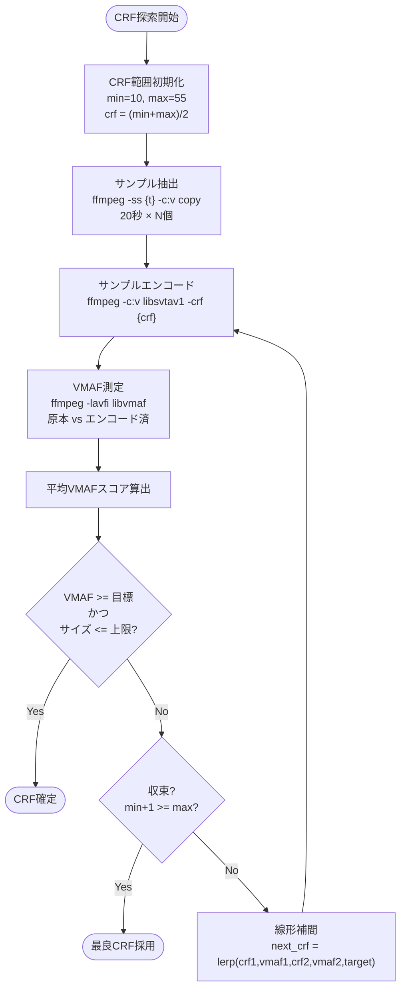
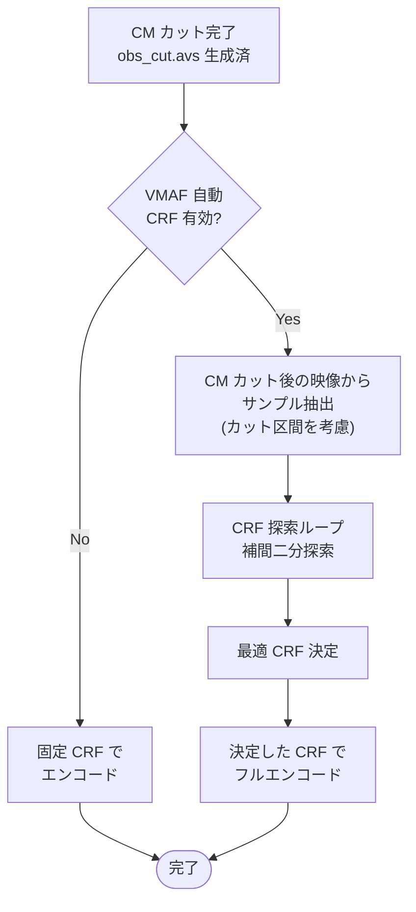

# VMAF ベース CRF 自動決定

> 親ドキュメント: [IMPROVEMENT_PLAN.md](../IMPROVEMENT_PLAN.md)

## 1.1 背景

現行の ffmpeg エンコードでは CRF を固定値で指定しており、ソース映像の複雑度に関わらず同一の値を使用している。
映像品質を一定に保ちつつファイルサイズを最適化するには、VMAF (Video Multi-Method Assessment Fusion) スコアを基準にした CRF 決定が有効。

## 1.2 ab-av1 の実装分析

[ab-av1](https://github.com/alexheretic/ab-av1) (v0.10.4, MIT License) は Rust で書かれた VMAF ターゲット CRF 自動決定ツール。

### コアアルゴリズム: 補間二分探索 (Interpolated Binary Search)

```
1. CRF 範囲の初期化 (例: SVT-AV1 → 10.0〜55.0)
2. 中間点から開始: crf = (min + max) / 2
3. ループ:
   a. 動画から等間隔にサンプルセグメントを抽出 (デフォルト: 20秒間 × 12分おき)
   b. 現在の CRF でサンプルをエンコード
   c. ffmpeg -lavfi libvmaf でエンコード前後を比較し VMAF スコア算出
   d. 全サンプルの平均 VMAF スコアを算出
   e. 条件判定:
      - VMAF >= 目標 (デフォルト95) かつ エンコード後サイズ <= 元の80%  → 成功
      - そうでなければ → 2点の (CRF, VMAF) データから線形補間で次の CRF を推定
   f. 収束判定: 隣接する CRF 値に到達 or 許容誤差内 → 終了
4. 発見した CRF でフルエンコード
```



### 主要パラメータ

| パラメータ                | デフォルト値           | 説明                                    |
| ------------------------- | ---------------------- | --------------------------------------- |
| `--min-vmaf`              | 95.0                   | 目標 VMAF スコア                        |
| `--max-encoded-percent`   | 80%                    | エンコード後の最大サイズ (元ファイル比) |
| `--encoder`               | libsvtav1              | 動画コーデック                          |
| `--preset`                | 8                      | エンコーダ速度                          |
| `--sample-duration`       | 20秒                   | 各サンプルの長さ                        |
| `--sample-every`          | 12分                   | サンプル抽出間隔                        |
| `--min-crf` / `--max-crf` | 10 / 55                | CRF 探索範囲                            |
| `--crf-increment`         | 1.0 (x264/x265 は 0.1) | CRF 刻み幅                              |
| `--thorough`              | false                  | 許容誤差の緩和を無効化                  |

### キャッシュ機構

- sled (組み込み DB) を使用。パスは `~/.cache/ab-av1/sample-encode-cache`
- キー: BLAKE3 ハッシュ (サンプルファイル名 + 入力長 + エンコード引数 + エンコーダバージョン)
- エンコーダバージョンが変わるとキャッシュ自動無効化

## 1.3 VMAF の利用方式: ライブラリ vs コマンド

### Rust VMAF ライブラリの現状

| Crate         | バージョン | 最終更新 | ライセンス | 状態                    |
| ------------- | ---------- | -------- | ---------- | ----------------------- |
| `libvmaf-sys` | 0.4.4      | 2023/12  | GPL-3.0    | 2年以上放置             |
| `libvmaf-rs`  | 0.5.2      | 2024/05  | GPL-3.0    | WIP、docs.rs ビルド不可 |
| `vmaf-sys`    | 0.0.10     | 2019/11  | MIT        | 放棄                    |

### 方式比較

| 方式                                   | メリット                                               | デメリット                                                                                  |
| -------------------------------------- | ------------------------------------------------------ | ------------------------------------------------------------------------------------------- |
| **A. ab-av1 をコマンドとして利用**     | 実装コスト最小。既に完成度が高い                       | ab-av1 のインストールが必要。カスタマイズ性が低い                                           |
| **B. ffmpeg subprocess (ab-av1 方式)** | ffmpeg がデコード+VMAF計算を一括実行。テキスト解析のみ | ffmpeg に libvmaf 組み込みが必要。パース処理が脆い                                          |
| **C. libvmaf FFI 自前実装**            | フレーム単位の制御。プロセス起動オーバーヘッドなし     | ビルド依存 (meson/ninja/nasm)。映像デコードは別途必要。GPL 回避に自前 -sys crate 作成が必要 |

## 1.4 推奨方式

**方式 B (ffmpeg subprocess) を推奨。** 理由:

1. ab-av1 および Av1an の2大 Rust ツールが両方ともこの方式を採用している実績
2. 既存の Rust VMAF crate は全て未メンテ or GPL-3.0 で実用不可
3. 本プロジェクトは既に ffmpeg を外部コマンドとして利用しており、追加の依存が少ない
4. libvmaf の直接リンクはデコード処理の自前実装が必要となり複雑度が大幅増加
5. ab-av1 をコマンド利用する方式は依存が増えるだけでなく、CM カット後のサンプリング位置制御ができない

将来的に ab-av1 を crate として利用する選択肢が出てくれば (現状は CLI ツールのみ)、移行を検討可能。

## 1.5 実装設計

```rust
/// VMAF ベース CRF 探索の設定
pub struct VmafCrfConfig {
    /// 目標 VMAF スコア (デフォルト: 95.0)
    pub target_vmaf: f64,
    /// エンコード後最大サイズ比率 (デフォルト: 0.8)
    pub max_encoded_ratio: f64,
    /// エンコーダ (デフォルト: libsvtav1)
    pub encoder: Encoder,
    /// CRF 探索範囲
    pub crf_range: RangeInclusive<f64>,
    /// CRF 刻み幅
    pub crf_increment: f64,
    /// サンプル時間 (デフォルト: 20秒)
    pub sample_duration: Duration,
    /// サンプル間隔 (デフォルト: 12分)
    pub sample_interval: Duration,
    /// VMAF モデル (自動選択: 解像度による)
    pub vmaf_model: VmafModel,
}

/// CRF 探索結果
pub struct CrfSearchResult {
    pub crf: f64,
    pub mean_vmaf: f64,
    pub predicted_size_ratio: f64,
    pub iterations: usize,
}
```

### 処理フロー (CM カットとの統合)



**CM カット後サンプリングの注意点:**

- サンプル抽出は CM カット後の本編部分のみを対象とする
- Trim 情報 (obs_cut.avs) を参照し、本編区間内から均等にサンプルを取得
- CM 区間をサンプルに含めると CRF が不正確になるため、これは ab-av1 単体利用では実現できない制御
